Twitter and Physical Activity
================

``` r
library(tidyverse)
library(betareg)
library(fitdistrplus)
library(Hmisc)
library(knitr)
library(lmtest)
```

The compiled dataset contains a subset of US counties (names and FIPS
codes).

The associated data for each county is as follows:

  - All\_Tweets: the total collected number of tweets from that county
  - PA\_Tweets: the number of tweets identified as physical
    activity-related
  - Inactivity\_Cases: TODO
  - Inactivity\_Percent: TODO
  - Inactivity\_Percent\_AgeAdjusted: TODO
  - Gini\_Index: TODO
  - Gini\_Index\_MoE: the margin of error of the Gini index
estimate

<!-- end list -->

``` r
# This helper will render legible tables in both RStudio and the generated markdown.
display <- function(x) {
  if (interactive()) (x)
  else kable(x)
}

all_data <- read.csv("data/all_data.csv")
cat('Rows in complete dataset: ', nrow(all_data))
```

Rows in complete dataset:
3146

``` r
display(head(all_data))
```

| FIPS | State   | County         | Inactivity.Percent | Inactivity.Ageadjusted | Gini\_Index.Estimate | Education.College.Estimate | Tweets.All | Tweets.PA | Tweets.PA.Negative | Tweets.PA.Neutral | Tweets.PA.Positive |
| ---: | :------ | :------------- | -----------------: | ---------------------: | -------------------: | -------------------------: | ---------: | --------: | -----------------: | ----------------: | -----------------: |
| 1001 | Alabama | Autauga County |               28.6 |                   28.0 |               0.4031 |                       37.9 |       8720 |        28 |                 13 |                13 |                  2 |
| 1003 | Alabama | Baldwin County |               22.3 |                   21.2 |               0.4455 |                       39.3 |      36023 |       114 |                 55 |                52 |                  7 |
| 1005 | Alabama | Barbour County |               31.8 |                   31.0 |               0.4658 |                       33.8 |       1025 |         0 |                  0 |                 0 |                  0 |
| 1007 | Alabama | Bibb County    |               33.9 |                   33.3 |               0.4500 |                       30.0 |        778 |         1 |                  0 |                 1 |                  0 |
| 1009 | Alabama | Blount County  |               28.0 |                   27.1 |               0.4144 |                       40.9 |       2385 |         3 |                  1 |                 2 |                  0 |
| 1011 | Alabama | Bullock County |               31.7 |                   31.1 |               0.4899 |                       44.9 |        302 |         0 |                  0 |                 0 |                  0 |

Not all counties in the dataset have tweet or physical activity data
available, so we must filter those out.

``` r
# Remove rows with missing values
cleaned_data <- na.omit(all_data)
cleaned_data <- cleaned_data[cleaned_data$Tweets.All >= cleaned_data$Tweets.PA,]
display(all_data[rowSums(is.na(all_data)) > 0,])
```

|      |  FIPS | State        | County                                      | Inactivity.Percent | Inactivity.Ageadjusted | Gini\_Index.Estimate | Education.College.Estimate | Tweets.All | Tweets.PA | Tweets.PA.Negative | Tweets.PA.Neutral | Tweets.PA.Positive |
| ---- | ----: | :----------- | :------------------------------------------ | -----------------: | ---------------------: | -------------------: | -------------------------: | ---------: | --------: | -----------------: | ----------------: | -----------------: |
| 69   |  2016 | Alaska       | Aleutians West                              |               23.2 |                   23.9 |               0.3827 |                       30.7 |         NA |        NA |                 NA |                NA |                 NA |
| 89   |  2201 | Alaska       | Prince of Wales-Outer K 2004 to 2008 Census |                 NA |                     NA |                   NA |                         NA |         NA |        NA |                 NA |                NA |                 NA |
| 92   |  2232 | Alaska       | Hoonah-Angoon 2004 to 2008 Census           |                 NA |                     NA |                   NA |                         NA |         NA |        NA |                 NA |                NA |                 NA |
| 95   |  2270 | Alaska       | Wade Hampton Census Area                    |               27.4 |                   28.4 |               0.3980 |                       13.3 |         NA |        NA |                 NA |                NA |                 NA |
| 97   |  2280 | Alaska       | Wrangell-Petersburg 2004 to 2008 Census     |                 NA |                     NA |                   NA |                         NA |         NA |        NA |                 NA |                NA |                 NA |
| 2421 | 46113 | South Dakota | Shannon County                              |               21.6 |                   22.4 |               0.4853 |                       26.3 |         NA |        NA |                 NA |                NA |                 NA |
| 2604 | 48155 | Texas        | Foard County                                |               25.2 |                   22.5 |               0.3803 |                         NA |         56 |         0 |                  0 |                 0 |                  0 |
| 2920 | 51515 | Virginia     | Bedford city                                |                 NA |                     NA |               0.4790 |                       22.4 |         NA |        NA |                 NA |                NA |                 NA |

``` r
cat('Rows after cleaning: ', nrow(cleaned_data))
```

    ## Rows after cleaning:  3138

We must also normalize the percentages (expressed here as a number /100)
to values we can use for a beta distribution
(i.e. 0-1)

``` r
cleaned_data$Tweets.PA.Percent <- cleaned_data$Tweets.PA / cleaned_data$Tweets.All
cleaned_data$Inactivity.Percent <- cleaned_data$Inactivity.Percent / 100
cleaned_data$Inactivity.Ageadjusted <- cleaned_data$Inactivity.Ageadjusted / 100

display(head(arrange(cleaned_data, desc(Tweets.All))))
```

|  FIPS | State      | County             | Inactivity.Percent | Inactivity.Ageadjusted | Gini\_Index.Estimate | Education.College.Estimate | Tweets.All | Tweets.PA | Tweets.PA.Negative | Tweets.PA.Neutral | Tweets.PA.Positive | Tweets.PA.Percent |
| ----: | :--------- | :----------------- | -----------------: | ---------------------: | -------------------: | -------------------------: | ---------: | --------: | -----------------: | ----------------: | -----------------: | ----------------: |
|  6037 | California | Los Angeles County |              0.176 |                  0.176 |               0.4957 |                       46.2 |    3208246 |     20589 |               8455 |             10888 |               1246 |         0.0064175 |
| 36061 | New York   | New York County    |              0.175 |                  0.176 |               0.5985 |                       37.8 |    2462994 |     12601 |               6014 |              5845 |                742 |         0.0051161 |
| 17031 | Illinois   | Cook County        |              0.201 |                  0.200 |               0.4973 |                       41.5 |    1304668 |      5738 |               2385 |              3047 |                306 |         0.0043981 |
| 48201 | Texas      | Harris County      |              0.215 |                  0.217 |               0.4943 |                       39.5 |    1186230 |      6148 |               3547 |              2296 |                305 |         0.0051828 |
| 12086 | Florida    | Miami-Dade County  |              0.208 |                  0.203 |               0.5150 |                       44.1 |     924360 |      7055 |               3029 |              3606 |                420 |         0.0076323 |
|  4013 | Arizona    | Maricopa County    |              0.182 |                  0.180 |               0.4582 |                       43.3 |     858184 |      3495 |               1411 |              1887 |                197 |         0.0040726 |

``` r
display(head(arrange(cleaned_data, desc(Tweets.PA))))
```

|  FIPS | State      | County             | Inactivity.Percent | Inactivity.Ageadjusted | Gini\_Index.Estimate | Education.College.Estimate | Tweets.All | Tweets.PA | Tweets.PA.Negative | Tweets.PA.Neutral | Tweets.PA.Positive | Tweets.PA.Percent |
| ----: | :--------- | :----------------- | -----------------: | ---------------------: | -------------------: | -------------------------: | ---------: | --------: | -----------------: | ----------------: | -----------------: | ----------------: |
|  6037 | California | Los Angeles County |              0.176 |                  0.176 |               0.4957 |                       46.2 |    3208246 |     20589 |               8455 |             10888 |               1246 |         0.0064175 |
| 36061 | New York   | New York County    |              0.175 |                  0.176 |               0.5985 |                       37.8 |    2462994 |     12601 |               6014 |              5845 |                742 |         0.0051161 |
| 12086 | Florida    | Miami-Dade County  |              0.208 |                  0.203 |               0.5150 |                       44.1 |     924360 |      7055 |               3029 |              3606 |                420 |         0.0076323 |
| 48201 | Texas      | Harris County      |              0.215 |                  0.217 |               0.4943 |                       39.5 |    1186230 |      6148 |               3547 |              2296 |                305 |         0.0051828 |
| 17031 | Illinois   | Cook County        |              0.201 |                  0.200 |               0.4973 |                       41.5 |    1304668 |      5738 |               2385 |              3047 |                306 |         0.0043981 |
|  6073 | California | San Diego County   |              0.156 |                  0.156 |               0.4625 |                       48.4 |     838505 |      4932 |               2251 |              2385 |                296 |         0.0058819 |

``` r
vars <- setdiff(names(cleaned_data), c("FIPS", "State", "County"))
display(as.data.frame(do.call(cbind, lapply(cleaned_data[vars], summary))))
```

|         | Inactivity.Percent | Inactivity.Ageadjusted | Gini\_Index.Estimate | Education.College.Estimate | Tweets.All |   Tweets.PA | Tweets.PA.Negative | Tweets.PA.Neutral | Tweets.PA.Positive | Tweets.PA.Percent |
| ------- | -----------------: | ---------------------: | -------------------: | -------------------------: | ---------: | ----------: | -----------------: | ----------------: | -----------------: | ----------------: |
| Min.    |          0.0810000 |              0.0840000 |            0.3296000 |                    0.00000 |      16.00 |     0.00000 |            0.00000 |            0.0000 |            0.00000 |         0.0000000 |
| 1st Qu. |          0.2260000 |              0.2140000 |            0.4148000 |                   32.50000 |     569.00 |     0.00000 |            0.00000 |            0.0000 |            0.00000 |         0.0000000 |
| Median  |          0.2580000 |              0.2450000 |            0.4356000 |                   39.50000 |    1917.00 |     2.00000 |            1.00000 |            1.0000 |            0.00000 |         0.0010933 |
| Mean    |          0.2595341 |              0.2469716 |            0.4378008 |                   39.80402 |   20396.69 |    74.78521 |           32.96335 |           37.0905 |            4.73072 |         0.0020292 |
| 3rd Qu. |          0.2940000 |              0.2800000 |            0.4593500 |                   46.10000 |    7903.50 |    16.00000 |            7.00000 |            8.0000 |            1.00000 |         0.0026289 |
| Max.    |          0.4140000 |              0.3980000 |            0.5985000 |                   88.20000 | 3208246.00 | 20589.00000 |         8455.00000 |        10888.0000 |         1246.00000 |         0.0772947 |

The count data are heavily right-skewed with notable outliers. This is
partly attributable to the disparity in population between counties
(e.g. LA, the most populous county, has a similar relative magnitude of
tweets)

``` r
par(mfrow=c(ceiling(length(vars) / 2), 2))
for (v in vars) {
  boxplot(cleaned_data[v], main = v, horizontal = TRUE)
}
```

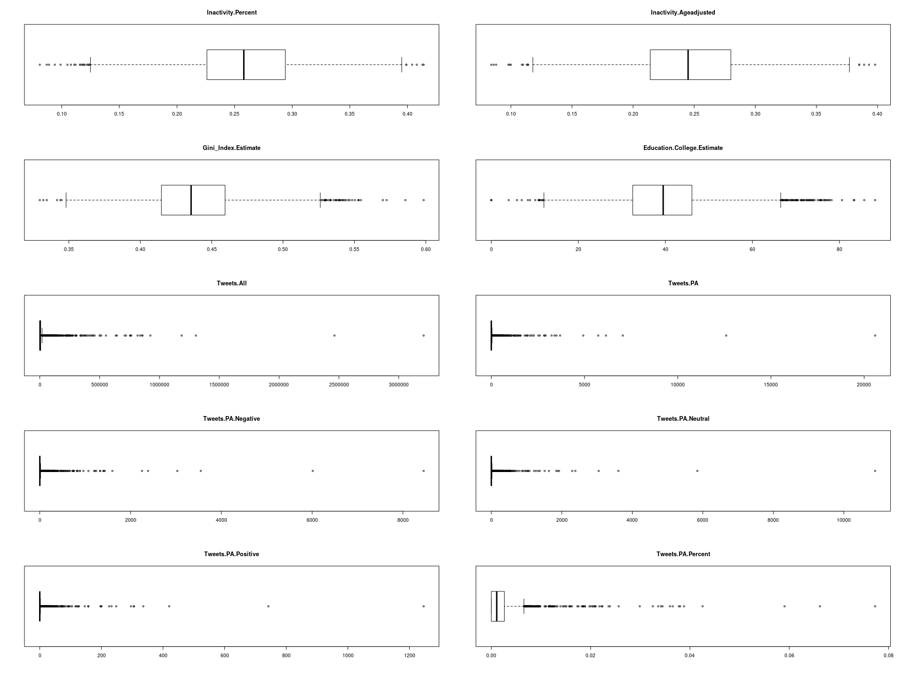<!-- -->

``` r
par(mfrow=c(2, 2))
hist(cleaned_data$Inactivity.Percent)
descdist(cleaned_data$Inactivity.Percent)
```

    ## summary statistics
    ## ------
    ## min:  0.081   max:  0.414 
    ## median:  0.258 
    ## mean:  0.2595341 
    ## estimated sd:  0.05204437 
    ## estimated skewness:  -0.03394601 
    ## estimated kurtosis:  2.905071

``` r
hist(cleaned_data$Inactivity.Ageadjusted)
descdist(cleaned_data$Inactivity.Ageadjusted)
```

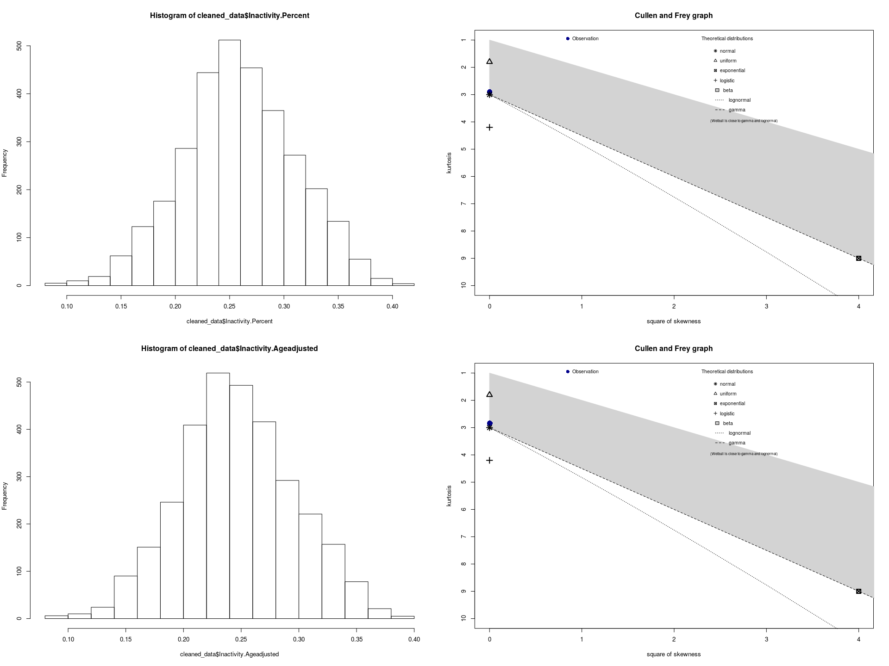<!-- -->

    ## summary statistics
    ## ------
    ## min:  0.084   max:  0.398 
    ## median:  0.245 
    ## mean:  0.2469716 
    ## estimated sd:  0.04962338 
    ## estimated skewness:  0.0558045 
    ## estimated kurtosis:  2.8428

``` r
fit.beta1 <- fitdist(cleaned_data$Inactivity.Percent, "beta")
plot(fit.beta1)
```

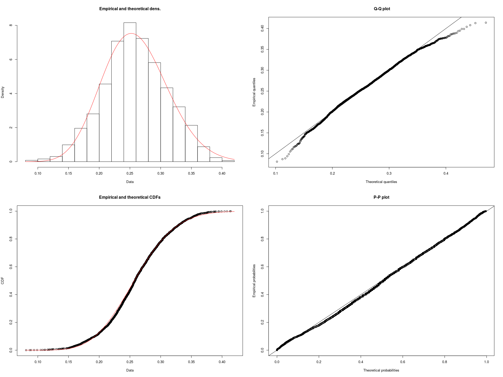<!-- -->

``` r
fit.beta2 <- fitdist(cleaned_data$Inactivity.Ageadjusted, "beta")
plot(fit.beta2)
```

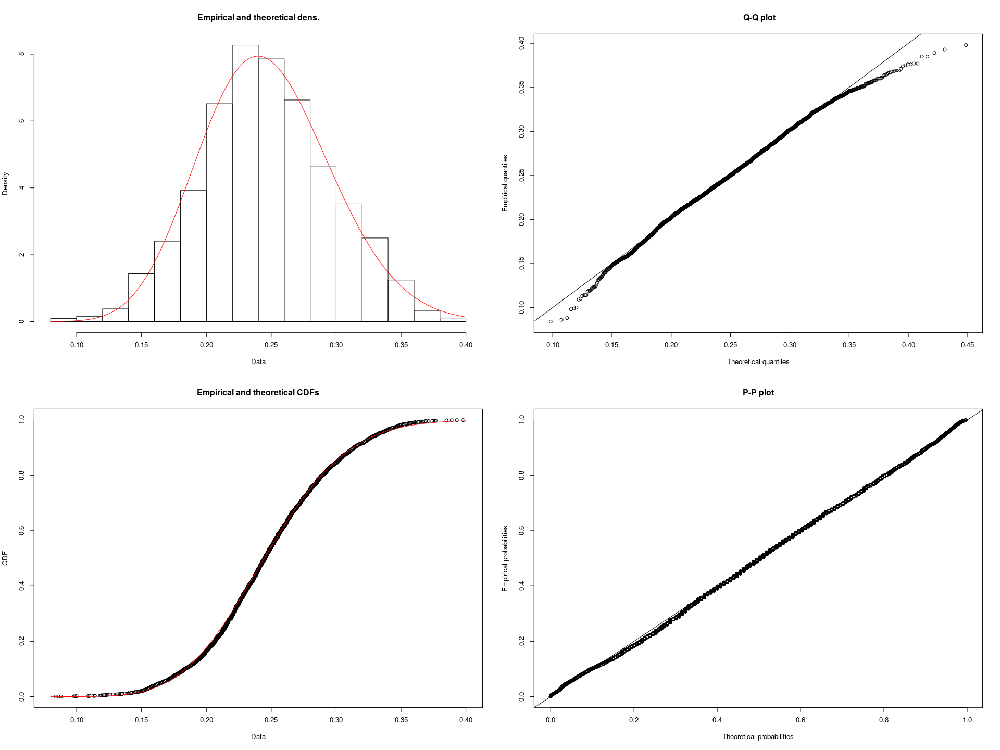<!-- -->

Correlation of variables:

``` r
results <- rcorr(as.matrix(cleaned_data[vars]), type = "pearson")
display(as.data.frame(results$r))
```

|                            | Inactivity.Percent | Inactivity.Ageadjusted | Gini\_Index.Estimate | Education.College.Estimate |  Tweets.All |   Tweets.PA | Tweets.PA.Negative | Tweets.PA.Neutral | Tweets.PA.Positive | Tweets.PA.Percent |
| -------------------------- | -----------------: | ---------------------: | -------------------: | -------------------------: | ----------: | ----------: | -----------------: | ----------------: | -----------------: | ----------------: |
| Inactivity.Percent         |          1.0000000 |              0.9879634 |            0.1358852 |                \-0.2554301 | \-0.1920161 | \-0.1483694 |        \-0.1484844 |       \-0.1467731 |        \-0.1474921 |       \-0.1055739 |
| Inactivity.Ageadjusted     |          0.9879634 |              1.0000000 |            0.1585263 |                \-0.2258347 | \-0.1640103 | \-0.1272114 |        \-0.1270248 |       \-0.1261983 |        \-0.1255797 |       \-0.0890623 |
| Gini\_Index.Estimate       |          0.1358852 |              0.1585263 |            1.0000000 |                  0.0544177 |   0.1855131 |   0.1484244 |          0.1516070 |         0.1440678 |          0.1482038 |         0.0241816 |
| Education.College.Estimate |        \-0.2554301 |            \-0.2258347 |            0.0544177 |                  1.0000000 |   0.0833683 |   0.0571301 |          0.0551888 |         0.0579259 |          0.0594573 |         0.0384326 |
| Tweets.All                 |        \-0.1920161 |            \-0.1640103 |            0.1855131 |                  0.0833683 |   1.0000000 |   0.9591607 |          0.9587656 |         0.9506079 |          0.9469833 |         0.0830065 |
| Tweets.PA                  |        \-0.1483694 |            \-0.1272114 |            0.1484244 |                  0.0571301 |   0.9591607 |   1.0000000 |          0.9941121 |         0.9959811 |          0.9862984 |         0.1051300 |
| Tweets.PA.Negative         |        \-0.1484844 |            \-0.1270248 |            0.1516070 |                  0.0551888 |   0.9587656 |   0.9941121 |          1.0000000 |         0.9806251 |          0.9742527 |         0.1085664 |
| Tweets.PA.Neutral          |        \-0.1467731 |            \-0.1261983 |            0.1440678 |                  0.0579259 |   0.9506079 |   0.9959811 |          0.9806251 |         1.0000000 |          0.9844928 |         0.1017561 |
| Tweets.PA.Positive         |        \-0.1474921 |            \-0.1255797 |            0.1482038 |                  0.0594573 |   0.9469833 |   0.9862984 |          0.9742527 |         0.9844928 |          1.0000000 |         0.0988174 |
| Tweets.PA.Percent          |        \-0.1055739 |            \-0.0890623 |            0.0241816 |                  0.0384326 |   0.0830065 |   0.1051300 |          0.1085664 |         0.1017561 |          0.0988174 |         1.0000000 |

``` r
display(as.data.frame(results$P))
```

|                            | Inactivity.Percent | Inactivity.Ageadjusted | Gini\_Index.Estimate | Education.College.Estimate | Tweets.All | Tweets.PA | Tweets.PA.Negative | Tweets.PA.Neutral | Tweets.PA.Positive | Tweets.PA.Percent |
| -------------------------- | -----------------: | ---------------------: | -------------------: | -------------------------: | ---------: | --------: | -----------------: | ----------------: | -----------------: | ----------------: |
| Inactivity.Percent         |                 NA |                  0e+00 |            0.0000000 |                  0.0000000 |    0.0e+00 | 0.0000000 |          0.0000000 |         0.0000000 |          0.0000000 |         0.0000000 |
| Inactivity.Ageadjusted     |                  0 |                     NA |            0.0000000 |                  0.0000000 |    0.0e+00 | 0.0000000 |          0.0000000 |         0.0000000 |          0.0000000 |         0.0000006 |
| Gini\_Index.Estimate       |                  0 |                  0e+00 |                   NA |                  0.0022929 |    0.0e+00 | 0.0000000 |          0.0000000 |         0.0000000 |          0.0000000 |         0.1756542 |
| Education.College.Estimate |                  0 |                  0e+00 |            0.0022929 |                         NA |    2.9e-06 | 0.0013665 |          0.0019836 |         0.0011691 |          0.0008613 |         0.0313303 |
| Tweets.All                 |                  0 |                  0e+00 |            0.0000000 |                  0.0000029 |         NA | 0.0000000 |          0.0000000 |         0.0000000 |          0.0000000 |         0.0000032 |
| Tweets.PA                  |                  0 |                  0e+00 |            0.0000000 |                  0.0013665 |    0.0e+00 |        NA |          0.0000000 |         0.0000000 |          0.0000000 |         0.0000000 |
| Tweets.PA.Negative         |                  0 |                  0e+00 |            0.0000000 |                  0.0019836 |    0.0e+00 | 0.0000000 |                 NA |         0.0000000 |          0.0000000 |         0.0000000 |
| Tweets.PA.Neutral          |                  0 |                  0e+00 |            0.0000000 |                  0.0011691 |    0.0e+00 | 0.0000000 |          0.0000000 |                NA |          0.0000000 |         0.0000000 |
| Tweets.PA.Positive         |                  0 |                  0e+00 |            0.0000000 |                  0.0008613 |    0.0e+00 | 0.0000000 |          0.0000000 |         0.0000000 |                 NA |         0.0000000 |
| Tweets.PA.Percent          |                  0 |                  6e-07 |            0.1756542 |                  0.0313303 |    3.2e-06 | 0.0000000 |          0.0000000 |         0.0000000 |          0.0000000 |                NA |

Correlation of variables:

``` r
results <- rcorr(as.matrix(cleaned_data[vars]), type = "spearman")
display(as.data.frame(results$r))
```

|                            | Inactivity.Percent | Inactivity.Ageadjusted | Gini\_Index.Estimate | Education.College.Estimate |  Tweets.All |   Tweets.PA | Tweets.PA.Negative | Tweets.PA.Neutral | Tweets.PA.Positive | Tweets.PA.Percent |
| -------------------------- | -----------------: | ---------------------: | -------------------: | -------------------------: | ----------: | ----------: | -----------------: | ----------------: | -----------------: | ----------------: |
| Inactivity.Percent         |          1.0000000 |              0.9852580 |            0.1577457 |                \-0.2582295 | \-0.3449183 | \-0.3756333 |        \-0.3691798 |       \-0.3831594 |        \-0.3251020 |       \-0.2767997 |
| Inactivity.Ageadjusted     |          0.9852580 |              1.0000000 |            0.1778914 |                \-0.2351572 | \-0.2706446 | \-0.3117496 |        \-0.3081947 |       \-0.3220416 |        \-0.2688513 |       \-0.2337110 |
| Gini\_Index.Estimate       |          0.1577457 |              0.1778914 |            1.0000000 |                  0.0423255 |   0.1098778 |   0.1018590 |          0.1055138 |         0.1034011 |          0.1371681 |         0.0481104 |
| Education.College.Estimate |        \-0.2582295 |            \-0.2351572 |            0.0423255 |                  1.0000000 |   0.3300317 |   0.3336489 |          0.3160272 |         0.3329079 |          0.2950627 |         0.2210386 |
| Tweets.All                 |        \-0.3449183 |            \-0.2706446 |            0.1098778 |                  0.3300317 |   1.0000000 |   0.8604490 |          0.8243860 |         0.8293666 |          0.7132757 |         0.5744226 |
| Tweets.PA                  |        \-0.3756333 |            \-0.3117496 |            0.1018590 |                  0.3336489 |   0.8604490 |   1.0000000 |          0.9393843 |         0.9524752 |          0.7808170 |         0.8656386 |
| Tweets.PA.Negative         |        \-0.3691798 |            \-0.3081947 |            0.1055138 |                  0.3160272 |   0.8243860 |   0.9393843 |          1.0000000 |         0.8462829 |          0.7491283 |         0.7828336 |
| Tweets.PA.Neutral          |        \-0.3831594 |            \-0.3220416 |            0.1034011 |                  0.3329079 |   0.8293666 |   0.9524752 |          0.8462829 |         1.0000000 |          0.7542168 |         0.8015422 |
| Tweets.PA.Positive         |        \-0.3251020 |            \-0.2688513 |            0.1371681 |                  0.2950627 |   0.7132757 |   0.7808170 |          0.7491283 |         0.7542168 |          1.0000000 |         0.6014704 |
| Tweets.PA.Percent          |        \-0.2767997 |            \-0.2337110 |            0.0481104 |                  0.2210386 |   0.5744226 |   0.8656386 |          0.7828336 |         0.8015422 |          0.6014704 |         1.0000000 |

``` r
display(as.data.frame(results$P))
```

|                            | Inactivity.Percent | Inactivity.Ageadjusted | Gini\_Index.Estimate | Education.College.Estimate | Tweets.All | Tweets.PA | Tweets.PA.Negative | Tweets.PA.Neutral | Tweets.PA.Positive | Tweets.PA.Percent |
| -------------------------- | -----------------: | ---------------------: | -------------------: | -------------------------: | ---------: | --------: | -----------------: | ----------------: | -----------------: | ----------------: |
| Inactivity.Percent         |                 NA |                      0 |            0.0000000 |                  0.0000000 |          0 |         0 |                  0 |                 0 |                  0 |         0.0000000 |
| Inactivity.Ageadjusted     |                  0 |                     NA |            0.0000000 |                  0.0000000 |          0 |         0 |                  0 |                 0 |                  0 |         0.0000000 |
| Gini\_Index.Estimate       |                  0 |                      0 |                   NA |                  0.0177353 |          0 |         0 |                  0 |                 0 |                  0 |         0.0070277 |
| Education.College.Estimate |                  0 |                      0 |            0.0177353 |                         NA |          0 |         0 |                  0 |                 0 |                  0 |         0.0000000 |
| Tweets.All                 |                  0 |                      0 |            0.0000000 |                  0.0000000 |         NA |         0 |                  0 |                 0 |                  0 |         0.0000000 |
| Tweets.PA                  |                  0 |                      0 |            0.0000000 |                  0.0000000 |          0 |        NA |                  0 |                 0 |                  0 |         0.0000000 |
| Tweets.PA.Negative         |                  0 |                      0 |            0.0000000 |                  0.0000000 |          0 |         0 |                 NA |                 0 |                  0 |         0.0000000 |
| Tweets.PA.Neutral          |                  0 |                      0 |            0.0000000 |                  0.0000000 |          0 |         0 |                  0 |                NA |                  0 |         0.0000000 |
| Tweets.PA.Positive         |                  0 |                      0 |            0.0000000 |                  0.0000000 |          0 |         0 |                  0 |                 0 |                 NA |         0.0000000 |
| Tweets.PA.Percent          |                  0 |                      0 |            0.0070277 |                  0.0000000 |          0 |         0 |                  0 |                 0 |                  0 |                NA |

Comparing models:

``` r
m1 <- betareg(Inactivity.Percent ~ Tweets.PA, data = cleaned_data)
summary(m1)
```

    ## 
    ## Call:
    ## betareg(formula = Inactivity.Percent ~ Tweets.PA, data = cleaned_data)
    ## 
    ## Standardized weighted residuals 2:
    ##     Min      1Q  Median      3Q     Max 
    ## -4.9225 -0.5876  0.0337  0.6858  2.9239 
    ## 
    ## Coefficients (mean model with logit link):
    ##               Estimate Std. Error z value Pr(>|z|)    
    ## (Intercept) -1.0374532  0.0049045 -211.53   <2e-16 ***
    ## Tweets.PA   -0.0001802  0.0000157  -11.48   <2e-16 ***
    ## 
    ## Phi coefficients (precision model with identity link):
    ##       Estimate Std. Error z value Pr(>|z|)    
    ## (phi)   70.345      1.766   39.83   <2e-16 ***
    ## ---
    ## Signif. codes:  0 '***' 0.001 '**' 0.01 '*' 0.05 '.' 0.1 ' ' 1 
    ## 
    ## Type of estimator: ML (maximum likelihood)
    ## Log-likelihood:  4849 on 3 Df
    ## Pseudo R-squared: 0.02364
    ## Number of iterations: 13 (BFGS) + 2 (Fisher scoring)

``` r
m2 <- update(m1, . ~ . + Gini_Index.Estimate)
summary(m2)
```

    ## 
    ## Call:
    ## betareg(formula = Inactivity.Percent ~ Tweets.PA + Gini_Index.Estimate, 
    ##     data = cleaned_data)
    ## 
    ## Standardized weighted residuals 2:
    ##     Min      1Q  Median      3Q     Max 
    ## -4.9971 -0.5892  0.0541  0.6873  2.9464 
    ## 
    ## Coefficients (mean model with logit link):
    ##                       Estimate Std. Error z value Pr(>|z|)    
    ## (Intercept)         -1.590e+00  6.063e-02 -26.224   <2e-16 ***
    ## Tweets.PA           -2.192e-04  1.635e-05 -13.405   <2e-16 ***
    ## Gini_Index.Estimate  1.266e+00  1.382e-01   9.164   <2e-16 ***
    ## 
    ## Phi coefficients (precision model with identity link):
    ##       Estimate Std. Error z value Pr(>|z|)    
    ## (phi)   72.278      1.815   39.82   <2e-16 ***
    ## ---
    ## Signif. codes:  0 '***' 0.001 '**' 0.01 '*' 0.05 '.' 0.1 ' ' 1 
    ## 
    ## Type of estimator: ML (maximum likelihood)
    ## Log-likelihood:  4890 on 4 Df
    ## Pseudo R-squared: 0.03821
    ## Number of iterations: 16 (BFGS) + 3 (Fisher scoring)

``` r
m3 <- update(m2, . ~ . + Education.College.Estimate)
summary(m3)
```

    ## 
    ## Call:
    ## betareg(formula = Inactivity.Percent ~ Tweets.PA + Gini_Index.Estimate + 
    ##     Education.College.Estimate, data = cleaned_data)
    ## 
    ## Standardized weighted residuals 2:
    ##     Min      1Q  Median      3Q     Max 
    ## -5.3629 -0.6073  0.0649  0.6785  3.0023 
    ## 
    ## Coefficients (mean model with logit link):
    ##                              Estimate Std. Error z value Pr(>|z|)    
    ## (Intercept)                -1.393e+00  6.028e-02  -23.11   <2e-16 ***
    ## Tweets.PA                  -1.778e-04  1.492e-05  -11.92   <2e-16 ***
    ## Gini_Index.Estimate         1.344e+00  1.338e-01   10.04   <2e-16 ***
    ## Education.College.Estimate -5.881e-03  4.033e-04  -14.58   <2e-16 ***
    ## 
    ## Phi coefficients (precision model with identity link):
    ##       Estimate Std. Error z value Pr(>|z|)    
    ## (phi)    77.23       1.94   39.81   <2e-16 ***
    ## ---
    ## Signif. codes:  0 '***' 0.001 '**' 0.01 '*' 0.05 '.' 0.1 ' ' 1 
    ## 
    ## Type of estimator: ML (maximum likelihood)
    ## Log-likelihood:  4996 on 5 Df
    ## Pseudo R-squared: 0.09488
    ## Number of iterations: 23 (BFGS) + 2 (Fisher scoring)

``` r
m4 <- update(m3, . ~ . + Tweets.PA.Positive - Tweets.PA)
summary(m4)
```

    ## 
    ## Call:
    ## betareg(formula = Inactivity.Percent ~ Gini_Index.Estimate + Education.College.Estimate + 
    ##     Tweets.PA.Positive, data = cleaned_data)
    ## 
    ## Standardized weighted residuals 2:
    ##     Min      1Q  Median      3Q     Max 
    ## -5.3955 -0.6070  0.0634  0.6802  2.8394 
    ## 
    ## Coefficients (mean model with logit link):
    ##                              Estimate Std. Error z value Pr(>|z|)    
    ## (Intercept)                -1.3860060  0.0603314 -22.973   <2e-16 ***
    ## Gini_Index.Estimate         1.3284493  0.1339634   9.917   <2e-16 ***
    ## Education.College.Estimate -0.0059049  0.0004039 -14.620   <2e-16 ***
    ## Tweets.PA.Positive         -0.0026330  0.0002327 -11.314   <2e-16 ***
    ## 
    ## Phi coefficients (precision model with identity link):
    ##       Estimate Std. Error z value Pr(>|z|)    
    ## (phi)   77.028      1.935   39.81   <2e-16 ***
    ## ---
    ## Signif. codes:  0 '***' 0.001 '**' 0.01 '*' 0.05 '.' 0.1 ' ' 1 
    ## 
    ## Type of estimator: ML (maximum likelihood)
    ## Log-likelihood:  4992 on 5 Df
    ## Pseudo R-squared: 0.09786
    ## Number of iterations: 11 (BFGS) + 2 (Fisher scoring)

``` r
m5 <- update(m3, . ~ . + Tweets.PA.Negative - Tweets.PA)
summary(m5)
```

    ## 
    ## Call:
    ## betareg(formula = Inactivity.Percent ~ Gini_Index.Estimate + Education.College.Estimate + 
    ##     Tweets.PA.Negative, data = cleaned_data)
    ## 
    ## Standardized weighted residuals 2:
    ##     Min      1Q  Median      3Q     Max 
    ## -5.4113 -0.6057  0.0574  0.6830  3.0029 
    ## 
    ## Coefficients (mean model with logit link):
    ##                              Estimate Std. Error z value Pr(>|z|)    
    ## (Intercept)                -1.386e+00  6.032e-02 -22.978   <2e-16 ***
    ## Gini_Index.Estimate         1.329e+00  1.339e-01   9.924   <2e-16 ***
    ## Education.College.Estimate -5.926e-03  4.036e-04 -14.681   <2e-16 ***
    ## Tweets.PA.Negative         -3.670e-04  3.222e-05 -11.391   <2e-16 ***
    ## 
    ## Phi coefficients (precision model with identity link):
    ##       Estimate Std. Error z value Pr(>|z|)    
    ## (phi)   77.066      1.936   39.81   <2e-16 ***
    ## ---
    ## Signif. codes:  0 '***' 0.001 '**' 0.01 '*' 0.05 '.' 0.1 ' ' 1 
    ## 
    ## Type of estimator: ML (maximum likelihood)
    ## Log-likelihood:  4993 on 5 Df
    ## Pseudo R-squared: 0.09886
    ## Number of iterations: 12 (BFGS) + 2 (Fisher scoring)

``` r
m6 <- update(m3, . ~ . + Tweets.PA.Positive + Tweets.PA.Negative + Tweets.PA.Neutral - Tweets.PA)
summary(m6)
```

    ## 
    ## Call:
    ## betareg(formula = Inactivity.Percent ~ Gini_Index.Estimate + Education.College.Estimate + 
    ##     Tweets.PA.Positive + Tweets.PA.Negative + Tweets.PA.Neutral, 
    ##     data = cleaned_data)
    ## 
    ## Standardized weighted residuals 2:
    ##     Min      1Q  Median      3Q     Max 
    ## -5.2780 -0.6075  0.0627  0.6786  3.0083 
    ## 
    ## Coefficients (mean model with logit link):
    ##                              Estimate Std. Error z value Pr(>|z|)    
    ## (Intercept)                -1.398e+00  6.025e-02 -23.205  < 2e-16 ***
    ## Gini_Index.Estimate         1.353e+00  1.338e-01  10.114  < 2e-16 ***
    ## Education.College.Estimate -5.843e-03  4.032e-04 -14.491  < 2e-16 ***
    ## Tweets.PA.Positive          2.639e-04  9.037e-04   0.292  0.77027    
    ## Tweets.PA.Negative          9.551e-05  1.311e-04   0.728  0.46647    
    ## Tweets.PA.Neutral          -5.006e-04  1.526e-04  -3.281  0.00103 ** 
    ## 
    ## Phi coefficients (precision model with identity link):
    ##       Estimate Std. Error z value Pr(>|z|)    
    ## (phi)   77.349      1.943   39.81   <2e-16 ***
    ## ---
    ## Signif. codes:  0 '***' 0.001 '**' 0.01 '*' 0.05 '.' 0.1 ' ' 1 
    ## 
    ## Type of estimator: ML (maximum likelihood)
    ## Log-likelihood:  4997 on 7 Df
    ## Pseudo R-squared: 0.08902
    ## Number of iterations: 15 (BFGS) + 2 (Fisher scoring)

``` r
compareModels <- function(...) {
  res = AIC(...)
  rownames(res) <- paste('m', 1:nrow(res), sep = '')
  res$BIC <- BIC(...)$BIC
  display(res)
}
compareModels(m1, m2, m3, m4, m5, m6)
```

|    | df |        AIC |        BIC |
| -- | -: | ---------: | ---------: |
| m1 |  3 | \-9691.974 | \-9673.820 |
| m2 |  4 | \-9772.825 | \-9748.620 |
| m3 |  5 | \-9981.128 | \-9950.871 |
| m4 |  5 | \-9973.760 | \-9943.503 |
| m5 |  5 | \-9975.216 | \-9944.960 |
| m6 |  7 | \-9980.644 | \-9938.285 |

``` r
m1.aa <- betareg(Inactivity.Ageadjusted ~ Tweets.PA, data = cleaned_data)
summary(m1.aa)
```

    ## 
    ## Call:
    ## betareg(formula = Inactivity.Ageadjusted ~ Tweets.PA, data = cleaned_data)
    ## 
    ## Standardized weighted residuals 2:
    ##     Min      1Q  Median      3Q     Max 
    ## -4.6085 -0.6115  0.0213  0.6871  3.1775 
    ## 
    ## Coefficients (mean model with logit link):
    ##               Estimate Std. Error z value Pr(>|z|)    
    ## (Intercept) -1.107e+00  4.831e-03 -229.19   <2e-16 ***
    ## Tweets.PA   -1.201e-04  1.357e-05   -8.85   <2e-16 ***
    ## 
    ## Phi coefficients (precision model with identity link):
    ##       Estimate Std. Error z value Pr(>|z|)    
    ## (phi)   74.643      1.875   39.81   <2e-16 ***
    ## ---
    ## Signif. codes:  0 '***' 0.001 '**' 0.01 '*' 0.05 '.' 0.1 ' ' 1 
    ## 
    ## Type of estimator: ML (maximum likelihood)
    ## Log-likelihood:  4994 on 3 Df
    ## Pseudo R-squared: 0.01711
    ## Number of iterations: 15 (BFGS) + 2 (Fisher scoring)

``` r
m2.aa <- update(m1.aa, . ~ . + Gini_Index.Estimate)
summary(m2.aa)
```

    ## 
    ## Call:
    ## betareg(formula = Inactivity.Ageadjusted ~ Tweets.PA + Gini_Index.Estimate, 
    ##     data = cleaned_data)
    ## 
    ## Standardized weighted residuals 2:
    ##     Min      1Q  Median      3Q     Max 
    ## -5.0694 -0.6020  0.0442  0.6993  2.9077 
    ## 
    ## Coefficients (mean model with logit link):
    ##                       Estimate Std. Error z value Pr(>|z|)    
    ## (Intercept)         -1.698e+00  5.967e-02 -28.464   <2e-16 ***
    ## Tweets.PA           -1.570e-04  1.445e-05 -10.869   <2e-16 ***
    ## Gini_Index.Estimate  1.355e+00  1.360e-01   9.964   <2e-16 ***
    ## 
    ## Phi coefficients (precision model with identity link):
    ##       Estimate Std. Error z value Pr(>|z|)    
    ## (phi)   77.034      1.935    39.8   <2e-16 ***
    ## ---
    ## Signif. codes:  0 '***' 0.001 '**' 0.01 '*' 0.05 '.' 0.1 ' ' 1 
    ## 
    ## Type of estimator: ML (maximum likelihood)
    ## Log-likelihood:  5043 on 4 Df
    ## Pseudo R-squared: 0.03842
    ## Number of iterations: 19 (BFGS) + 2 (Fisher scoring)

``` r
m3.aa <- update(m2.aa, . ~ . + Education.College.Estimate)
summary(m3.aa)
```

    ## 
    ## Call:
    ## betareg(formula = Inactivity.Ageadjusted ~ Tweets.PA + Gini_Index.Estimate + 
    ##     Education.College.Estimate, data = cleaned_data)
    ## 
    ## Standardized weighted residuals 2:
    ##     Min      1Q  Median      3Q     Max 
    ## -5.3716 -0.6233  0.0686  0.6849  3.2591 
    ## 
    ## Coefficients (mean model with logit link):
    ##                              Estimate Std. Error z value Pr(>|z|)    
    ## (Intercept)                -1.525e+00  5.969e-02 -25.543   <2e-16 ***
    ## Tweets.PA                  -1.286e-04  1.321e-05  -9.732   <2e-16 ***
    ## Gini_Index.Estimate         1.421e+00  1.325e-01  10.720   <2e-16 ***
    ## Education.College.Estimate -5.155e-03  3.993e-04 -12.911   <2e-16 ***
    ## 
    ## Phi coefficients (precision model with identity link):
    ##       Estimate Std. Error z value Pr(>|z|)    
    ## (phi)    81.19       2.04   39.79   <2e-16 ***
    ## ---
    ## Signif. codes:  0 '***' 0.001 '**' 0.01 '*' 0.05 '.' 0.1 ' ' 1 
    ## 
    ## Type of estimator: ML (maximum likelihood)
    ## Log-likelihood:  5126 on 5 Df
    ## Pseudo R-squared: 0.08792
    ## Number of iterations: 20 (BFGS) + 2 (Fisher scoring)

``` r
m4.aa <- update(m3.aa, . ~ . + Tweets.PA.Positive - Tweets.PA)
summary(m4.aa)
```

    ## 
    ## Call:
    ## betareg(formula = Inactivity.Ageadjusted ~ Gini_Index.Estimate + 
    ##     Education.College.Estimate + Tweets.PA.Positive, data = cleaned_data)
    ## 
    ## Standardized weighted residuals 2:
    ##     Min      1Q  Median      3Q     Max 
    ## -5.3936 -0.6245  0.0698  0.6849  3.3114 
    ## 
    ## Coefficients (mean model with logit link):
    ##                              Estimate Std. Error z value Pr(>|z|)    
    ## (Intercept)                -1.5190250  0.0597260 -25.433   <2e-16 ***
    ## Gini_Index.Estimate         1.4082724  0.1326076  10.620   <2e-16 ***
    ## Education.College.Estimate -0.0051691  0.0003997 -12.932   <2e-16 ***
    ## Tweets.PA.Positive         -0.0019314  0.0002080  -9.287   <2e-16 ***
    ## 
    ## Phi coefficients (precision model with identity link):
    ##       Estimate Std. Error z value Pr(>|z|)    
    ## (phi)   81.035      2.036   39.79   <2e-16 ***
    ## ---
    ## Signif. codes:  0 '***' 0.001 '**' 0.01 '*' 0.05 '.' 0.1 ' ' 1 
    ## 
    ## Type of estimator: ML (maximum likelihood)
    ## Log-likelihood:  5123 on 5 Df
    ## Pseudo R-squared: 0.08908
    ## Number of iterations: 12 (BFGS) + 3 (Fisher scoring)

``` r
m5.aa <- update(m3.aa, . ~ . + Tweets.PA.Negative - Tweets.PA)
summary(m5.aa)
```

    ## 
    ## Call:
    ## betareg(formula = Inactivity.Ageadjusted ~ Gini_Index.Estimate + 
    ##     Education.College.Estimate + Tweets.PA.Negative, data = cleaned_data)
    ## 
    ## Standardized weighted residuals 2:
    ##     Min      1Q  Median      3Q     Max 
    ## -5.4079 -0.6284  0.0653  0.6867  3.2839 
    ## 
    ## Coefficients (mean model with logit link):
    ##                              Estimate Std. Error z value Pr(>|z|)    
    ## (Intercept)                -1.519e+00  5.970e-02 -25.447   <2e-16 ***
    ## Gini_Index.Estimate         1.410e+00  1.326e-01  10.633   <2e-16 ***
    ## Education.College.Estimate -5.188e-03  3.994e-04 -12.988   <2e-16 ***
    ## Tweets.PA.Negative         -2.662e-04  2.844e-05  -9.363   <2e-16 ***
    ## 
    ## Phi coefficients (precision model with identity link):
    ##       Estimate Std. Error z value Pr(>|z|)    
    ## (phi)   81.092      2.038   39.79   <2e-16 ***
    ## ---
    ## Signif. codes:  0 '***' 0.001 '**' 0.01 '*' 0.05 '.' 0.1 ' ' 1 
    ## 
    ## Type of estimator: ML (maximum likelihood)
    ## Log-likelihood:  5124 on 5 Df
    ## Pseudo R-squared: 0.09044
    ## Number of iterations: 20 (BFGS) + 2 (Fisher scoring)

``` r
m6.aa <- update(m3.aa, . ~ . + Tweets.PA.Positive + Tweets.PA.Negative + Tweets.PA.Neutral - Tweets.PA)
summary(m6.aa)
```

    ## 
    ## Call:
    ## betareg(formula = Inactivity.Ageadjusted ~ Gini_Index.Estimate + 
    ##     Education.College.Estimate + Tweets.PA.Positive + Tweets.PA.Negative + 
    ##     Tweets.PA.Neutral, data = cleaned_data)
    ## 
    ## Standardized weighted residuals 2:
    ##     Min      1Q  Median      3Q     Max 
    ## -5.3047 -0.6208  0.0651  0.6862  3.1037 
    ## 
    ## Coefficients (mean model with logit link):
    ##                              Estimate Std. Error z value Pr(>|z|)    
    ## (Intercept)                -1.529e+00  5.969e-02 -25.617  < 2e-16 ***
    ## Gini_Index.Estimate         1.429e+00  1.325e-01  10.783  < 2e-16 ***
    ## Education.College.Estimate -5.124e-03  3.993e-04 -12.832  < 2e-16 ***
    ## Tweets.PA.Positive          4.193e-04  8.703e-04   0.482  0.62994    
    ## Tweets.PA.Negative          5.362e-05  1.238e-04   0.433  0.66500    
    ## Tweets.PA.Neutral          -3.801e-04  1.434e-04  -2.650  0.00805 ** 
    ## 
    ## Phi coefficients (precision model with identity link):
    ##       Estimate Std. Error z value Pr(>|z|)    
    ## (phi)   81.267      2.042   39.79   <2e-16 ***
    ## ---
    ## Signif. codes:  0 '***' 0.001 '**' 0.01 '*' 0.05 '.' 0.1 ' ' 1 
    ## 
    ## Type of estimator: ML (maximum likelihood)
    ## Log-likelihood:  5127 on 7 Df
    ## Pseudo R-squared: 0.08338
    ## Number of iterations: 16 (BFGS) + 2 (Fisher scoring)

``` r
compareModels(m1.aa, m2.aa, m3.aa, m4.aa, m5.aa, m6.aa)
```

|    | df |        AIC |         BIC |
| -- | -: | ---------: | ----------: |
| m1 |  3 |  \-9982.87 |  \-9964.716 |
| m2 |  4 | \-10078.19 | \-10053.985 |
| m3 |  5 | \-10242.09 | \-10211.836 |
| m4 |  5 | \-10236.51 | \-10206.250 |
| m5 |  5 | \-10238.74 | \-10208.479 |
| m6 |  7 | \-10240.21 | \-10197.855 |

``` r
par(mfrow=c(2, 1))
scatter.smooth(cleaned_data$Tweets.PA, cleaned_data$Inactivity.Percent)
scatter.smooth(log1p(cleaned_data$Tweets.PA), cleaned_data$Inactivity.Percent)
```

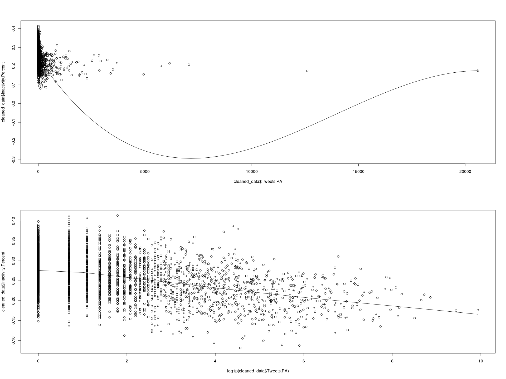<!-- -->

``` r
m.test <- m3
lrtest(m.test)
```

    ## Likelihood ratio test
    ## 
    ## Model 1: Inactivity.Percent ~ Tweets.PA + Gini_Index.Estimate + Education.College.Estimate
    ## Model 2: Inactivity.Percent ~ 1
    ##   #Df LogLik Df  Chisq Pr(>Chisq)    
    ## 1   5 4995.6                         
    ## 2   2 4795.1 -3 400.86  < 2.2e-16 ***
    ## ---
    ## Signif. codes:  0 '***' 0.001 '**' 0.01 '*' 0.05 '.' 0.1 ' ' 1

``` r
# gleverage(m4.aa)
m.test.rmse <- sqrt(mean(m.test$residuals^2))
print(m.test.rmse)
```

    ## [1] 0.04857339

``` r
plot(m.test)
```

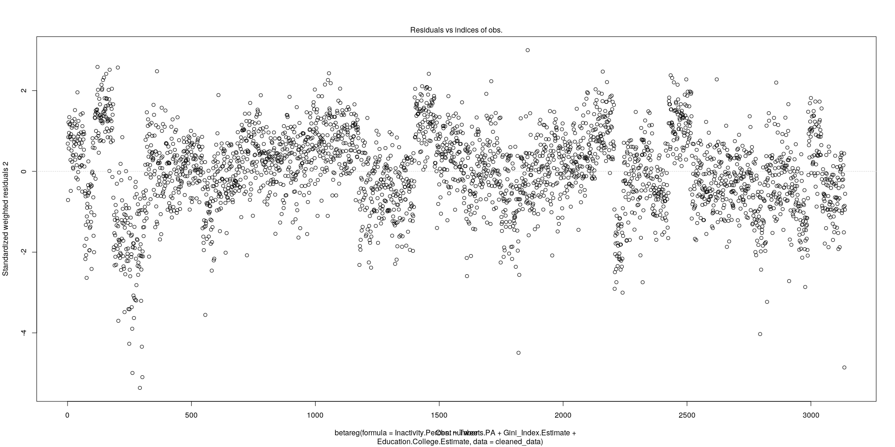<!-- -->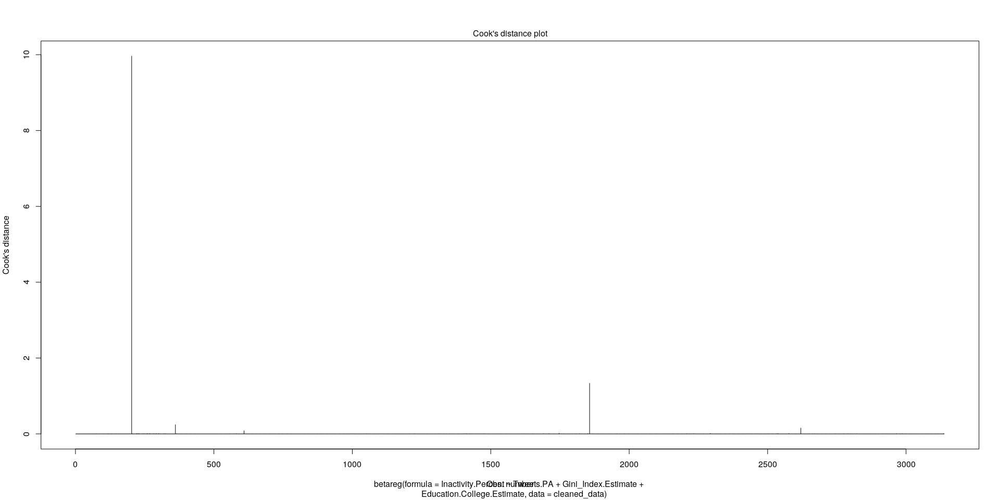<!-- -->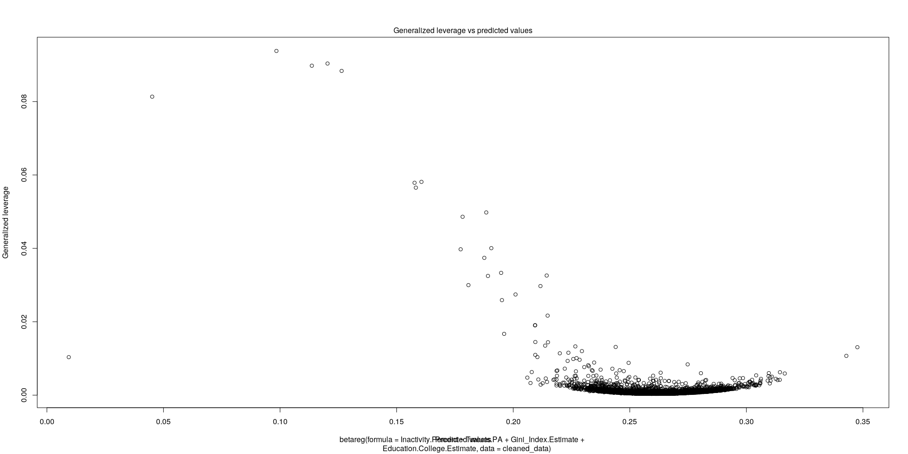<!-- -->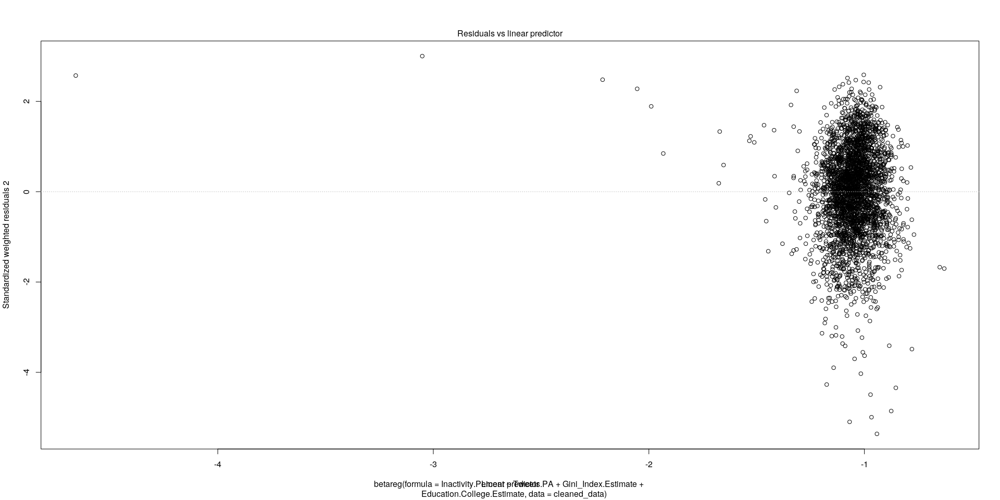<!-- -->

``` r
library(classInt)
```

    ## Loading required package: spData

    ## To access larger datasets in this package, install the spDataLarge
    ## package with: `install.packages('spDataLarge',
    ## repos='https://nowosad.github.io/drat/', type='source'))`

``` r
intervals <- classIntervals(cleaned_data$Inactivity.Ageadjusted, n = 5, style = 'jenks')
```

``` r
library(scales)
```

    ## 
    ## Attaching package: 'scales'

    ## The following object is masked from 'package:purrr':
    ## 
    ##     discard

    ## The following object is masked from 'package:readr':
    ## 
    ##     col_factor

``` r
library(usmap)
library(viridis)
```

    ## Loading required package: viridisLite

    ## 
    ## Attaching package: 'viridis'

    ## The following object is masked from 'package:scales':
    ## 
    ##     viridis_pal

``` r
cleaned_data$quants <-  cut(cleaned_data$Inactivity.Ageadjusted, intervals$brks, include.lowest = T)

cleaned_data$predicted <- predict(m3, type = 'response')
cleaned_data$pred_quants <-  cut(cleaned_data$predicted, intervals$brks, include.lowest = T)

counties_map <- us_map(regions = 'counties')
counties_map$fips <- as.numeric(counties_map$fips)
plot_data <- inner_join(counties_map, cleaned_data, by = c('fips'= 'FIPS'))

states <- us_map(region = 'states')

scale_dir <- 1
ggplot(plot_data, aes(long, lat, group = group)) + 
  geom_polygon(aes(fill = Inactivity.Ageadjusted), colour = alpha('white', 1 / 2), size = 0.2) +
  geom_polygon(data = states, colour = 'white', fill = NA) +
  coord_equal() +
  theme_minimal() +
  theme(axis.line = element_blank(), axis.text = element_blank(),
        axis.ticks = element_blank(), axis.title = element_blank(),
        legend.position = 'bottom') +
  scale_fill_distiller(
    #option = 'magma',
    direction = scale_dir,
    labels = percent,
                     guide = guide_colourbar(
                       direction = 'horizontal',
                       title = 'Age-adjusted physical inactivity level',
                       title.position = 'top',
                       title.hjust = .5,
                       barheight = unit(3, units = 'mm'),
                       barwidth = unit(100, units = 'mm')
                     ))
```

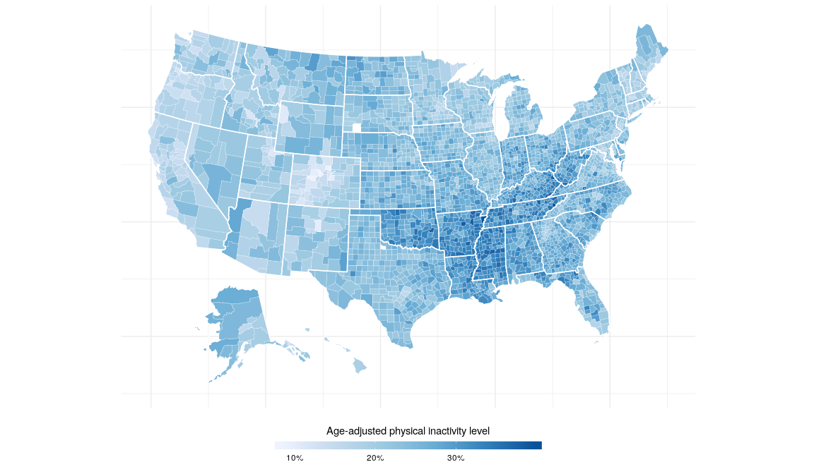<!-- -->

``` r
ggplot(plot_data, aes(long, lat, group = group)) + 
  geom_polygon(aes(fill = Tweets.PA.Percent), colour = alpha('white', 1 / 2), size = 0.2) +
  geom_polygon(data = states, colour = 'white', fill = NA) +
  coord_equal() +
  theme_minimal() +
  theme(axis.line = element_blank(), axis.text = element_blank(),
        axis.ticks = element_blank(), axis.title = element_blank(),
        legend.position = 'bottom') +
  scale_fill_distiller(
    #option = 'magma',
    direction = -scale_dir,
    labels = percent,
    trans = 'sqrt',
                     guide = guide_colourbar(
                       direction = 'horizontal',
                       title = 'Percentage of physical activity related tweets',
                       title.position = 'top',
                       title.hjust = .5,
                       barheight = unit(3, units = 'mm'),
                       barwidth = unit(100, units = 'mm')
                     ))
```

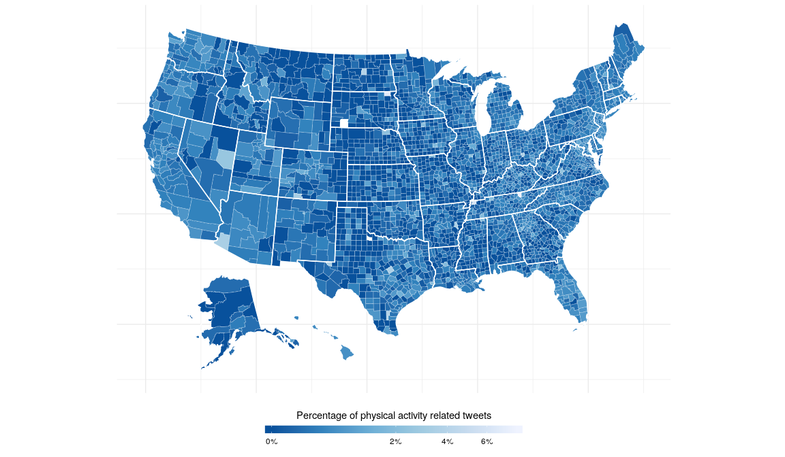<!-- -->

``` r
ggplot(plot_data, aes(long, lat, group = group)) + 
  geom_polygon(aes(fill = Gini_Index.Estimate), colour = alpha('white', 1 / 2), size = 0.2) +
  geom_polygon(data = states, colour = 'white', fill = NA) +
  coord_equal() +
  theme_minimal() +
  theme(axis.line = element_blank(), axis.text = element_blank(),
        axis.ticks = element_blank(), axis.title = element_blank(),
        legend.position = 'bottom') +
  scale_fill_distiller(
      #option = 'magma',
    direction = scale_dir,
      guide = guide_colourbar(
        direction = 'horizontal',
        title = 'Gini Index of income inequality',
        title.position = 'top',
        title.hjust = .5,
        barheight = unit(3, units = 'mm'),
        barwidth = unit(100, units = 'mm')
      ))
```

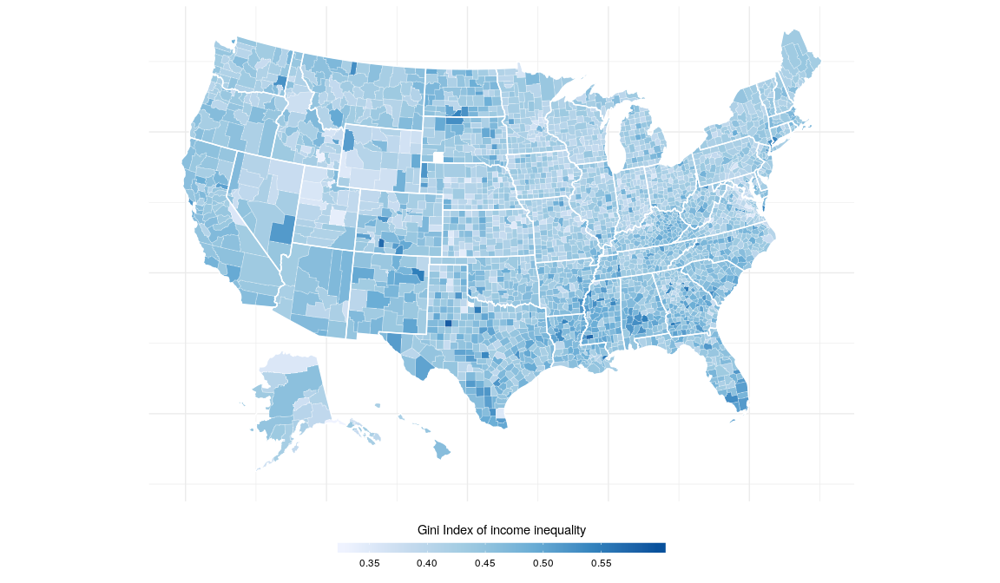<!-- -->

``` r
ggplot(plot_data, aes(long, lat, group = group)) + 
  geom_polygon(aes(fill = Education.College.Estimate / 100), colour = alpha('white', 1 / 2), size = 0.2) +
  geom_polygon(data = states, colour = 'white', fill = NA) +
  coord_equal() +
  theme_minimal() +
  theme(axis.line = element_blank(), axis.text = element_blank(),
        axis.ticks = element_blank(), axis.title = element_blank(),
        legend.position = 'bottom') +
  scale_fill_distiller(
    #option = 'magma',
    labels = percent,
    direction = scale_dir,
                     guide = guide_colourbar(
                       direction = 'horizontal',
                       title = 'Percentage of college educated population',
                       title.position = 'top',
                       title.hjust = .5,
                       barheight = unit(3, units = 'mm'),
                       barwidth = unit(100, units = 'mm')
                     ))
```

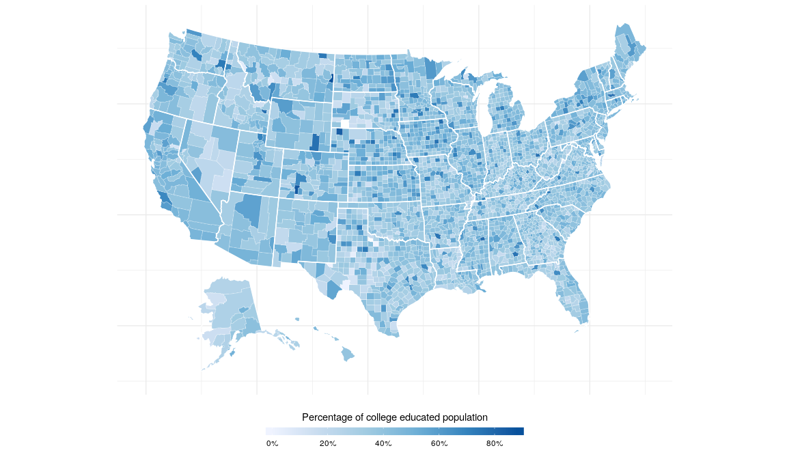<!-- -->

``` r
ggplot(plot_data, aes(long, lat, group = group)) + 
  geom_polygon(aes(fill = quants), colour = alpha('white', 1 / 2), size = 0.2) +
  geom_polygon(data = states, colour = 'white', fill = NA) +
  coord_equal() +
  theme_minimal() +
  theme(axis.line = element_blank(), axis.text = element_blank(),
        axis.ticks = element_blank(), axis.title = element_blank(),
        #legend.position = 'bottom',
        plot.background = element_rect(fill = "#f5f5f2", color = NA), 
        panel.background = element_rect(fill = "#f5f5f2", color = NA), 
        legend.background = element_rect(fill = "#f5f5f2", color = NA),
        panel.border = element_blank()
        ) +
  scale_fill_viridis(
    option = 'magma',
    name = 'Age-adjusted physical inactivity',
    discrete = T,
    alpha = .80
  )
```

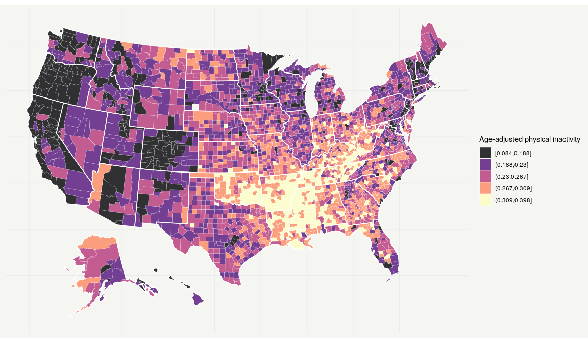<!-- -->

``` r
ggplot(plot_data, aes(long, lat, group = group)) + 
  geom_polygon(aes(fill = pred_quants), colour = alpha('white', 1 / 2), size = 0.2) +
  geom_polygon(data = states, colour = 'white', fill = NA) +
  coord_equal() +
  theme_minimal() +
  theme(axis.line = element_blank(), axis.text = element_blank(),
        axis.ticks = element_blank(), axis.title = element_blank(),
        #legend.position = 'bottom',
        plot.background = element_rect(fill = "#f5f5f2", color = NA), 
        panel.background = element_rect(fill = "#f5f5f2", color = NA), 
        legend.background = element_rect(fill = "#f5f5f2", color = NA),
        panel.border = element_blank()
        ) +
  scale_fill_viridis(
    option = 'magma',
    name = 'Age-adjusted physical inactivity',
    discrete = T,
    alpha = .80
  )
```

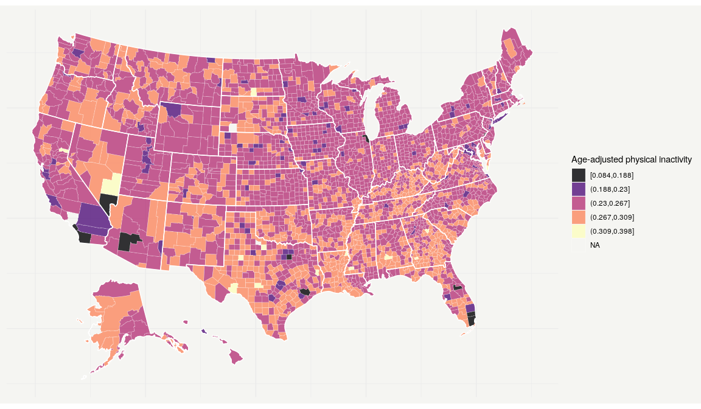<!-- -->
