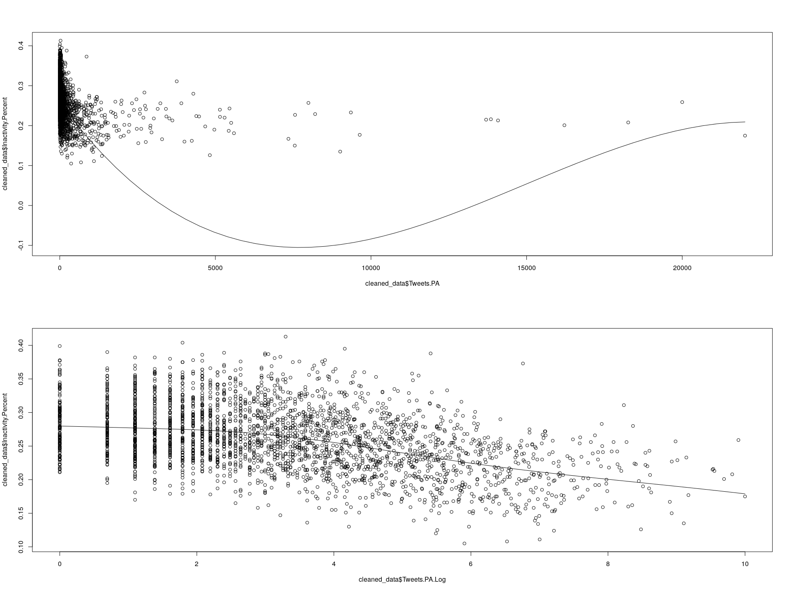

Twitter and Physical Activity
================

``` r
library(foreign)
library(betareg)
library(ggplot2)
library(fitdistrplus)
library(logspline)
library(Hmisc)
library(knitr)
```

The compiled dataset contains a subset of US counties (names and FIPS codes).

The associated data for each county is as follows:

-   All\_Tweets: the total collected number of tweets from that county
-   PA\_Tweets: the number of tweets identified as physical activity-related
-   Inactivity\_Cases: TODO
-   Inactivity\_Percent: TODO
-   Inactivity\_Percent\_AgeAdjusted: TODO
-   Gini\_Index: TODO
-   Gini\_Index\_MoE: the margin of error of the Gini index estimate

``` r
# This helper will render legible tables in both RStudio and the generated markdown.
display <- function(x) {
  if (interactive()) (x)
  else kable(x)
}

all_data <- read.csv("all_data.csv")
display(head(all_data))
```

|   FIPS|  Tweets.PA|  Tweets.All|  Inactivity.Cases|  Inactivity.Percent|  Inactivity.Ageadjusted| Geography                                  |  Gini\_Index.Estimate|  Gini\_Index.Margin\_of\_Error|
|------:|----------:|-----------:|-----------------:|-------------------:|-----------------------:|:-------------------------------------------|---------------------:|------------------------------:|
|  10001|        244|       18025|             34487|                27.8|                    27.1| Kent County, Delaware                      |                0.4201|                         0.0088|
|  10003|        805|       63204|             91924|                22.4|                    22.0| New Castle County, Delaware                |                0.4545|                         0.0065|
|  10005|        493|       23623|             41310|                25.5|                    24.0| Sussex County, Delaware                    |                0.4384|                         0.0082|
|  11001|       7347|      596256|             86126|                16.7|                    17.4| District of Columbia, District of Columbia |                0.5334|                         0.0047|
|  12001|        539|       33272|             37343|                19.2|                    19.4| Alachua County, Florida                    |                0.5161|                         0.0095|
|  12003|          4|         798|              7024|                35.7|                    35.1| Baker County, Florida                      |                0.4300|                         0.0334|

Not all counties in the dataset have tweet or physical activity data available, so we must filter those out. We must also normalize the percentages (expressed here as a number /100) to values we can use for a beta distribution (i.e. 0-1)

``` r
# Remove rows with missing values
cleaned_data <- na.omit(all_data)
cleaned_data$Tweets.PA.Log <- log1p(cleaned_data$Tweets.PA)
cleaned_data$Tweets.PA.Percent <- cleaned_data$Tweets.PA / cleaned_data$Tweets.All
cleaned_data$Inactivity.Percent <- cleaned_data$Inactivity.Percent / 100
cleaned_data$Inactivity.Ageadjusted <- cleaned_data$Inactivity.Ageadjusted / 100

vars <- c(
  "Gini_Index.Estimate",
  "Tweets.PA",
  "Tweets.PA.Percent",
  "Tweets.PA.Log",
  "Tweets.All",
  "Inactivity.Cases",
  "Inactivity.Percent",
  "Inactivity.Ageadjusted"
)
display(as.data.frame(do.call(cbind, lapply(cleaned_data[vars], summary))))
```

|         |  Gini\_Index.Estimate|   Tweets.PA|  Tweets.PA.Percent|  Tweets.PA.Log|  Tweets.All|  Inactivity.Cases|  Inactivity.Percent|  Inactivity.Ageadjusted|
|---------|---------------------:|-----------:|------------------:|--------------:|-----------:|-----------------:|-------------------:|-----------------------:|
| Min.    |             0.3209000|      0.0000|          0.0000000|       0.000000|        12.0|             16.00|           0.1050000|               0.1000000|
| 1st Qu. |             0.4196000|      5.0000|          0.0081833|       1.791759|       413.0|           2198.00|           0.2290000|               0.2170000|
| Median  |             0.4410000|     19.0000|          0.0143158|       2.995732|      1379.0|           5276.00|           0.2590000|               0.2450000|
| Mean    |             0.4436276|    231.0747|          0.0222560|       3.232902|     13523.6|          15370.11|           0.2610014|               0.2481051|
| 3rd Qu. |             0.4638000|     90.0000|          0.0232490|       4.510859|      5591.0|          12238.00|           0.2920000|               0.2780000|
| Max.    |             0.6265000|  22017.0000|          6.0667816|       9.999616|   1244823.0|         787298.00|           0.4130000|               0.3930000|

The count data are heavily right-skewed with notable outliers. This is partly attributable to the disparity in population between counties (e.g. LA, the most populous county, has a similar relative magnitude of tweets)

``` r
par(mfrow=c(ceiling(length(vars) / 2), 2))
for (v in vars) {
  boxplot(cleaned_data[v], main = v, horizontal = TRUE)
}
```


``` r
par(mfrow=c(2, 2))
hist(cleaned_data$Inactivity.Percent)
descdist(cleaned_data$Inactivity.Percent)
```

    ## summary statistics
    ## ------
    ## min:  0.105   max:  0.413 
    ## median:  0.259 
    ## mean:  0.2610014 
    ## estimated sd:  0.04812304 
    ## estimated skewness:  0.07595172 
    ## estimated kurtosis:  2.921151

``` r
hist(cleaned_data$Inactivity.Ageadjusted)
descdist(cleaned_data$Inactivity.Ageadjusted)
```


    ## summary statistics
    ## ------
    ## min:  0.1   max:  0.393 
    ## median:  0.245 
    ## mean:  0.2481051 
    ## estimated sd:  0.04605318 
    ## estimated skewness:  0.1820065 
    ## estimated kurtosis:  2.870831

``` r
fit.beta1 <- fitdist(cleaned_data$Inactivity.Percent, "beta")
plot(fit.beta1)
```


``` r
fit.beta2 <- fitdist(cleaned_data$Inactivity.Ageadjusted, "beta")
plot(fit.beta2)
```


Correlation of variables:

``` r
results <- rcorr(as.matrix(cleaned_data[vars]), type = "pearson")
display(as.data.frame(results$r))
```

|                        |  Gini\_Index.Estimate|   Tweets.PA|  Tweets.PA.Percent|  Tweets.PA.Log|  Tweets.All|  Inactivity.Cases|  Inactivity.Percent|  Inactivity.Ageadjusted|
|------------------------|---------------------:|-----------:|------------------:|--------------:|-----------:|-----------------:|-------------------:|-----------------------:|
| Gini\_Index.Estimate   |             1.0000000|   0.1828871|         -0.0051419|      0.0747611|   0.1968967|         0.1696016|           0.1580863|               0.1833116|
| Tweets.PA              |             0.1828871|   1.0000000|          0.2360498|      0.4706111|   0.9436434|         0.8119692|          -0.1986630|              -0.1650729|
| Tweets.PA.Percent      |            -0.0051419|   0.2360498|          1.0000000|      0.1034598|  -0.0100313|        -0.0145826|          -0.0375301|              -0.0405947|
| Tweets.PA.Log          |             0.0747611|   0.4706111|          0.1034598|      1.0000000|   0.4749432|         0.5802211|          -0.4275208|              -0.3620773|
| Tweets.All             |             0.1968967|   0.9436434|         -0.0100313|      0.4749432|   1.0000000|         0.8646176|          -0.1951957|              -0.1582598|
| Inactivity.Cases       |             0.1696016|   0.8119692|         -0.0145826|      0.5802211|   0.8646176|         1.0000000|          -0.1739280|              -0.1289495|
| Inactivity.Percent     |             0.1580863|  -0.1986630|         -0.0375301|     -0.4275208|  -0.1951957|        -0.1739280|           1.0000000|               0.9859595|
| Inactivity.Ageadjusted |             0.1833116|  -0.1650729|         -0.0405947|     -0.3620773|  -0.1582598|        -0.1289495|           0.9859595|               1.0000000|

``` r
display(as.data.frame(results$P))
```

|                        |  Gini\_Index.Estimate|  Tweets.PA|  Tweets.PA.Percent|  Tweets.PA.Log|  Tweets.All|  Inactivity.Cases|  Inactivity.Percent|  Inactivity.Ageadjusted|
|------------------------|---------------------:|----------:|------------------:|--------------:|-----------:|-----------------:|-------------------:|-----------------------:|
| Gini\_Index.Estimate   |                    NA|          0|          0.7847174|       6.97e-05|   0.0000000|         0.0000000|           0.0000000|                0.000000|
| Tweets.PA              |             0.0000000|         NA|          0.0000000|       0.00e+00|   0.0000000|         0.0000000|           0.0000000|                0.000000|
| Tweets.PA.Percent      |             0.7847174|          0|                 NA|       0.00e+00|   0.5940708|         0.4384729|           0.0460896|                0.030961|
| Tweets.PA.Log          |             0.0000697|          0|          0.0000000|             NA|   0.0000000|         0.0000000|           0.0000000|                0.000000|
| Tweets.All             |             0.0000000|          0|          0.5940708|       0.00e+00|          NA|         0.0000000|           0.0000000|                0.000000|
| Inactivity.Cases       |             0.0000000|          0|          0.4384729|       0.00e+00|   0.0000000|                NA|           0.0000000|                0.000000|
| Inactivity.Percent     |             0.0000000|          0|          0.0460896|       0.00e+00|   0.0000000|         0.0000000|                  NA|                0.000000|
| Inactivity.Ageadjusted |             0.0000000|          0|          0.0309610|       0.00e+00|   0.0000000|         0.0000000|           0.0000000|                      NA|

Correlation of variables:

``` r
results <- rcorr(as.matrix(cleaned_data[vars]), type = "spearman")
display(as.data.frame(results$r))
```

|                        |  Gini\_Index.Estimate|   Tweets.PA|  Tweets.PA.Percent|  Tweets.PA.Log|  Tweets.All|  Inactivity.Cases|  Inactivity.Percent|  Inactivity.Ageadjusted|
|------------------------|---------------------:|-----------:|------------------:|--------------:|-----------:|-----------------:|-------------------:|-----------------------:|
| Gini\_Index.Estimate   |             1.0000000|   0.0482518|         -0.0875027|      0.0482518|   0.0967191|         0.1100262|           0.1696390|               0.1871623|
| Tweets.PA              |             0.0482518|   1.0000000|          0.4305639|      1.0000000|   0.8848005|         0.7982819|          -0.4024944|              -0.3361326|
| Tweets.PA.Percent      |            -0.0875027|   0.4305639|          1.0000000|      0.4305639|   0.0147772|        -0.0048213|          -0.2473448|              -0.2643342|
| Tweets.PA.Log          |             0.0482518|   1.0000000|          0.4305639|      1.0000000|   0.8848005|         0.7982819|          -0.4024944|              -0.3361326|
| Tweets.All             |             0.0967191|   0.8848005|          0.0147772|      0.8848005|   1.0000000|         0.8972749|          -0.3252700|              -0.2426257|
| Inactivity.Cases       |             0.1100262|   0.7982819|         -0.0048213|      0.7982819|   0.8972749|         1.0000000|          -0.1224233|              -0.0371076|
| Inactivity.Percent     |             0.1696390|  -0.4024944|         -0.2473448|     -0.4024944|  -0.3252700|        -0.1224233|           1.0000000|               0.9826535|
| Inactivity.Ageadjusted |             0.1871623|  -0.3361326|         -0.2643342|     -0.3361326|  -0.2426257|        -0.0371076|           0.9826535|               1.0000000|

``` r
display(as.data.frame(results$P))
```

|                        |  Gini\_Index.Estimate|  Tweets.PA|  Tweets.PA.Percent|  Tweets.PA.Log|  Tweets.All|  Inactivity.Cases|  Inactivity.Percent|  Inactivity.Ageadjusted|
|------------------------|---------------------:|----------:|------------------:|--------------:|-----------:|-----------------:|-------------------:|-----------------------:|
| Gini\_Index.Estimate   |                    NA|  0.0103182|          0.0000032|      0.0103182|   0.0000003|         0.0000000|                   0|                0.000000|
| Tweets.PA              |             0.0103182|         NA|          0.0000000|      0.0000000|   0.0000000|         0.0000000|                   0|                0.000000|
| Tweets.PA.Percent      |             0.0000032|  0.0000000|                 NA|      0.0000000|   0.4323879|         0.7978384|                   0|                0.000000|
| Tweets.PA.Log          |             0.0103182|  0.0000000|          0.0000000|             NA|   0.0000000|         0.0000000|                   0|                0.000000|
| Tweets.All             |             0.0000003|  0.0000000|          0.4323879|      0.0000000|          NA|         0.0000000|                   0|                0.000000|
| Inactivity.Cases       |             0.0000000|  0.0000000|          0.7978384|      0.0000000|   0.0000000|                NA|                   0|                0.048598|
| Inactivity.Percent     |             0.0000000|  0.0000000|          0.0000000|      0.0000000|   0.0000000|         0.0000000|                  NA|                0.000000|
| Inactivity.Ageadjusted |             0.0000000|  0.0000000|          0.0000000|      0.0000000|   0.0000000|         0.0485980|                   0|                      NA|

Comparing models:

``` r
m1 <- betareg(Inactivity.Percent ~ Tweets.PA, data = cleaned_data)
summary(m1)
```

    ## 
    ## Call:
    ## betareg(formula = Inactivity.Percent ~ Tweets.PA, data = cleaned_data)
    ## 
    ## Standardized weighted residuals 2:
    ##     Min      1Q  Median      3Q     Max 
    ## -4.3174 -0.6253  0.0047  0.6701  3.5383 
    ## 
    ## Coefficients (mean model with logit link):
    ##               Estimate Std. Error z value Pr(>|z|)    
    ## (Intercept) -1.027e+00  4.732e-03 -217.10   <2e-16 ***
    ## Tweets.PA   -6.414e-05  5.364e-06  -11.96   <2e-16 ***
    ## 
    ## Phi coefficients (precision model with identity link):
    ##       Estimate Std. Error z value Pr(>|z|)    
    ## (phi)   85.264      2.258   37.76   <2e-16 ***
    ## ---
    ## Signif. codes:  0 '***' 0.001 '**' 0.01 '*' 0.05 '.' 0.1 ' ' 1 
    ## 
    ## Type of estimator: ML (maximum likelihood)
    ## Log-likelihood:  4627 on 3 Df
    ## Pseudo R-squared: 0.04282
    ## Number of iterations: 14 (BFGS) + 2 (Fisher scoring)

``` r
m2 <- update(m1, . ~ . + Gini_Index.Estimate)
summary(m2)
```

    ## 
    ## Call:
    ## betareg(formula = Inactivity.Percent ~ Tweets.PA + Gini_Index.Estimate, 
    ##     data = cleaned_data)
    ## 
    ## Standardized weighted residuals 2:
    ##     Min      1Q  Median      3Q     Max 
    ## -4.6837 -0.6060  0.0406  0.6600  3.7323 
    ## 
    ## Coefficients (mean model with logit link):
    ##                       Estimate Std. Error z value Pr(>|z|)    
    ## (Intercept)         -1.635e+00  5.788e-02  -28.24   <2e-16 ***
    ## Tweets.PA           -7.509e-05  5.418e-06  -13.86   <2e-16 ***
    ## Gini_Index.Estimate  1.373e+00  1.303e-01   10.54   <2e-16 ***
    ## 
    ## Phi coefficients (precision model with identity link):
    ##       Estimate Std. Error z value Pr(>|z|)    
    ## (phi)   88.632      2.348   37.75   <2e-16 ***
    ## ---
    ## Signif. codes:  0 '***' 0.001 '**' 0.01 '*' 0.05 '.' 0.1 ' ' 1 
    ## 
    ## Type of estimator: ML (maximum likelihood)
    ## Log-likelihood:  4681 on 4 Df
    ## Pseudo R-squared: 0.07526
    ## Number of iterations: 17 (BFGS) + 2 (Fisher scoring)

``` r
m3 <- update(m2, . ~ . + Tweets.PA:Gini_Index.Estimate)
summary(m3)
```

    ## 
    ## Call:
    ## betareg(formula = Inactivity.Percent ~ Tweets.PA + Gini_Index.Estimate + 
    ##     Tweets.PA:Gini_Index.Estimate, data = cleaned_data)
    ## 
    ## Standardized weighted residuals 2:
    ##     Min      1Q  Median      3Q     Max 
    ## -5.0310 -0.6040  0.0326  0.6651  3.5487 
    ## 
    ## Coefficients (mean model with logit link):
    ##                                 Estimate Std. Error z value Pr(>|z|)    
    ## (Intercept)                   -1.588e+00  5.765e-02 -27.542  < 2e-16 ***
    ## Tweets.PA                     -4.744e-04  5.031e-05  -9.430  < 2e-16 ***
    ## Gini_Index.Estimate            1.281e+00  1.296e-01   9.883  < 2e-16 ***
    ## Tweets.PA:Gini_Index.Estimate  7.846e-04  9.704e-05   8.085  6.2e-16 ***
    ## 
    ## Phi coefficients (precision model with identity link):
    ##       Estimate Std. Error z value Pr(>|z|)    
    ## (phi)   90.360      2.394   37.75   <2e-16 ***
    ## ---
    ## Signif. codes:  0 '***' 0.001 '**' 0.01 '*' 0.05 '.' 0.1 ' ' 1 
    ## 
    ## Type of estimator: ML (maximum likelihood)
    ## Log-likelihood:  4708 on 5 Df
    ## Pseudo R-squared: 0.09013
    ## Number of iterations: 12 (BFGS) + 4 (Fisher scoring)

``` r
m4 <- betareg(Inactivity.Percent ~ Tweets.PA.Log, data = cleaned_data)
summary(m4)
```

    ## 
    ## Call:
    ## betareg(formula = Inactivity.Percent ~ Tweets.PA.Log, data = cleaned_data)
    ## 
    ## Standardized weighted residuals 2:
    ##     Min      1Q  Median      3Q     Max 
    ## -3.9225 -0.6926 -0.0174  0.6993  3.0856 
    ## 
    ## Coefficients (mean model with logit link):
    ##                Estimate Std. Error z value Pr(>|z|)    
    ## (Intercept)   -0.863119   0.008109 -106.44   <2e-16 ***
    ## Tweets.PA.Log -0.055853   0.002204  -25.35   <2e-16 ***
    ## 
    ## Phi coefficients (precision model with identity link):
    ##       Estimate Std. Error z value Pr(>|z|)    
    ## (phi)  100.285      2.658   37.73   <2e-16 ***
    ## ---
    ## Signif. codes:  0 '***' 0.001 '**' 0.01 '*' 0.05 '.' 0.1 ' ' 1 
    ## 
    ## Type of estimator: ML (maximum likelihood)
    ## Log-likelihood:  4856 on 3 Df
    ## Pseudo R-squared: 0.194
    ## Number of iterations: 8 (BFGS) + 2 (Fisher scoring)

``` r
m5 <- update(m4, . ~ . + Gini_Index.Estimate)
summary(m5)
```

    ## 
    ## Call:
    ## betareg(formula = Inactivity.Percent ~ Tweets.PA.Log + Gini_Index.Estimate, 
    ##     data = cleaned_data)
    ## 
    ## Standardized weighted residuals 2:
    ##     Min      1Q  Median      3Q     Max 
    ## -4.2599 -0.6688  0.0049  0.6984  3.1834 
    ## 
    ## Coefficients (mean model with logit link):
    ##                      Estimate Std. Error z value Pr(>|z|)    
    ## (Intercept)         -1.421273   0.052743  -26.95   <2e-16 ***
    ## Tweets.PA.Log       -0.057307   0.002158  -26.56   <2e-16 ***
    ## Gini_Index.Estimate  1.267792   0.118278   10.72   <2e-16 ***
    ## 
    ## Phi coefficients (precision model with identity link):
    ##       Estimate Std. Error z value Pr(>|z|)    
    ## (phi)  104.401      2.767   37.73   <2e-16 ***
    ## ---
    ## Signif. codes:  0 '***' 0.001 '**' 0.01 '*' 0.05 '.' 0.1 ' ' 1 
    ## 
    ## Type of estimator: ML (maximum likelihood)
    ## Log-likelihood:  4913 on 4 Df
    ## Pseudo R-squared: 0.2254
    ## Number of iterations: 13 (BFGS) + 3 (Fisher scoring)

``` r
m6 <- update(m5, . ~ . + Tweets.PA:Gini_Index.Estimate)
summary(m6)
```

    ## 
    ## Call:
    ## betareg(formula = Inactivity.Percent ~ Tweets.PA.Log + Gini_Index.Estimate + 
    ##     Gini_Index.Estimate:Tweets.PA, data = cleaned_data)
    ## 
    ## Standardized weighted residuals 2:
    ##     Min      1Q  Median      3Q     Max 
    ## -4.2952 -0.6710  0.0052  0.7003  3.1794 
    ## 
    ## Coefficients (mean model with logit link):
    ##                                 Estimate Std. Error z value Pr(>|z|)    
    ## (Intercept)                   -1.444e+00  5.395e-02 -26.759   <2e-16 ***
    ## Tweets.PA.Log                 -5.527e-02  2.400e-03 -23.035   <2e-16 ***
    ## Gini_Index.Estimate            1.308e+00  1.200e-01  10.903   <2e-16 ***
    ## Gini_Index.Estimate:Tweets.PA -1.834e-05  9.384e-06  -1.954   0.0507 .  
    ## 
    ## Phi coefficients (precision model with identity link):
    ##       Estimate Std. Error z value Pr(>|z|)    
    ## (phi)  104.544      2.771   37.72   <2e-16 ***
    ## ---
    ## Signif. codes:  0 '***' 0.001 '**' 0.01 '*' 0.05 '.' 0.1 ' ' 1 
    ## 
    ## Type of estimator: ML (maximum likelihood)
    ## Log-likelihood:  4915 on 5 Df
    ## Pseudo R-squared: 0.2262
    ## Number of iterations: 12 (BFGS) + 2 (Fisher scoring)

``` r
display(AIC(m1, m2, m3, m4, m5, m6))
```

|     |   df|        AIC|
|-----|----:|----------:|
| m1  |    3|  -9247.228|
| m2  |    4|  -9354.089|
| m3  |    5|  -9406.025|
| m4  |    3|  -9706.256|
| m5  |    4|  -9817.783|
| m6  |    5|  -9819.579|

``` r
m1 <- betareg(Inactivity.Ageadjusted ~ Tweets.PA, data = cleaned_data)
summary(m1)
```

    ## 
    ## Call:
    ## betareg(formula = Inactivity.Ageadjusted ~ Tweets.PA, data = cleaned_data)
    ## 
    ## Standardized weighted residuals 2:
    ##     Min      1Q  Median      3Q     Max 
    ## -4.3041 -0.6392 -0.0044  0.6784  3.2758 
    ## 
    ## Coefficients (mean model with logit link):
    ##               Estimate Std. Error  z value Pr(>|z|)    
    ## (Intercept) -1.098e+00  4.695e-03 -233.924   <2e-16 ***
    ## Tweets.PA   -4.872e-05  5.046e-06   -9.656   <2e-16 ***
    ## 
    ## Phi coefficients (precision model with identity link):
    ##       Estimate Std. Error z value Pr(>|z|)    
    ## (phi)   89.414      2.369   37.74   <2e-16 ***
    ## ---
    ## Signif. codes:  0 '***' 0.001 '**' 0.01 '*' 0.05 '.' 0.1 ' ' 1 
    ## 
    ## Type of estimator: ML (maximum likelihood)
    ## Log-likelihood:  4741 on 3 Df
    ## Pseudo R-squared: 0.02918
    ## Number of iterations: 14 (BFGS) + 2 (Fisher scoring)

``` r
m2 <- update(m1, . ~ . + Gini_Index.Estimate)
summary(m2)
```

    ## 
    ## Call:
    ## betareg(formula = Inactivity.Ageadjusted ~ Tweets.PA + Gini_Index.Estimate, 
    ##     data = cleaned_data)
    ## 
    ## Standardized weighted residuals 2:
    ##     Min      1Q  Median      3Q     Max 
    ## -4.7144 -0.6233  0.0133  0.6899  3.5234 
    ## 
    ## Coefficients (mean model with logit link):
    ##                       Estimate Std. Error z value Pr(>|z|)    
    ## (Intercept)         -1.753e+00  5.724e-02  -30.62   <2e-16 ***
    ## Tweets.PA           -5.960e-05  5.073e-06  -11.75   <2e-16 ***
    ## Gini_Index.Estimate  1.479e+00  1.288e-01   11.49   <2e-16 ***
    ## 
    ## Phi coefficients (precision model with identity link):
    ##       Estimate Std. Error z value Pr(>|z|)    
    ## (phi)    93.59       2.48   37.73   <2e-16 ***
    ## ---
    ## Signif. codes:  0 '***' 0.001 '**' 0.01 '*' 0.05 '.' 0.1 ' ' 1 
    ## 
    ## Type of estimator: ML (maximum likelihood)
    ## Log-likelihood:  4805 on 4 Df
    ## Pseudo R-squared: 0.06972
    ## Number of iterations: 17 (BFGS) + 2 (Fisher scoring)

``` r
m3 <- update(m2, . ~ . + Tweets.PA:Gini_Index.Estimate)
summary(m3)
```

    ## 
    ## Call:
    ## betareg(formula = Inactivity.Ageadjusted ~ Tweets.PA + Gini_Index.Estimate + 
    ##     Tweets.PA:Gini_Index.Estimate, data = cleaned_data)
    ## 
    ## Standardized weighted residuals 2:
    ##     Min      1Q  Median      3Q     Max 
    ## -4.7244 -0.6298  0.0159  0.6896  3.3227 
    ## 
    ## Coefficients (mean model with logit link):
    ##                                 Estimate Std. Error z value Pr(>|z|)    
    ## (Intercept)                   -1.715e+00  5.720e-02 -29.978  < 2e-16 ***
    ## Tweets.PA                     -3.723e-04  4.877e-05  -7.634 2.27e-14 ***
    ## Gini_Index.Estimate            1.404e+00  1.285e-01  10.925  < 2e-16 ***
    ## Tweets.PA:Gini_Index.Estimate  6.134e-04  9.436e-05   6.501 7.98e-11 ***
    ## 
    ## Phi coefficients (precision model with identity link):
    ##       Estimate Std. Error z value Pr(>|z|)    
    ## (phi)   94.835      2.513   37.73   <2e-16 ***
    ## ---
    ## Signif. codes:  0 '***' 0.001 '**' 0.01 '*' 0.05 '.' 0.1 ' ' 1 
    ## 
    ## Type of estimator: ML (maximum likelihood)
    ## Log-likelihood:  4824 on 5 Df
    ## Pseudo R-squared: 0.08001
    ## Number of iterations: 12 (BFGS) + 4 (Fisher scoring)

``` r
m4 <- betareg(Inactivity.Ageadjusted ~ Tweets.PA.Log, data = cleaned_data)
summary(m4)
```

    ## 
    ## Call:
    ## betareg(formula = Inactivity.Ageadjusted ~ Tweets.PA.Log, data = cleaned_data)
    ## 
    ## Standardized weighted residuals 2:
    ##     Min      1Q  Median      3Q     Max 
    ## -3.9236 -0.7015 -0.0008  0.7153  3.0276 
    ## 
    ## Coefficients (mean model with logit link):
    ##                Estimate Std. Error z value Pr(>|z|)    
    ## (Intercept)   -0.960249   0.008249 -116.41   <2e-16 ***
    ## Tweets.PA.Log -0.046576   0.002233  -20.86   <2e-16 ***
    ## 
    ## Phi coefficients (precision model with identity link):
    ##       Estimate Std. Error z value Pr(>|z|)    
    ## (phi)  100.312      2.659   37.73   <2e-16 ***
    ## ---
    ## Signif. codes:  0 '***' 0.001 '**' 0.01 '*' 0.05 '.' 0.1 ' ' 1 
    ## 
    ## Type of estimator: ML (maximum likelihood)
    ## Log-likelihood:  4904 on 3 Df
    ## Pseudo R-squared: 0.1397
    ## Number of iterations: 8 (BFGS) + 2 (Fisher scoring)

``` r
m5 <- update(m4, . ~ . + Gini_Index.Estimate)
summary(m5)
```

    ## 
    ## Call:
    ## betareg(formula = Inactivity.Ageadjusted ~ Tweets.PA.Log + Gini_Index.Estimate, 
    ##     data = cleaned_data)
    ## 
    ## Standardized weighted residuals 2:
    ##     Min      1Q  Median      3Q     Max 
    ## -4.2999 -0.6818  0.0058  0.6997  3.0107 
    ## 
    ## Coefficients (mean model with logit link):
    ##                      Estimate Std. Error z value Pr(>|z|)    
    ## (Intercept)         -1.573752   0.053378  -29.48   <2e-16 ***
    ## Tweets.PA.Log       -0.048233   0.002179  -22.13   <2e-16 ***
    ## Gini_Index.Estimate  1.393714   0.119685   11.64   <2e-16 ***
    ## 
    ## Phi coefficients (precision model with identity link):
    ##       Estimate Std. Error z value Pr(>|z|)    
    ## (phi)  105.153      2.788   37.72   <2e-16 ***
    ## ---
    ## Signif. codes:  0 '***' 0.001 '**' 0.01 '*' 0.05 '.' 0.1 ' ' 1 
    ## 
    ## Type of estimator: ML (maximum likelihood)
    ## Log-likelihood:  4970 on 4 Df
    ## Pseudo R-squared: 0.1789
    ## Number of iterations: 10 (BFGS) + 2 (Fisher scoring)

``` r
m6 <- update(m5, . ~ . + Tweets.PA:Gini_Index.Estimate)
summary(m6)
```

    ## 
    ## Call:
    ## betareg(formula = Inactivity.Ageadjusted ~ Tweets.PA.Log + Gini_Index.Estimate + 
    ##     Gini_Index.Estimate:Tweets.PA, data = cleaned_data)
    ## 
    ## Standardized weighted residuals 2:
    ##     Min      1Q  Median      3Q     Max 
    ## -4.3322 -0.6859  0.0039  0.6962  3.0064 
    ## 
    ## Coefficients (mean model with logit link):
    ##                                 Estimate Std. Error z value Pr(>|z|)    
    ## (Intercept)                   -1.594e+00  5.463e-02 -29.188   <2e-16 ***
    ## Tweets.PA.Log                 -4.638e-02  2.424e-03 -19.131   <2e-16 ***
    ## Gini_Index.Estimate            1.431e+00  1.214e-01  11.782   <2e-16 ***
    ## Gini_Index.Estimate:Tweets.PA -1.647e-05  9.336e-06  -1.764   0.0777 .  
    ## 
    ## Phi coefficients (precision model with identity link):
    ##       Estimate Std. Error z value Pr(>|z|)    
    ## (phi)  105.270      2.791   37.72   <2e-16 ***
    ## ---
    ## Signif. codes:  0 '***' 0.001 '**' 0.01 '*' 0.05 '.' 0.1 ' ' 1 
    ## 
    ## Type of estimator: ML (maximum likelihood)
    ## Log-likelihood:  4972 on 5 Df
    ## Pseudo R-squared: 0.1796
    ## Number of iterations: 12 (BFGS) + 2 (Fisher scoring)

``` r
display(AIC(m1, m2, m3, m4, m5, m6))
```

|     |   df|        AIC|
|-----|----:|----------:|
| m1  |    3|  -9476.304|
| m2  |    4|  -9602.755|
| m3  |    5|  -9637.649|
| m4  |    3|  -9801.249|
| m5  |    4|  -9932.168|
| m6  |    5|  -9933.273|

``` r
trunc_data <- cleaned_data[cleaned_data$Tweets.All > median(cleaned_data$Tweets.All),]
results <- rcorr(as.matrix(trunc_data[vars]), type = "pearson")
display(as.data.frame(results$r))
```

|                        |  Gini\_Index.Estimate|   Tweets.PA|  Tweets.PA.Percent|  Tweets.PA.Log|  Tweets.All|  Inactivity.Cases|  Inactivity.Percent|  Inactivity.Ageadjusted|
|------------------------|---------------------:|-----------:|------------------:|--------------:|-----------:|-----------------:|-------------------:|-----------------------:|
| Gini\_Index.Estimate   |             1.0000000|   0.2635671|          0.0084286|      0.2054924|   0.2847763|         0.2390042|           0.0780499|               0.1008199|
| Tweets.PA              |             0.2635671|   1.0000000|          0.2455180|      0.5800280|   0.9412285|         0.8057476|          -0.1999399|              -0.1712217|
| Tweets.PA.Percent      |             0.0084286|   0.2455180|          1.0000000|      0.1108111|  -0.0095821|        -0.0139085|          -0.0380755|              -0.0385578|
| Tweets.PA.Log          |             0.2054924|   0.5800280|          0.1108111|      1.0000000|   0.5753153|         0.6416643|          -0.4728093|              -0.4325667|
| Tweets.All             |             0.2847763|   0.9412285|         -0.0095821|      0.5753153|   1.0000000|         0.8601917|          -0.1909047|              -0.1586923|
| Inactivity.Cases       |             0.2390042|   0.8057476|         -0.0139085|      0.6416643|   0.8601917|         1.0000000|          -0.1362256|              -0.1024184|
| Inactivity.Percent     |             0.0780499|  -0.1999399|         -0.0380755|     -0.4728093|  -0.1909047|        -0.1362256|           1.0000000|               0.9888890|
| Inactivity.Ageadjusted |             0.1008199|  -0.1712217|         -0.0385578|     -0.4325667|  -0.1586923|        -0.1024184|           0.9888890|               1.0000000|

``` r
display(as.data.frame(results$P))
```

|                        |  Gini\_Index.Estimate|  Tweets.PA|  Tweets.PA.Percent|  Tweets.PA.Log|  Tweets.All|  Inactivity.Cases|  Inactivity.Percent|  Inactivity.Ageadjusted|
|------------------------|---------------------:|----------:|------------------:|--------------:|-----------:|-----------------:|-------------------:|-----------------------:|
| Gini\_Index.Estimate   |                    NA|          0|          0.7516656|       0.00e+00|   0.0000000|         0.0000000|           0.0033384|               0.0001478|
| Tweets.PA              |             0.0000000|         NA|          0.0000000|       0.00e+00|   0.0000000|         0.0000000|           0.0000000|               0.0000000|
| Tweets.PA.Percent      |             0.7516656|          0|                 NA|       3.01e-05|   0.7190332|         0.6015330|           0.1527172|               0.1475815|
| Tweets.PA.Log          |             0.0000000|          0|          0.0000301|             NA|   0.0000000|         0.0000000|           0.0000000|               0.0000000|
| Tweets.All             |             0.0000000|          0|          0.7190332|       0.00e+00|          NA|         0.0000000|           0.0000000|               0.0000000|
| Inactivity.Cases       |             0.0000000|          0|          0.6015330|       0.00e+00|   0.0000000|                NA|           0.0000003|               0.0001156|
| Inactivity.Percent     |             0.0033384|          0|          0.1527172|       0.00e+00|   0.0000000|         0.0000003|                  NA|               0.0000000|
| Inactivity.Ageadjusted |             0.0001478|          0|          0.1475815|       0.00e+00|   0.0000000|         0.0001156|           0.0000000|                      NA|

``` r
par(mfrow=c(2, 1))
scatter.smooth(cleaned_data$Tweets.PA, cleaned_data$Inactivity.Percent)
scatter.smooth(cleaned_data$Tweets.PA.Log, cleaned_data$Inactivity.Percent)
```



``` r
predict(m4, data.frame(Tweets.PA.Log = log(23)))
```

    ##         1 
    ## 0.2485635
