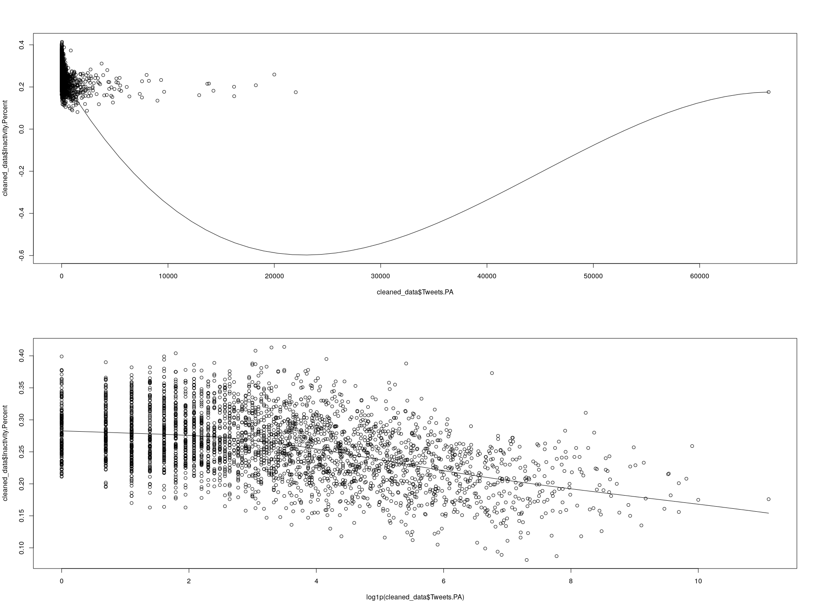

Twitter and Physical Activity
================

``` r
library(foreign)
library(betareg)
library(ggplot2)
library(fitdistrplus)
library(logspline)
library(Hmisc)
library(knitr)
library(dplyr)
```

The compiled dataset contains a subset of US counties (names and FIPS codes).

The associated data for each county is as follows:

-   All\_Tweets: the total collected number of tweets from that county
-   PA\_Tweets: the number of tweets identified as physical activity-related
-   Inactivity\_Cases: TODO
-   Inactivity\_Percent: TODO
-   Inactivity\_Percent\_AgeAdjusted: TODO
-   Gini\_Index: TODO
-   Gini\_Index\_MoE: the margin of error of the Gini index estimate

``` r
# This helper will render legible tables in both RStudio and the generated markdown.
display <- function(x) {
  if (interactive()) (x)
  else kable(x)
}

all_data <- read.csv("data/all_data.csv")
display(head(all_data))
```

|  X.1|   FIPS| Geography                   |    X|  Tweets.PA|  Tweets.All| State    | County            |  Inactivity.Cases|  Inactivity.Percent|  lower.confidence.limit|  upper.confidence.limit|  Inactivity.Ageadjusted|  age.adjusted.lower.confidence.limit|  age.adjusted.upper.confidence.limit| FIPS.Long      |  Gini\_Index.Estimate|  Gini\_Index.Margin\_of\_Error|  CENSUS2010POP|  ESTIMATESBASE2010|  POPESTIMATE2010|  POPESTIMATE2011|  POPESTIMATE2012|  POPESTIMATE2013|  NPOPCHG\_2010|  NPOPCHG\_2011|  NPOPCHG\_2012|  NPOPCHG\_2013|  BIRTHS2010|  BIRTHS2011|  BIRTHS2012|  BIRTHS2013|  DEATHS2010|  DEATHS2011|  DEATHS2012|  DEATHS2013|  NATURALINC2010|  NATURALINC2011|  NATURALINC2012|  NATURALINC2013|  INTERNATIONALMIG2010|  INTERNATIONALMIG2011|  INTERNATIONALMIG2012|  INTERNATIONALMIG2013|  DOMESTICMIG2010|  DOMESTICMIG2011|  DOMESTICMIG2012|  DOMESTICMIG2013|  NETMIG2010|  NETMIG2011|  NETMIG2012|  NETMIG2013|  RESIDUAL2010|  RESIDUAL2011|  RESIDUAL2012|  RESIDUAL2013|  GQESTIMATESBASE2010|  GQESTIMATES2010|  GQESTIMATES2011|  GQESTIMATES2012|  GQESTIMATES2013|  RBIRTH2011|  RBIRTH2012|  RBIRTH2013|  RDEATH2011|  RDEATH2012|  RDEATH2013|  RNATURALINC2011|  RNATURALINC2012|  RNATURALINC2013|  RINTERNATIONALMIG2011|  RINTERNATIONALMIG2012|  RINTERNATIONALMIG2013|  RDOMESTICMIG2011|  RDOMESTICMIG2012|  RDOMESTICMIG2013|  RNETMIG2011|  RNETMIG2012|  RNETMIG2013|  Education.College.Percent|  Total..Margin.of.Error..Some.college.or.associate.s.degree|  Male..Estimate..Some.college.or.associate.s.degree|  Male..Margin.of.Error..Some.college.or.associate.s.degree| Female..Estimate..Some.college.or.associate.s.degree | Female..Margin.of.Error..Some.college.or.associate.s.degree |  Total..Estimate..Bachelor.s.degree.or.higher|  Total..Margin.of.Error..Bachelor.s.degree.or.higher|  Male..Estimate..Bachelor.s.degree.or.higher|  Male..Margin.of.Error..Bachelor.s.degree.or.higher| Female..Estimate..Bachelor.s.degree.or.higher | Female..Margin.of.Error..Bachelor.s.degree.or.higher |  Total..Estimate..PERCENT.IMPUTED...Educational.attainment|
|----:|------:|:----------------------------|----:|----------:|-----------:|:---------|:------------------|-----------------:|-------------------:|-----------------------:|-----------------------:|-----------------------:|------------------------------------:|------------------------------------:|:---------------|---------------------:|------------------------------:|--------------:|------------------:|----------------:|----------------:|----------------:|----------------:|--------------:|--------------:|--------------:|--------------:|-----------:|-----------:|-----------:|-----------:|-----------:|-----------:|-----------:|-----------:|---------------:|---------------:|---------------:|---------------:|---------------------:|---------------------:|---------------------:|---------------------:|----------------:|----------------:|----------------:|----------------:|-----------:|-----------:|-----------:|-----------:|-------------:|-------------:|-------------:|-------------:|--------------------:|----------------:|----------------:|----------------:|----------------:|-----------:|-----------:|-----------:|-----------:|-----------:|-----------:|----------------:|----------------:|----------------:|----------------------:|----------------------:|----------------------:|-----------------:|-----------------:|-----------------:|------------:|------------:|------------:|--------------------------:|-----------------------------------------------------------:|---------------------------------------------------:|----------------------------------------------------------:|:-----------------------------------------------------|:------------------------------------------------------------|---------------------------------------------:|----------------------------------------------------:|--------------------------------------------:|---------------------------------------------------:|:----------------------------------------------|:-----------------------------------------------------|----------------------------------------------------------:|
|    1|  10001| Kent County, Delaware       |  316|        244|       18025| Delaware | Kent County       |             34487|                27.8|                    26.3|                    29.3|                    27.1|                                 25.6|                                 28.6| 0500000US10001 |                0.4201|                         0.0088|         162310|             162313|           162922|           165189|           167540|           169416|            609|           2267|           2351|           1876|         538|        2198|        2171|        2190|         329|        1363|        1446|        1498|             209|             835|             725|             692|                    97|                   308|                   543|                   407|              294|             1045|             1082|              825|         391|        1353|        1625|        1232|             9|            79|             1|           -48|                 4322|             4342|             4493|             4589|             4596|    13.39790|    13.04966|    12.99873|    8.308164|    8.691758|    8.891369|        5.0897410|        4.3579009|         4.107361|              1.8774134|              3.2639175|              2.4157457|         6.3697956|         6.5037914|          4.896782|     8.247209|     9.767709|     7.312527|                       48.9|                                                         3.2|                                                42.8|                                                        4.3| 55.2                                                 | 4.3                                                         |                                           6.6|                                                  1.5|                                          6.1|                                                 2.1| 7                                             | 1.9                                                  |                                                        3.8|
|    2|  10003| New Castle County, Delaware |  317|        805|       63204| Delaware | New Castle County |             91924|                22.4|                    21.4|                    23.5|                    22.0|                                 21.0|                                 23.1| 0500000US10003 |                0.4545|                         0.0065|         538479|             538479|           538845|           542354|           546140|           549684|            366|           3509|           3786|           3544|        1673|        6871|        6947|        6936|        1032|        4297|        4354|        4287|             641|            2574|            2593|            2649|                   307|                  1498|                  1538|                  1566|             -583|             -278|             -272|             -847|        -276|        1220|        1266|         719|             1|          -285|           -73|           176|                17154|            17113|            17468|            17789|            17787|    12.70996|    12.76442|    12.65897|    7.948583|    8.000044|    7.824249|        4.7613807|        4.7643809|         4.834718|              2.7709978|              2.8259228|              2.8581232|        -0.5142439|        -0.4997731|         -1.545869|     2.256754|     2.326150|     1.312255|                       44.4|                                                         1.9|                                                41.3|                                                        2.6| 47.3                                                 | 2.3                                                         |                                          11.8|                                                  1.0|                                          9.1|                                                 1.2| 14.5                                          | 1.6                                                  |                                                        4.2|
|    3|  10005| Sussex County, Delaware     |  318|        493|       23623| Delaware | Sussex County     |             41310|                25.5|                    24.1|                    26.9|                    24.0|                                 22.4|                                 25.7| 0500000US10005 |                0.4384|                         0.0082|         197145|             197144|           197944|           200442|           203373|           206649|            800|           2498|           2931|           3276|         583|        2236|        2148|        2160|         479|        2116|        2178|        2240|             104|             120|             -30|             -80|                   109|                   455|                   440|                   449|              556|             1840|             2508|             3032|         665|        2295|        2948|        3481|            31|            83|            13|          -125|                 2937|             2894|             2789|             2824|             2821|    11.22529|    10.63853|    10.53602|   10.622863|   10.787118|   10.926243|        0.6024308|       -0.1485829|        -0.390223|              2.2842168|              2.1792157|              2.1901264|         9.2372724|        12.4215297|         14.789450|    11.521489|    14.600745|    16.979577|                       33.8|                                                         2.8|                                                28.8|                                                        3.2| 39.1                                                 | 4.7                                                         |                                           7.1|                                                  1.5|                                          4.2|                                                 1.4| 10.2                                          | 2.4                                                  |                                                        5.4|
|    4|   1001| Autauga County, Alabama     |    1|        104|        6063| Alabama  | Autauga County    |             11342|                28.6|                    23.8|                    33.1|                    28.0|                                 23.3|                                 32.4| 0500000US01001 |                0.4295|                         0.0177|          54571|              54571|            54613|            55278|            55265|            55246|             42|            665|            -13|            -19|         170|         636|         607|         601|         146|         493|         490|         469|              24|             143|             117|             132|                    33|                    49|                    40|                    40|              -20|              428|             -180|             -173|          13|         477|        -140|        -133|             5|            45|            10|           -18|                  455|              455|              455|              455|              455|    11.57511|    10.98215|    10.87675|    8.972527|    8.865328|    8.487843|        2.6025789|        2.1168233|         2.388902|              0.8917928|              0.7237003|              0.7239098|         7.7895369|        -3.2566513|         -3.130910|     8.681330|    -2.532951|    -2.407000|                       37.9|                                                         6.2|                                                37.1|                                                        8.1| 38.7                                                 | 8.1                                                         |                                           4.5|                                                  2.4|                                          3.0|                                                 2.7| 6.1                                           | 4                                                    |                                                        4.2|
|    5|   1003| Baldwin County, Alabama     |    2|        511|       27019| Alabama  | Baldwin County    |             32856|                22.3|                    19.9|                    24.9|                    21.2|                                 18.8|                                 23.9| 0500000US01003 |                0.4608|                         0.0098|         182265|             182265|           183223|           186727|           190675|           195540|            958|           3504|           3948|           4865|         549|        2187|        2127|        2206|         536|        1852|        1788|        1850|              13|             335|             339|             356|                    71|                   270|                   301|                   288|              855|             2730|             3261|             4072|         926|        3000|        3562|        4360|            19|           169|            47|           149|                 2307|             2307|             2263|             2244|             2240|    11.82322|    11.27180|    11.42369|   10.012164|    9.475307|    9.580156|        1.8110555|        1.7964929|         1.843533|              1.4596567|              1.5951161|              1.4913973|        14.7587512|        17.2813075|         21.086700|    16.218408|    18.876424|    22.578098|                       39.3|                                                         4.2|                                                32.5|                                                        5.1| 46.4                                                 | 5.8                                                         |                                           8.2|                                                  2.3|                                          9.9|                                                 4.7| 6.5                                           | 2                                                    |                                                        3.5|
|    6|   1005| Barbour County, Alabama     |    3|          5|         802| Alabama  | Barbour County    |              6578|                31.8|                    26.8|                    37.0|                    31.0|                                 26.0|                                 36.2| 0500000US01005 |                0.4620|                         0.0117|          27457|              27457|            27341|            27301|            27232|            27076|           -116|            -40|            -69|           -156|          69|         334|         277|         296|         130|         309|         268|         294|             -61|              25|               9|               2|                     5|                    23|                    17|                    17|              -60|              -89|              -94|             -200|         -55|         -66|         -77|        -183|             0|             1|            -1|            25|                 3193|             3193|             3382|             3387|             3388|    12.22503|    10.15899|    10.90079|   11.309981|    9.828911|   10.827134|        0.9150470|        0.3300754|         0.073654|              0.8418433|              0.6234757|              0.6260588|        -3.2575674|        -3.4474538|         -7.365397|    -2.415724|    -2.823978|    -6.739339|                       33.8|                                                         5.8|                                                28.2|                                                        8.2| 42                                                   | 6.5                                                         |                                           2.0|                                                  2.0|                                          2.3|                                                 2.7| 1.5                                           | 2.5                                                  |                                                        7.9|

Not all counties in the dataset have tweet or physical activity data available, so we must filter those out. We must also normalize the percentages (expressed here as a number /100) to values we can use for a beta distribution (i.e. 0-1)

``` r
# Remove rows with missing values
cat('Rows in complete dataset: ', nrow(all_data), '\n')
```

    ## Rows in complete dataset:  3137

``` r
cleaned_data <- na.omit(all_data)
cleaned_data <- cleaned_data[cleaned_data$Tweets.All >= cleaned_data$Tweets.PA,]
cat('Rows after cleaning: ', nrow(cleaned_data))
```

    ## Rows after cleaning:  3136

``` r
#cleaned_data$Tweets.PA.Log <- log1p(cleaned_data$Tweets.PA)
cleaned_data$Tweets.PA.Percent <- cleaned_data$Tweets.PA / cleaned_data$Tweets.All
cleaned_data$Inactivity.Percent <- cleaned_data$Inactivity.Percent / 100
cleaned_data$Inactivity.Ageadjusted <- cleaned_data$Inactivity.Ageadjusted / 100

display(head(arrange(cleaned_data, desc(Tweets.All))))
```

|   X.1|   FIPS| Geography                      |     X|  Tweets.PA|  Tweets.All| State      | County             |  Inactivity.Cases|  Inactivity.Percent|  lower.confidence.limit|  upper.confidence.limit|  Inactivity.Ageadjusted|  age.adjusted.lower.confidence.limit|  age.adjusted.upper.confidence.limit| FIPS.Long      |  Gini\_Index.Estimate|  Gini\_Index.Margin\_of\_Error|  CENSUS2010POP|  ESTIMATESBASE2010|  POPESTIMATE2010|  POPESTIMATE2011|  POPESTIMATE2012|  POPESTIMATE2013|  NPOPCHG\_2010|  NPOPCHG\_2011|  NPOPCHG\_2012|  NPOPCHG\_2013|  BIRTHS2010|  BIRTHS2011|  BIRTHS2012|  BIRTHS2013|  DEATHS2010|  DEATHS2011|  DEATHS2012|  DEATHS2013|  NATURALINC2010|  NATURALINC2011|  NATURALINC2012|  NATURALINC2013|  INTERNATIONALMIG2010|  INTERNATIONALMIG2011|  INTERNATIONALMIG2012|  INTERNATIONALMIG2013|  DOMESTICMIG2010|  DOMESTICMIG2011|  DOMESTICMIG2012|  DOMESTICMIG2013|  NETMIG2010|  NETMIG2011|  NETMIG2012|  NETMIG2013|  RESIDUAL2010|  RESIDUAL2011|  RESIDUAL2012|  RESIDUAL2013|  GQESTIMATESBASE2010|  GQESTIMATES2010|  GQESTIMATES2011|  GQESTIMATES2012|  GQESTIMATES2013|  RBIRTH2011|  RBIRTH2012|  RBIRTH2013|  RDEATH2011|  RDEATH2012|  RDEATH2013|  RNATURALINC2011|  RNATURALINC2012|  RNATURALINC2013|  RINTERNATIONALMIG2011|  RINTERNATIONALMIG2012|  RINTERNATIONALMIG2013|  RDOMESTICMIG2011|  RDOMESTICMIG2012|  RDOMESTICMIG2013|  RNETMIG2011|  RNETMIG2012|  RNETMIG2013|  Education.College.Percent|  Total..Margin.of.Error..Some.college.or.associate.s.degree|  Male..Estimate..Some.college.or.associate.s.degree|  Male..Margin.of.Error..Some.college.or.associate.s.degree| Female..Estimate..Some.college.or.associate.s.degree | Female..Margin.of.Error..Some.college.or.associate.s.degree |  Total..Estimate..Bachelor.s.degree.or.higher|  Total..Margin.of.Error..Bachelor.s.degree.or.higher|  Male..Estimate..Bachelor.s.degree.or.higher|  Male..Margin.of.Error..Bachelor.s.degree.or.higher| Female..Estimate..Bachelor.s.degree.or.higher | Female..Margin.of.Error..Bachelor.s.degree.or.higher |  Total..Estimate..PERCENT.IMPUTED...Educational.attainment|  Tweets.PA.Percent|
|-----:|------:|:-------------------------------|-----:|----------:|-----------:|:-----------|:-------------------|-----------------:|-------------------:|-----------------------:|-----------------------:|-----------------------:|------------------------------------:|------------------------------------:|:---------------|---------------------:|------------------------------:|--------------:|------------------:|----------------:|----------------:|----------------:|----------------:|--------------:|--------------:|--------------:|--------------:|-----------:|-----------:|-----------:|-----------:|-----------:|-----------:|-----------:|-----------:|---------------:|---------------:|---------------:|---------------:|---------------------:|---------------------:|---------------------:|---------------------:|----------------:|----------------:|----------------:|----------------:|-----------:|-----------:|-----------:|-----------:|-------------:|-------------:|-------------:|-------------:|--------------------:|----------------:|----------------:|----------------:|----------------:|-----------:|-----------:|-----------:|-----------:|-----------:|-----------:|----------------:|----------------:|----------------:|----------------------:|----------------------:|----------------------:|-----------------:|-----------------:|-----------------:|------------:|------------:|------------:|--------------------------:|-----------------------------------------------------------:|---------------------------------------------------:|----------------------------------------------------------:|:-----------------------------------------------------|:------------------------------------------------------------|---------------------------------------------:|----------------------------------------------------:|--------------------------------------------:|---------------------------------------------------:|:----------------------------------------------|:-----------------------------------------------------|----------------------------------------------------------:|------------------:|
|  3027|   6037| Los Angeles County, California |   204|      66486|     2408076| California | Los Angeles County |           1310363|               0.176|                    16.6|                    18.7|                   0.176|                                 16.6|                                 18.7| 0500000US06037 |                0.5023|                         0.0015|        9818605|            9818610|          9826044|          9885201|          9951690|         10017068|           7434|          59157|          66489|          65378|       33120|      132648|      129831|      130332|       13805|       57609|       60715|       61856|           19315|           75039|           69116|           68476|                  8709|                 37388|                 37975|                 39399|           -21108|           -49559|           -39798|           -42136|      -12399|      -12171|       -1823|       -2737|           518|         -3711|          -804|          -361|               171681|           171392|           170801|           172654|           175989|    13.45912|    13.08985|    13.05359|    5.845293|    6.121423|    6.195278|         7.613827|         6.968431|         6.858313|               3.793571|               3.828725|               3.946064|         -5.028500|         -4.012524|         -4.220192|    -1.234930|   -0.1837990|   -0.2741282|                       46.2|                                                         0.4|                                                43.4|                                                        0.5| 49.2                                                 | 0.5                                                         |                                           9.4|                                                  0.2|                                          7.7|                                                 0.3| 11.2                                          | 0.3                                                  |                                                        6.7|          0.0276096|
|  1629|  36047| Kings County, New York         |  1851|      19999|     1244823| New York   | Kings County       |            501799|               0.259|                    24.2|                    27.6|                   0.260|                                 24.3|                                 27.7| 0500000US36047 |                0.5201|                         0.0028|        2504700|            2504700|          2509591|          2541018|          2568435|          2592149|           4891|          31427|          27417|          23714|       10255|       42203|       41751|       42022|        3743|       15884|       16468|       16502|            6512|           26319|           25283|           25520|                  4374|                 19876|                 20696|                 21247|            -5824|           -15219|           -18222|           -20323|       -1450|        4657|        2474|         924|          -171|           451|          -340|         -2730|                35609|            35607|            35595|            36283|            36293|    16.71204|    16.34265|    16.28575|    6.289935|    6.446091|    6.395400|        10.422109|         9.896558|         9.890353|               7.870734|               8.101063|               8.234339|         -6.026600|         -7.132662|         -7.876240|     1.844134|    0.9684011|    0.3580990|                       41.5|                                                         0.7|                                                40.4|                                                        1.0| 42.6                                                 | 1                                                           |                                          15.3|                                                  0.5|                                         12.6|                                                 0.6| 18                                            | 0.7                                                  |                                                        9.6|          0.0160657|
|  1636|  36061| New York County, New York      |  1858|      22017|     1076577| New York   | New York County    |            237176|               0.175|                    16.1|                    19.0|                   0.176|                                 16.2|                                 19.1| 0500000US36061 |                0.5967|                         0.0039|        1585873|            1585873|          1588129|          1607316|          1621323|          1626159|           2256|          19187|          14007|           4836|        4896|       19710|       19699|       19911|        2291|        9853|       10527|       10768|            2605|            9857|            9172|            9143|                  2794|                 12883|                 13352|                 13652|            -2887|            -3945|            -8393|           -16126|         -93|        8938|        4959|       -2474|          -256|           392|          -124|         -1833|                67373|            67373|            67297|            67310|            67286|    12.33631|    12.20266|    12.26242|    6.166903|    6.521014|    6.631600|         6.169407|         5.681651|         5.630824|               8.063353|               8.270977|               8.407745|         -2.469140|         -5.199095|         -9.931387|     5.594213|    3.0718826|   -1.5236420|                       37.8|                                                         1.2|                                                34.6|                                                        1.8| 40.4                                                 | 1.5                                                         |                                          32.9|                                                  0.9|                                         29.0|                                                 1.4| 36                                            | 1.3                                                  |                                                        6.5|          0.0204509|
|   362|  17031| Cook County, Illinois          |   610|      16214|      985672| Illinois   | Cook County        |            787298|               0.201|                    19.0|                    21.3|                   0.200|                                 18.9|                                 21.2| 0500000US17031 |                0.5048|                         0.0021|        5194675|            5194675|          5198853|          5212589|          5227992|          5240700|           4178|          13736|          15403|          12708|       18016|       71847|       70877|       70608|        9389|       38989|       40119|       40380|            8627|           32858|           30758|           30228|                  3536|                 16054|                 16360|                 16897|            -7874|           -34568|           -31378|           -31056|       -4338|      -18514|      -15018|      -14159|          -111|          -608|          -337|         -3361|                90282|            90260|            90263|            90256|            90224|    13.80155|    13.57721|    13.48936|    7.489645|    7.685205|    7.714431|         6.311902|         5.892009|         5.774934|               3.083915|               3.133925|               3.228102|         -6.640387|         -6.010777|         -5.933119|    -3.556472|   -2.8768514|   -2.7050180|                       41.5|                                                         0.5|                                                39.0|                                                        0.7| 44                                                   | 0.6                                                         |                                          15.4|                                                  0.4|                                         12.6|                                                 0.5| 18.1                                          | 0.5                                                  |                                                        5.5|          0.0164497|
|  2415|  48201| Harris County, Texas           |  2622|      13699|      906056| Texas      | Harris County      |            654419|               0.215|                    19.6|                    23.3|                   0.217|                                 19.9|                                 23.6| 0500000US48201 |                0.4982|                         0.0024|        4092459|            4093165|          4109067|          4176674|          4253963|          4336853|          15902|          67607|          77289|          82890|       16949|       66938|       66897|       66942|        5418|       22137|       23267|       24084|           11531|           44801|           43630|           42858|                  4245|                 19240|                 19252|                 19862|              202|             5023|            14477|            20304|        4447|       24263|       33729|       40166|           -76|         -1457|           -70|          -134|                44524|            44558|            45874|            45170|            45174|    16.15740|    15.86998|    15.58455|    5.343397|    5.519630|    5.606918|        10.814000|        10.350345|         9.977632|               4.644123|               4.567152|               4.624008|          1.212444|          3.434379|          4.726908|     5.856567|    8.0015306|    9.3509161|                       39.5|                                                         0.7|                                                36.7|                                                        0.9| 42.3                                                 | 1.1                                                         |                                           8.5|                                                  0.4|                                          6.6|                                                 0.5| 10.6                                          | 0.6                                                  |                                                        5.5|          0.0151194|
|   114|  12086| Miami-Dade County, Florida     |   362|      18264|      705395| Florida    | Miami-Dade County  |            422522|               0.208|                    19.0|                    22.9|                   0.203|                                 18.5|                                 22.4| 0500000US12086 |                0.5264|                         0.0036|        2496435|            2496457|          2504829|          2566718|          2592710|          2617176|           8372|          61889|          25992|          24466|        7819|       31320|       31202|       31209|        4334|       18174|       18976|       19803|            3485|           13146|           12226|           11406|                  6652|                 29809|                 31283|                 32104|            -1793|            18805|           -17618|           -21064|        4859|       48614|       13665|       11040|            28|           129|           101|          2020|                40057|            39871|            39595|            39589|            39833|    12.35126|    12.09514|    11.98068|    7.167044|    7.355854|    7.602086|         5.184217|         4.739285|         4.378599|              11.755387|              12.126538|              12.324262|          7.415883|         -6.829439|         -8.086165|    19.171271|    5.2970988|    4.2380966|                       44.1|                                                         0.9|                                                41.2|                                                        1.1| 47.1                                                 | 1.2                                                         |                                           8.4|                                                  0.5|                                          6.0|                                                 0.5| 10.8                                          | 0.8                                                  |                                                        5.3|          0.0258919|

``` r
display(head(arrange(cleaned_data, desc(Tweets.PA))))
```

|   X.1|   FIPS| Geography                      |     X|  Tweets.PA|  Tweets.All| State      | County             |  Inactivity.Cases|  Inactivity.Percent|  lower.confidence.limit|  upper.confidence.limit|  Inactivity.Ageadjusted|  age.adjusted.lower.confidence.limit|  age.adjusted.upper.confidence.limit| FIPS.Long      |  Gini\_Index.Estimate|  Gini\_Index.Margin\_of\_Error|  CENSUS2010POP|  ESTIMATESBASE2010|  POPESTIMATE2010|  POPESTIMATE2011|  POPESTIMATE2012|  POPESTIMATE2013|  NPOPCHG\_2010|  NPOPCHG\_2011|  NPOPCHG\_2012|  NPOPCHG\_2013|  BIRTHS2010|  BIRTHS2011|  BIRTHS2012|  BIRTHS2013|  DEATHS2010|  DEATHS2011|  DEATHS2012|  DEATHS2013|  NATURALINC2010|  NATURALINC2011|  NATURALINC2012|  NATURALINC2013|  INTERNATIONALMIG2010|  INTERNATIONALMIG2011|  INTERNATIONALMIG2012|  INTERNATIONALMIG2013|  DOMESTICMIG2010|  DOMESTICMIG2011|  DOMESTICMIG2012|  DOMESTICMIG2013|  NETMIG2010|  NETMIG2011|  NETMIG2012|  NETMIG2013|  RESIDUAL2010|  RESIDUAL2011|  RESIDUAL2012|  RESIDUAL2013|  GQESTIMATESBASE2010|  GQESTIMATES2010|  GQESTIMATES2011|  GQESTIMATES2012|  GQESTIMATES2013|  RBIRTH2011|  RBIRTH2012|  RBIRTH2013|  RDEATH2011|  RDEATH2012|  RDEATH2013|  RNATURALINC2011|  RNATURALINC2012|  RNATURALINC2013|  RINTERNATIONALMIG2011|  RINTERNATIONALMIG2012|  RINTERNATIONALMIG2013|  RDOMESTICMIG2011|  RDOMESTICMIG2012|  RDOMESTICMIG2013|  RNETMIG2011|  RNETMIG2012|  RNETMIG2013|  Education.College.Percent|  Total..Margin.of.Error..Some.college.or.associate.s.degree|  Male..Estimate..Some.college.or.associate.s.degree|  Male..Margin.of.Error..Some.college.or.associate.s.degree| Female..Estimate..Some.college.or.associate.s.degree | Female..Margin.of.Error..Some.college.or.associate.s.degree |  Total..Estimate..Bachelor.s.degree.or.higher|  Total..Margin.of.Error..Bachelor.s.degree.or.higher|  Male..Estimate..Bachelor.s.degree.or.higher|  Male..Margin.of.Error..Bachelor.s.degree.or.higher| Female..Estimate..Bachelor.s.degree.or.higher | Female..Margin.of.Error..Bachelor.s.degree.or.higher |  Total..Estimate..PERCENT.IMPUTED...Educational.attainment|  Tweets.PA.Percent|
|-----:|------:|:-------------------------------|-----:|----------:|-----------:|:-----------|:-------------------|-----------------:|-------------------:|-----------------------:|-----------------------:|-----------------------:|------------------------------------:|------------------------------------:|:---------------|---------------------:|------------------------------:|--------------:|------------------:|----------------:|----------------:|----------------:|----------------:|--------------:|--------------:|--------------:|--------------:|-----------:|-----------:|-----------:|-----------:|-----------:|-----------:|-----------:|-----------:|---------------:|---------------:|---------------:|---------------:|---------------------:|---------------------:|---------------------:|---------------------:|----------------:|----------------:|----------------:|----------------:|-----------:|-----------:|-----------:|-----------:|-------------:|-------------:|-------------:|-------------:|--------------------:|----------------:|----------------:|----------------:|----------------:|-----------:|-----------:|-----------:|-----------:|-----------:|-----------:|----------------:|----------------:|----------------:|----------------------:|----------------------:|----------------------:|-----------------:|-----------------:|-----------------:|------------:|------------:|------------:|--------------------------:|-----------------------------------------------------------:|---------------------------------------------------:|----------------------------------------------------------:|:-----------------------------------------------------|:------------------------------------------------------------|---------------------------------------------:|----------------------------------------------------:|--------------------------------------------:|---------------------------------------------------:|:----------------------------------------------|:-----------------------------------------------------|----------------------------------------------------------:|------------------:|
|  3027|   6037| Los Angeles County, California |   204|      66486|     2408076| California | Los Angeles County |           1310363|               0.176|                    16.6|                    18.7|                   0.176|                                 16.6|                                 18.7| 0500000US06037 |                0.5023|                         0.0015|        9818605|            9818610|          9826044|          9885201|          9951690|         10017068|           7434|          59157|          66489|          65378|       33120|      132648|      129831|      130332|       13805|       57609|       60715|       61856|           19315|           75039|           69116|           68476|                  8709|                 37388|                 37975|                 39399|           -21108|           -49559|           -39798|           -42136|      -12399|      -12171|       -1823|       -2737|           518|         -3711|          -804|          -361|               171681|           171392|           170801|           172654|           175989|    13.45912|    13.08985|    13.05359|    5.845293|    6.121423|    6.195278|         7.613827|         6.968431|         6.858313|               3.793571|               3.828725|               3.946064|        -5.0285002|        -4.0125239|         -4.220192|    -1.234930|   -0.1837990|   -0.2741282|                       46.2|                                                         0.4|                                                43.4|                                                        0.5| 49.2                                                 | 0.5                                                         |                                           9.4|                                                  0.2|                                          7.7|                                                 0.3| 11.2                                          | 0.3                                                  |                                                        6.7|          0.0276096|
|  1636|  36061| New York County, New York      |  1858|      22017|     1076577| New York   | New York County    |            237176|               0.175|                    16.1|                    19.0|                   0.176|                                 16.2|                                 19.1| 0500000US36061 |                0.5967|                         0.0039|        1585873|            1585873|          1588129|          1607316|          1621323|          1626159|           2256|          19187|          14007|           4836|        4896|       19710|       19699|       19911|        2291|        9853|       10527|       10768|            2605|            9857|            9172|            9143|                  2794|                 12883|                 13352|                 13652|            -2887|            -3945|            -8393|           -16126|         -93|        8938|        4959|       -2474|          -256|           392|          -124|         -1833|                67373|            67373|            67297|            67310|            67286|    12.33631|    12.20266|    12.26242|    6.166903|    6.521014|    6.631600|         6.169407|         5.681651|         5.630824|               8.063353|               8.270977|               8.407745|        -2.4691397|        -5.1990947|         -9.931387|     5.594213|    3.0718826|   -1.5236420|                       37.8|                                                         1.2|                                                34.6|                                                        1.8| 40.4                                                 | 1.5                                                         |                                          32.9|                                                  0.9|                                         29.0|                                                 1.4| 36                                            | 1.3                                                  |                                                        6.5|          0.0204509|
|  1629|  36047| Kings County, New York         |  1851|      19999|     1244823| New York   | Kings County       |            501799|               0.259|                    24.2|                    27.6|                   0.260|                                 24.3|                                 27.7| 0500000US36047 |                0.5201|                         0.0028|        2504700|            2504700|          2509591|          2541018|          2568435|          2592149|           4891|          31427|          27417|          23714|       10255|       42203|       41751|       42022|        3743|       15884|       16468|       16502|            6512|           26319|           25283|           25520|                  4374|                 19876|                 20696|                 21247|            -5824|           -15219|           -18222|           -20323|       -1450|        4657|        2474|         924|          -171|           451|          -340|         -2730|                35609|            35607|            35595|            36283|            36293|    16.71204|    16.34265|    16.28575|    6.289935|    6.446091|    6.395400|        10.422109|         9.896558|         9.890353|               7.870734|               8.101063|               8.234339|        -6.0266000|        -7.1326618|         -7.876240|     1.844134|    0.9684011|    0.3580990|                       41.5|                                                         0.7|                                                40.4|                                                        1.0| 42.6                                                 | 1                                                           |                                          15.3|                                                  0.5|                                         12.6|                                                 0.6| 18                                            | 0.7                                                  |                                                        9.6|          0.0160657|
|   114|  12086| Miami-Dade County, Florida     |   362|      18264|      705395| Florida    | Miami-Dade County  |            422522|               0.208|                    19.0|                    22.9|                   0.203|                                 18.5|                                 22.4| 0500000US12086 |                0.5264|                         0.0036|        2496435|            2496457|          2504829|          2566718|          2592710|          2617176|           8372|          61889|          25992|          24466|        7819|       31320|       31202|       31209|        4334|       18174|       18976|       19803|            3485|           13146|           12226|           11406|                  6652|                 29809|                 31283|                 32104|            -1793|            18805|           -17618|           -21064|        4859|       48614|       13665|       11040|            28|           129|           101|          2020|                40057|            39871|            39595|            39589|            39833|    12.35126|    12.09514|    11.98068|    7.167044|    7.355854|    7.602086|         5.184217|         4.739285|         4.378599|              11.755387|              12.126538|              12.324262|         7.4158832|        -6.8294392|         -8.086165|    19.171271|    5.2970988|    4.2380966|                       44.1|                                                         0.9|                                                41.2|                                                        1.1| 47.1                                                 | 1.2                                                         |                                           8.4|                                                  0.5|                                          6.0|                                                 0.5| 10.8                                          | 0.8                                                  |                                                        5.3|          0.0258919|
|  3045|   6073| San Diego County, California   |   222|      16225|      625269| California | San Diego County   |            375187|               0.156|                    14.2|                    17.1|                   0.156|                                 14.2|                                 17.1| 0500000US06073 |                0.4662|                         0.0024|        3095313|            3095308|          3104182|          3138550|          3176138|          3211252|           8874|          34368|          37588|          35114|       10948|       44696|       43504|       43894|        4684|       19708|       20536|       20704|            6264|           24988|           22968|           23190|                  2899|                  8982|                 14497|                 11720|             -242|             1158|              409|            -1112|        2657|       10140|       14906|       10608|           -47|          -760|          -286|          1316|               101966|           101182|           100077|           101604|            99656|    14.31937|    13.77867|    13.74395|    6.313902|    6.504201|    6.482773|         8.005469|         7.274469|         7.261182|               2.877586|               4.591517|               3.669731|         0.3709914|         0.1295393|         -0.348186|     3.248578|    4.7210567|    3.3215445|                       48.4|                                                         0.8|                                                44.8|                                                        1.0| 52.6                                                 | 1.2                                                         |                                           9.2|                                                  0.4|                                          7.5|                                                 0.6| 11.3                                          | 0.6                                                  |                                                        5.8|          0.0259488|
|   362|  17031| Cook County, Illinois          |   610|      16214|      985672| Illinois   | Cook County        |            787298|               0.201|                    19.0|                    21.3|                   0.200|                                 18.9|                                 21.2| 0500000US17031 |                0.5048|                         0.0021|        5194675|            5194675|          5198853|          5212589|          5227992|          5240700|           4178|          13736|          15403|          12708|       18016|       71847|       70877|       70608|        9389|       38989|       40119|       40380|            8627|           32858|           30758|           30228|                  3536|                 16054|                 16360|                 16897|            -7874|           -34568|           -31378|           -31056|       -4338|      -18514|      -15018|      -14159|          -111|          -608|          -337|         -3361|                90282|            90260|            90263|            90256|            90224|    13.80155|    13.57721|    13.48936|    7.489645|    7.685205|    7.714431|         6.311902|         5.892009|         5.774934|               3.083915|               3.133925|               3.228102|        -6.6403866|        -6.0107766|         -5.933119|    -3.556472|   -2.8768514|   -2.7050180|                       41.5|                                                         0.5|                                                39.0|                                                        0.7| 44                                                   | 0.6                                                         |                                          15.4|                                                  0.4|                                         12.6|                                                 0.5| 18.1                                          | 0.5                                                  |                                                        5.5|          0.0164497|

``` r
vars <- c(
  "Gini_Index.Estimate",
  "Tweets.PA",
  "Tweets.PA.Percent",
#  "Tweets.PA.Log",
  "Tweets.All",
  "Inactivity.Cases",
  "Inactivity.Percent",
  "Inactivity.Ageadjusted",
  "POPESTIMATE2013",
  "Education.College.Percent"
)
display(as.data.frame(do.call(cbind, lapply(cleaned_data[vars], summary))))
```

|         |  Gini\_Index.Estimate|   Tweets.PA|  Tweets.PA.Percent|  Tweets.All|  Inactivity.Cases|  Inactivity.Percent|  Inactivity.Ageadjusted|  POPESTIMATE2013|  Education.College.Percent|
|---------|---------------------:|-----------:|------------------:|-----------:|-----------------:|-------------------:|-----------------------:|----------------:|--------------------------:|
| Min.    |             0.3209000|      0.0000|          0.0000000|       12.00|             16.00|           0.0810000|               0.0840000|            90.00|                     0.0000|
| 1st Qu. |             0.4205000|      5.0000|          0.0082237|      428.00|           2220.25|           0.2260000|               0.2140000|         11064.00|                    32.5000|
| Median  |             0.4420000|     20.0000|          0.0143705|     1452.00|           5294.50|           0.2580000|               0.2450000|         25766.00|                    39.5000|
| Mean    |             0.4444018|    271.4732|          0.0204834|    15405.72|          16616.58|           0.2595717|               0.2470089|        100716.22|                    39.7846|
| 3rd Qu. |             0.4651000|     99.0000|          0.0232904|     5942.25|          12773.50|           0.2940000|               0.2800000|         67582.25|                    46.1000|
| Max.    |             0.6265000|  66486.0000|          0.5587734|  2408076.00|        1310363.00|           0.4140000|               0.3980000|      10017068.00|                    88.2000|

The count data are heavily right-skewed with notable outliers. This is partly attributable to the disparity in population between counties (e.g. LA, the most populous county, has a similar relative magnitude of tweets)

``` r
par(mfrow=c(ceiling(length(vars) / 2), 2))
for (v in vars) {
  boxplot(cleaned_data[v], main = v, horizontal = TRUE)
}
```


``` r
par(mfrow=c(2, 2))
hist(cleaned_data$Inactivity.Percent)
descdist(cleaned_data$Inactivity.Percent)
```

    ## summary statistics
    ## ------
    ## min:  0.081   max:  0.414 
    ## median:  0.258 
    ## mean:  0.2595717 
    ## estimated sd:  0.05203962 
    ## estimated skewness:  -0.03519922 
    ## estimated kurtosis:  2.906961

``` r
hist(cleaned_data$Inactivity.Ageadjusted)
descdist(cleaned_data$Inactivity.Ageadjusted)
```


    ## summary statistics
    ## ------
    ## min:  0.084   max:  0.398 
    ## median:  0.245 
    ## mean:  0.2470089 
    ## estimated sd:  0.04962112 
    ## estimated skewness:  0.05431752 
    ## estimated kurtosis:  2.844211

``` r
fit.beta1 <- fitdist(cleaned_data$Inactivity.Percent, "beta")
plot(fit.beta1)
```


``` r
fit.beta2 <- fitdist(cleaned_data$Inactivity.Ageadjusted, "beta")
plot(fit.beta2)
```


Correlation of variables:

``` r
results <- rcorr(as.matrix(cleaned_data[vars]), type = "pearson")
display(as.data.frame(results$r))
```

|                           |  Gini\_Index.Estimate|   Tweets.PA|  Tweets.PA.Percent|  Tweets.All|  Inactivity.Cases|  Inactivity.Percent|  Inactivity.Ageadjusted|  POPESTIMATE2013|  Education.College.Percent|
|---------------------------|---------------------:|-----------:|------------------:|-----------:|-----------------:|-------------------:|-----------------------:|----------------:|--------------------------:|
| Gini\_Index.Estimate      |             1.0000000|   0.1438749|         -0.0707676|   0.1769398|         0.1595713|           0.1549412|               0.1769161|        0.1448897|                  0.0340379|
| Tweets.PA                 |             0.1438749|   1.0000000|          0.0102117|   0.9600323|         0.8652510|          -0.1729010|              -0.1497499|        0.9006566|                  0.0732038|
| Tweets.PA.Percent         |            -0.0707676|   0.0102117|          1.0000000|  -0.0208026|        -0.0367913|          -0.1275386|              -0.1465599|       -0.0279178|                  0.0245342|
| Tweets.All                |             0.1769398|   0.9600323|         -0.0208026|   1.0000000|         0.9019083|          -0.1908108|              -0.1616052|        0.9172833|                  0.0865494|
| Inactivity.Cases          |             0.1595713|   0.8652510|         -0.0367913|   0.9019083|         1.0000000|          -0.1766420|              -0.1398795|        0.9842954|                  0.1130694|
| Inactivity.Percent        |             0.1549412|  -0.1729010|         -0.1275386|  -0.1908108|        -0.1766420|           1.0000000|               0.9879369|       -0.2212832|                 -0.2543087|
| Inactivity.Ageadjusted    |             0.1769161|  -0.1497499|         -0.1465599|  -0.1616052|        -0.1398795|           0.9879369|               1.0000000|       -0.1864355|                 -0.2248881|
| POPESTIMATE2013           |             0.1448897|   0.9006566|         -0.0279178|   0.9172833|         0.9842954|          -0.2212832|              -0.1864355|        1.0000000|                  0.1158493|
| Education.College.Percent |             0.0340379|   0.0732038|          0.0245342|   0.0865494|         0.1130694|          -0.2543087|              -0.2248881|        0.1158493|                  1.0000000|

``` r
display(as.data.frame(results$P))
```

|                           |  Gini\_Index.Estimate|  Tweets.PA|  Tweets.PA.Percent|  Tweets.All|  Inactivity.Cases|  Inactivity.Percent|  Inactivity.Ageadjusted|  POPESTIMATE2013|  Education.College.Percent|
|---------------------------|---------------------:|----------:|------------------:|-----------:|-----------------:|-------------------:|-----------------------:|----------------:|--------------------------:|
| Gini\_Index.Estimate      |                    NA|  0.0000000|          0.0000730|   0.0000000|         0.0000000|                   0|                       0|        0.0000000|                  0.0566616|
| Tweets.PA                 |             0.0000000|         NA|          0.5675633|   0.0000000|         0.0000000|                   0|                       0|        0.0000000|                  0.0000407|
| Tweets.PA.Percent         |             0.0000730|  0.5675633|                 NA|   0.2441780|         0.0393805|                   0|                       0|        0.1180342|                  0.1695733|
| Tweets.All                |             0.0000000|  0.0000000|          0.2441780|          NA|         0.0000000|                   0|                       0|        0.0000000|                  0.0000012|
| Inactivity.Cases          |             0.0000000|  0.0000000|          0.0393805|   0.0000000|                NA|                   0|                       0|        0.0000000|                  0.0000000|
| Inactivity.Percent        |             0.0000000|  0.0000000|          0.0000000|   0.0000000|         0.0000000|                  NA|                       0|        0.0000000|                  0.0000000|
| Inactivity.Ageadjusted    |             0.0000000|  0.0000000|          0.0000000|   0.0000000|         0.0000000|                   0|                      NA|        0.0000000|                  0.0000000|
| POPESTIMATE2013           |             0.0000000|  0.0000000|          0.1180342|   0.0000000|         0.0000000|                   0|                       0|               NA|                  0.0000000|
| Education.College.Percent |             0.0566616|  0.0000407|          0.1695733|   0.0000012|         0.0000000|                   0|                       0|        0.0000000|                         NA|

Correlation of variables:

``` r
results <- rcorr(as.matrix(cleaned_data[vars]), type = "spearman")
display(as.data.frame(results$r))
```

|                           |  Gini\_Index.Estimate|   Tweets.PA|  Tweets.PA.Percent|  Tweets.All|  Inactivity.Cases|  Inactivity.Percent|  Inactivity.Ageadjusted|  POPESTIMATE2013|  Education.College.Percent|
|---------------------------|---------------------:|-----------:|------------------:|-----------:|-----------------:|-------------------:|-----------------------:|----------------:|--------------------------:|
| Gini\_Index.Estimate      |             1.0000000|   0.0528992|         -0.0918761|   0.1060858|         0.1307789|           0.1680996|               0.1848462|        0.0973480|                  0.0245856|
| Tweets.PA                 |             0.0528992|   1.0000000|          0.4401824|   0.8844654|         0.7791858|          -0.4296886|              -0.3710666|        0.8201033|                  0.3486772|
| Tweets.PA.Percent         |            -0.0918761|   0.4401824|          1.0000000|   0.0258514|        -0.0165173|          -0.2788388|              -0.2960277|        0.0213013|                  0.1088764|
| Tweets.All                |             0.1060858|   0.8844654|          0.0258514|   1.0000000|         0.8861683|          -0.3404427|              -0.2663869|        0.9149537|                  0.3299084|
| Inactivity.Cases          |             0.1307789|   0.7791858|         -0.0165173|   0.8861683|         1.0000000|          -0.1083774|              -0.0323850|        0.9866798|                  0.2812393|
| Inactivity.Percent        |             0.1680996|  -0.4296886|         -0.2788388|  -0.3404427|        -0.1083774|           1.0000000|               0.9851936|       -0.2425831|                 -0.2567431|
| Inactivity.Ageadjusted    |             0.1848462|  -0.3710666|         -0.2960277|  -0.2663869|        -0.0323850|           0.9851936|               1.0000000|       -0.1641873|                 -0.2339503|
| POPESTIMATE2013           |             0.0973480|   0.8201033|          0.0213013|   0.9149537|         0.9866798|          -0.2425831|              -0.1641873|        1.0000000|                  0.3108435|
| Education.College.Percent |             0.0245856|   0.3486772|          0.1088764|   0.3299084|         0.2812393|          -0.2567431|              -0.2339503|        0.3108435|                  1.0000000|

``` r
display(as.data.frame(results$P))
```

|                           |  Gini\_Index.Estimate|  Tweets.PA|  Tweets.PA.Percent|  Tweets.All|  Inactivity.Cases|  Inactivity.Percent|  Inactivity.Ageadjusted|  POPESTIMATE2013|  Education.College.Percent|
|---------------------------|---------------------:|----------:|------------------:|-----------:|-----------------:|-------------------:|-----------------------:|----------------:|--------------------------:|
| Gini\_Index.Estimate      |                    NA|  0.0030441|          0.0000003|   0.0000000|         0.0000000|                   0|                0.000000|        0.0000000|                  0.1686821|
| Tweets.PA                 |             0.0030441|         NA|          0.0000000|   0.0000000|         0.0000000|                   0|                0.000000|        0.0000000|                  0.0000000|
| Tweets.PA.Percent         |             0.0000003|  0.0000000|                 NA|   0.1478012|         0.3551402|                   0|                0.000000|        0.2330518|                  0.0000000|
| Tweets.All                |             0.0000000|  0.0000000|          0.1478012|          NA|         0.0000000|                   0|                0.000000|        0.0000000|                  0.0000000|
| Inactivity.Cases          |             0.0000000|  0.0000000|          0.3551402|   0.0000000|                NA|                   0|                0.069784|        0.0000000|                  0.0000000|
| Inactivity.Percent        |             0.0000000|  0.0000000|          0.0000000|   0.0000000|         0.0000000|                  NA|                0.000000|        0.0000000|                  0.0000000|
| Inactivity.Ageadjusted    |             0.0000000|  0.0000000|          0.0000000|   0.0000000|         0.0697840|                   0|                      NA|        0.0000000|                  0.0000000|
| POPESTIMATE2013           |             0.0000000|  0.0000000|          0.2330518|   0.0000000|         0.0000000|                   0|                0.000000|               NA|                  0.0000000|
| Education.College.Percent |             0.1686821|  0.0000000|          0.0000000|   0.0000000|         0.0000000|                   0|                0.000000|        0.0000000|                         NA|

Comparing models:

``` r
m1 <- betareg(Inactivity.Percent ~ Tweets.PA, data = cleaned_data)
summary(m1)
```

    ## 
    ## Call:
    ## betareg(formula = Inactivity.Percent ~ Tweets.PA, data = cleaned_data)
    ## 
    ## Standardized weighted residuals 2:
    ##     Min      1Q  Median      3Q     Max 
    ## -4.5346 -0.5935  0.0281  0.6753  3.4441 
    ## 
    ## Coefficients (mean model with logit link):
    ##               Estimate Std. Error z value Pr(>|z|)    
    ## (Intercept) -1.031e+00  4.894e-03 -210.67   <2e-16 ***
    ## Tweets.PA   -7.644e-05  5.206e-06  -14.68   <2e-16 ***
    ## 
    ## Phi coefficients (precision model with identity link):
    ##       Estimate Std. Error z value Pr(>|z|)    
    ## (phi)   71.890      1.806   39.81   <2e-16 ***
    ## ---
    ## Signif. codes:  0 '***' 0.001 '**' 0.01 '*' 0.05 '.' 0.1 ' ' 1 
    ## 
    ## Type of estimator: ML (maximum likelihood)
    ## Log-likelihood:  4878 on 3 Df
    ## Pseudo R-squared: 0.03263
    ## Number of iterations: 15 (BFGS) + 2 (Fisher scoring)

``` r
m2 <- update(m1, . ~ . + Gini_Index.Estimate)
summary(m2)
```

    ## 
    ## Call:
    ## betareg(formula = Inactivity.Percent ~ Tweets.PA + Gini_Index.Estimate, 
    ##     data = cleaned_data)
    ## 
    ## Standardized weighted residuals 2:
    ##     Min      1Q  Median      3Q     Max 
    ## -5.2588 -0.5743  0.0565  0.6777  3.5975 
    ## 
    ## Coefficients (mean model with logit link):
    ##                       Estimate Std. Error z value Pr(>|z|)    
    ## (Intercept)         -1.690e+00  5.979e-02  -28.27   <2e-16 ***
    ## Tweets.PA           -8.977e-05  5.294e-06  -16.96   <2e-16 ***
    ## Gini_Index.Estimate  1.489e+00  1.343e-01   11.09   <2e-16 ***
    ## 
    ## Phi coefficients (precision model with identity link):
    ##       Estimate Std. Error z value Pr(>|z|)    
    ## (phi)   74.759      1.878    39.8   <2e-16 ***
    ## ---
    ## Signif. codes:  0 '***' 0.001 '**' 0.01 '*' 0.05 '.' 0.1 ' ' 1 
    ## 
    ## Type of estimator: ML (maximum likelihood)
    ## Log-likelihood:  4938 on 4 Df
    ## Pseudo R-squared: 0.05153
    ## Number of iterations: 11 (BFGS) + 7 (Fisher scoring)

``` r
m3 <- update(m2, . ~ . + POPESTIMATE2013)
summary(m3)
```

    ## 
    ## Call:
    ## betareg(formula = Inactivity.Percent ~ Tweets.PA + Gini_Index.Estimate + 
    ##     POPESTIMATE2013, data = cleaned_data)
    ## 
    ## Standardized weighted residuals 2:
    ##     Min      1Q  Median      3Q     Max 
    ## -5.6494 -0.5719  0.0612  0.6759  2.9933 
    ## 
    ## Coefficients (mean model with logit link):
    ##                       Estimate Std. Error z value Pr(>|z|)    
    ## (Intercept)         -1.673e+00  5.948e-02 -28.120  < 2e-16 ***
    ## Tweets.PA           -2.286e-05  9.519e-06  -2.402   0.0163 *  
    ## Gini_Index.Estimate  1.471e+00  1.336e-01  11.011  < 2e-16 ***
    ## POPESTIMATE2013     -2.666e-07  4.026e-08  -6.620 3.58e-11 ***
    ## 
    ## Phi coefficients (precision model with identity link):
    ##       Estimate Std. Error z value Pr(>|z|)    
    ## (phi)   75.435      1.895    39.8   <2e-16 ***
    ## ---
    ## Signif. codes:  0 '***' 0.001 '**' 0.01 '*' 0.05 '.' 0.1 ' ' 1 
    ## 
    ## Type of estimator: ML (maximum likelihood)
    ## Log-likelihood:  4955 on 5 Df
    ## Pseudo R-squared: 0.07214
    ## Number of iterations: 12 (BFGS) + 9 (Fisher scoring)

``` r
m4 <- update(m3, . ~ . + Education.College.Percent)
summary(m4)
```

    ## 
    ## Call:
    ## betareg(formula = Inactivity.Percent ~ Tweets.PA + Gini_Index.Estimate + 
    ##     POPESTIMATE2013 + Education.College.Percent, data = cleaned_data)
    ## 
    ## Standardized weighted residuals 2:
    ##     Min      1Q  Median      3Q     Max 
    ## -5.9008 -0.5938  0.0594  0.6792  2.9083 
    ## 
    ## Coefficients (mean model with logit link):
    ##                             Estimate Std. Error z value Pr(>|z|)    
    ## (Intercept)               -1.478e+00  5.972e-02 -24.755   <2e-16 ***
    ## Tweets.PA                 -2.613e-05  9.129e-06  -2.863   0.0042 ** 
    ## Gini_Index.Estimate        1.498e+00  1.299e-01  11.532   <2e-16 ***
    ## POPESTIMATE2013           -2.017e-07  3.881e-08  -5.199    2e-07 ***
    ## Education.College.Percent -5.336e-03  3.999e-04 -13.345   <2e-16 ***
    ## 
    ## Phi coefficients (precision model with identity link):
    ##       Estimate Std. Error z value Pr(>|z|)    
    ## (phi)   79.809      2.006   39.79   <2e-16 ***
    ## ---
    ## Signif. codes:  0 '***' 0.001 '**' 0.01 '*' 0.05 '.' 0.1 ' ' 1 
    ## 
    ## Type of estimator: ML (maximum likelihood)
    ## Log-likelihood:  5044 on 6 Df
    ## Pseudo R-squared: 0.121
    ## Number of iterations: 14 (BFGS) + 2 (Fisher scoring)

``` r
display(merge(AIC(m1, m2, m3, m4), BIC(m1, m2, m3, m4)))
```

|   df|         AIC|         BIC|
|----:|-----------:|-----------:|
|    3|   -9750.425|   -9732.273|
|    4|   -9868.559|   -9844.356|
|    5|   -9899.104|   -9868.851|
|    6|  -10075.046|  -10038.742|

``` r
m1.aa <- betareg(Inactivity.Ageadjusted ~ Tweets.PA, data = cleaned_data)
summary(m1.aa)
```

    ## 
    ## Call:
    ## betareg(formula = Inactivity.Ageadjusted ~ Tweets.PA, data = cleaned_data)
    ## 
    ## Standardized weighted residuals 2:
    ##     Min      1Q  Median      3Q     Max 
    ## -4.3524 -0.6169  0.0187  0.6834  3.2377 
    ## 
    ## Coefficients (mean model with logit link):
    ##               Estimate Std. Error z value Pr(>|z|)    
    ## (Intercept) -1.101e+00  4.840e-03 -227.58   <2e-16 ***
    ## Tweets.PA   -5.720e-05  4.810e-06  -11.89   <2e-16 ***
    ## 
    ## Phi coefficients (precision model with identity link):
    ##       Estimate Std. Error z value Pr(>|z|)    
    ## (phi)   75.816      1.905   39.79   <2e-16 ***
    ## ---
    ## Signif. codes:  0 '***' 0.001 '**' 0.01 '*' 0.05 '.' 0.1 ' ' 1 
    ## 
    ## Type of estimator: ML (maximum likelihood)
    ## Log-likelihood:  5014 on 3 Df
    ## Pseudo R-squared: 0.02421
    ## Number of iterations: 14 (BFGS) + 2 (Fisher scoring)

``` r
m2.aa <- update(m1.aa, . ~ . + Gini_Index.Estimate)
summary(m2.aa)
```

    ## 
    ## Call:
    ## betareg(formula = Inactivity.Ageadjusted ~ Tweets.PA + Gini_Index.Estimate, 
    ##     data = cleaned_data)
    ## 
    ## Standardized weighted residuals 2:
    ##     Min      1Q  Median      3Q     Max 
    ## -5.3468 -0.5942  0.0353  0.6849  3.4823 
    ## 
    ## Coefficients (mean model with logit link):
    ##                       Estimate Std. Error z value Pr(>|z|)    
    ## (Intercept)         -1.795e+00  5.901e-02  -30.43   <2e-16 ***
    ## Tweets.PA           -7.073e-05  4.927e-06  -14.36   <2e-16 ***
    ## Gini_Index.Estimate  1.567e+00  1.325e-01   11.83   <2e-16 ***
    ## 
    ## Phi coefficients (precision model with identity link):
    ##       Estimate Std. Error z value Pr(>|z|)    
    ## (phi)   79.228      1.991   39.79   <2e-16 ***
    ## ---
    ## Signif. codes:  0 '***' 0.001 '**' 0.01 '*' 0.05 '.' 0.1 ' ' 1 
    ## 
    ## Type of estimator: ML (maximum likelihood)
    ## Log-likelihood:  5082 on 4 Df
    ## Pseudo R-squared: 0.04919
    ## Number of iterations: 12 (BFGS) + 6 (Fisher scoring)

``` r
m3.aa <- update(m2.aa, . ~ . + POPESTIMATE2013)
summary(m3.aa)
```

    ## 
    ## Call:
    ## betareg(formula = Inactivity.Ageadjusted ~ Tweets.PA + Gini_Index.Estimate + 
    ##     POPESTIMATE2013, data = cleaned_data)
    ## 
    ## Standardized weighted residuals 2:
    ##     Min      1Q  Median      3Q     Max 
    ## -5.6256 -0.5930  0.0536  0.6895  2.8551 
    ## 
    ## Coefficients (mean model with logit link):
    ##                       Estimate Std. Error z value Pr(>|z|)    
    ## (Intercept)         -1.781e+00  5.882e-02 -30.284  < 2e-16 ***
    ## Tweets.PA           -2.334e-05  9.060e-06  -2.576     0.01 *  
    ## Gini_Index.Estimate  1.551e+00  1.320e-01  11.747  < 2e-16 ***
    ## POPESTIMATE2013     -1.903e-07  3.861e-08  -4.929 8.27e-07 ***
    ## 
    ## Phi coefficients (precision model with identity link):
    ##       Estimate Std. Error z value Pr(>|z|)    
    ## (phi)   79.629      2.002   39.78   <2e-16 ***
    ## ---
    ## Signif. codes:  0 '***' 0.001 '**' 0.01 '*' 0.05 '.' 0.1 ' ' 1 
    ## 
    ## Type of estimator: ML (maximum likelihood)
    ## Log-likelihood:  5091 on 5 Df
    ## Pseudo R-squared: 0.06362
    ## Number of iterations: 12 (BFGS) + 2 (Fisher scoring)

``` r
m4.aa <- update(m3.aa, . ~ . + Education.College.Percent)
summary(m4.aa)
```

    ## 
    ## Call:
    ## betareg(formula = Inactivity.Ageadjusted ~ Tweets.PA + Gini_Index.Estimate + 
    ##     POPESTIMATE2013 + Education.College.Percent, data = cleaned_data)
    ## 
    ## Standardized weighted residuals 2:
    ##     Min      1Q  Median      3Q     Max 
    ## -5.8321 -0.6131  0.0655  0.6717  3.1317 
    ## 
    ## Coefficients (mean model with logit link):
    ##                             Estimate Std. Error z value Pr(>|z|)    
    ## (Intercept)               -1.608e+00  5.939e-02 -27.081  < 2e-16 ***
    ## Tweets.PA                 -2.594e-05  8.725e-06  -2.973 0.002944 ** 
    ## Gini_Index.Estimate        1.571e+00  1.291e-01  12.165  < 2e-16 ***
    ## POPESTIMATE2013           -1.386e-07  3.748e-08  -3.698 0.000218 ***
    ## Education.College.Percent -4.689e-03  3.975e-04 -11.796  < 2e-16 ***
    ## 
    ## Phi coefficients (precision model with identity link):
    ##       Estimate Std. Error z value Pr(>|z|)    
    ## (phi)   83.237      2.093   39.78   <2e-16 ***
    ## ---
    ## Signif. codes:  0 '***' 0.001 '**' 0.01 '*' 0.05 '.' 0.1 ' ' 1 
    ## 
    ## Type of estimator: ML (maximum likelihood)
    ## Log-likelihood:  5161 on 6 Df
    ## Pseudo R-squared: 0.1041
    ## Number of iterations: 14 (BFGS) + 2 (Fisher scoring)

``` r
display(merge(AIC(m1.aa, m2.aa, m3.aa, m4.aa), BIC(m1.aa, m2.aa, m3.aa, m4.aa)))
```

|   df|        AIC|        BIC|
|----:|----------:|----------:|
|    3|  -10022.49|  -10004.34|
|    4|  -10156.27|  -10132.06|
|    5|  -10172.70|  -10142.45|
|    6|  -10310.31|  -10274.00|

``` r
par(mfrow=c(2, 1))
scatter.smooth(cleaned_data$Tweets.PA, cleaned_data$Inactivity.Percent)
scatter.smooth(log1p(cleaned_data$Tweets.PA), cleaned_data$Inactivity.Percent)
```



``` r
predict(m3, cleaned_data[cleaned_data$Geography == 'Madison County, New York',])
```

    ##      1632 
    ## 0.2567161

``` r
#map_data <- cleaned_data[c('FIPS', 'Inactivity.Percent')]
#names(map_data) <- c('region', 'value')

#library(choroplethr)
#map_data$value <- cleaned_data$Tweets.PA / cleaned_data$Tweets.All * 100
#county_choropleth(map_data)

#map_data$value <- cleaned_data$Tweets.PA
#county_choropleth(map_data)

#map_data$value <- cleaned_data$Gini_Index.Estimate
#county_choropleth(map_data)

#map_data$value <- cleaned_data$Inactivity.Percent * 100
#county_choropleth(map_data, title = '\tPercentage of Physical Inactivity')

#map_data$value <- predict(m1, cleaned_data) * 100
#county_choropleth(map_data, title = '\tModel 1 Predictions')
#map_data$value <- predict(m2, cleaned_data) * 100
#county_choropleth(map_data, title = '\tModel 2 Predictions')
#map_data$value <- predict(m3, cleaned_data) * 100
#county_choropleth(map_data, title = '\tModel 3 Predictions')

#map_data$value <- cleaned_data$Inactivity.Ageadjusted * 100
#county_choropleth(map_data, title = '\tPercentage of Physical Inactivity (Age-adjusted)')

#map_data$value <- predict(m1.aa, cleaned_data) * 100
#county_choropleth(map_data, title = '\tModel 1 Predictions')
#map_data$value <- predict(m2.aa, cleaned_data) * 100
#county_choropleth(map_data, title = '\tModel 2 Predictions')
#map_data$value <- predict(m3.aa, cleaned_data) * 100
#county_choropleth(map_data, title = '\tModel 3 Predictions')
```
