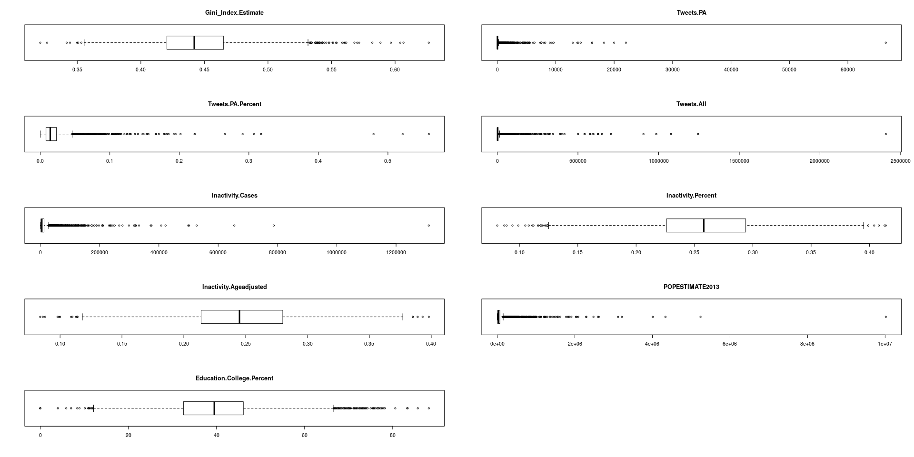
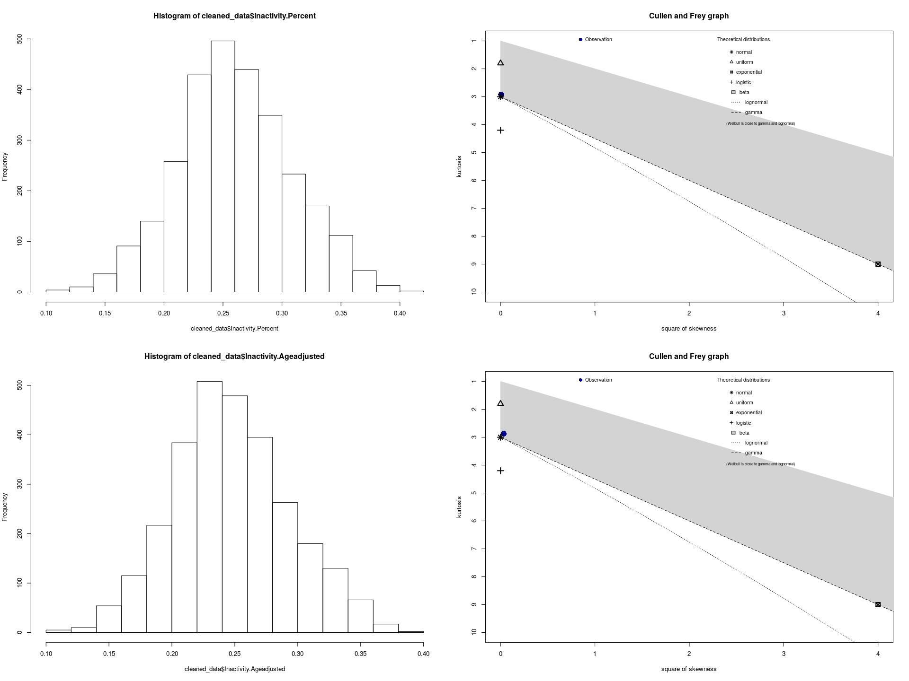
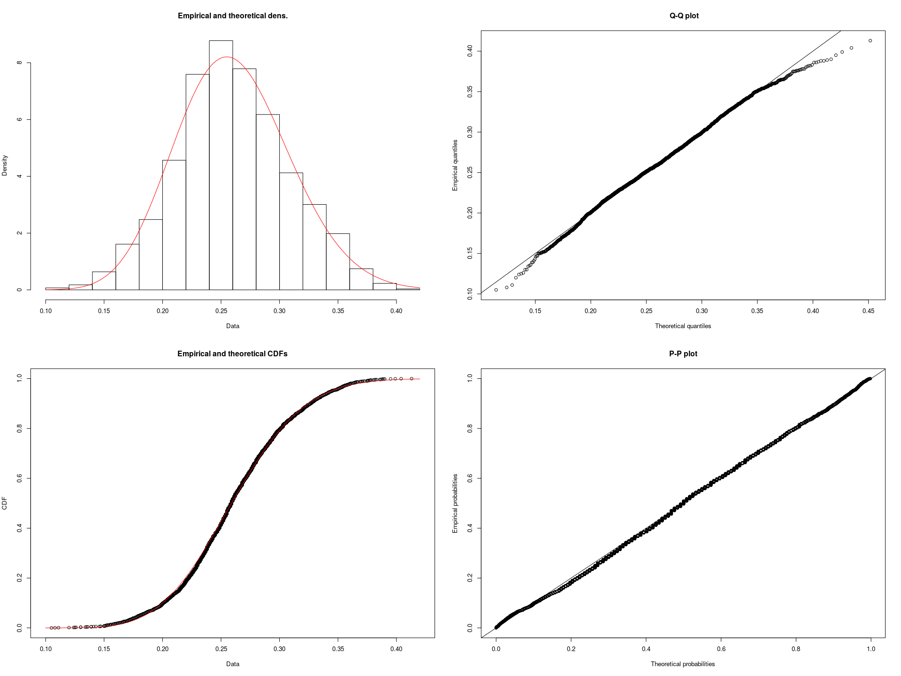
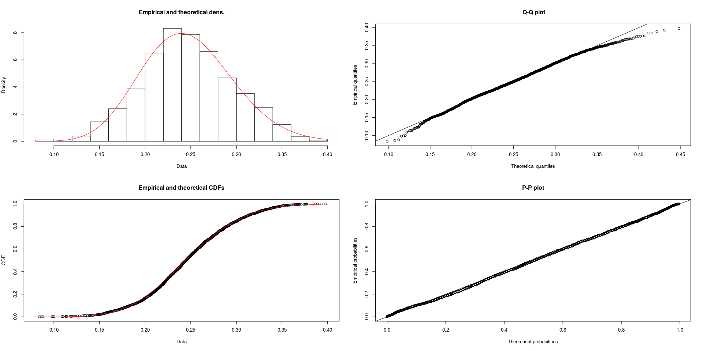
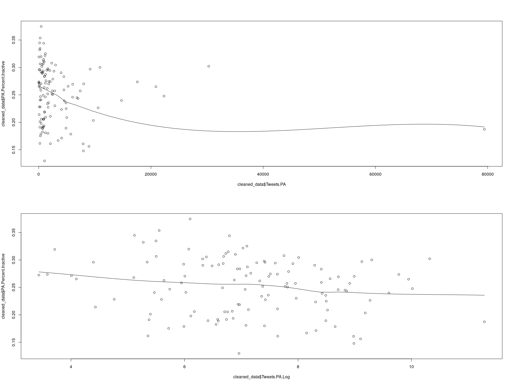

Twitter and Physical Activity
================

``` r
library(foreign)
library(betareg)
library(ggplot2)
library(fitdistrplus)
library(logspline)
library(Hmisc)
library(knitr)
```

The compiled dataset contains a subset of US counties (names and FIPS codes).

The associated data for each county is as follows:

-   All\_Tweets: the total collected number of tweets from that county
-   PA\_Tweets: the number of tweets identified as physical activity-related
-   Inactivity\_Cases: TODO
-   Inactivity\_Percent: TODO
-   Inactivity\_Percent\_AgeAdjusted: TODO
-   Gini\_Index: TODO
-   Gini\_Index\_MoE: the margin of error of the Gini index estimate

``` r
# This helper will render legible tables in both RStudio and the generated markdown.
display <- function(x) {
  if (interactive()) (x)
  else kable(x)
}

all_data <- read.csv("all_data_mmsa.csv")
display(head(all_data))
```

|  CBSA.Code| CBSA.Title                              | CBSA.Geography                                     |  Gini\_Index.Estimate|  Gini\_Index.MOE|  Tweets.PA|  Tweets.All|  PA.Active|  PA.Inactive|  PA.Refused|  PA.Missing|
|----------:|:----------------------------------------|:---------------------------------------------------|---------------------:|----------------:|----------:|-----------:|----------:|------------:|-----------:|-----------:|
|      31080| Los Angeles-Long Beach-Anaheim, CA      | Los Angeles-Long Beach-Anaheim, CA Metro Area      |                0.4965|           0.0013|      79420|     2949641|       5706|         1316|           0|           0|
|      16980| Chicago-Naperville-Elgin, IL-IN-WI      | Chicago-Naperville-Elgin, IL-IN-WI Metro Area      |                0.4820|           0.0015|      22341|     1441940|      44282|        14588|          42|           0|
|      33460| Minneapolis-St. Paul-Bloomington, MN-WI | Minneapolis-St. Paul-Bloomington, MN-WI Metro Area |                0.4458|           0.0018|       7926|      524472|     114656|        21984|         112|           0|
|      26420| Houston-The Woodlands-Sugar Land, TX    | Houston-The Woodlands-Sugar Land, TX Metro Area    |                0.4866|           0.0019|      17580|     1143204|      12015|         4527|          18|           0|
|      38060| Phoenix-Mesa-Scottsdale, AZ             | Phoenix-Mesa-Scottsdale, AZ Metro Area             |                0.4656|           0.0021|      14755|      673583|       8116|         2560|           6|           0|
|      12060| Atlanta-Sandy Springs-Roswell, GA       | Atlanta-Sandy Springs-Roswell, GA Metro Area       |                0.4720|           0.0021|      20881|     1105796|      51997|        18734|          29|           0|

Not all counties in the dataset have tweet or physical activity data available, so we must filter those out. We must also normalize the percentages (expressed here as a number /100) to values we can use for a beta distribution (i.e. 0-1)

``` r
# Remove rows with missing values
cleaned_data <- na.omit(all_data)
cleaned_data$Tweets.PA.Log <- log1p(cleaned_data$Tweets.PA)
cleaned_data$PA.Total <- cleaned_data$PA.Active + cleaned_data$PA.Inactive
cleaned_data$PA.Percent.Active <- cleaned_data$PA.Active / cleaned_data$PA.Total
cleaned_data$PA.Percent.Inactive <- cleaned_data$PA.Inactive / cleaned_data$PA.Total

vars <- c(
  "Gini_Index.Estimate",
  "Tweets.PA",
  "Tweets.All",
  "PA.Active",
  "PA.Inactive",
  "PA.Percent.Active",
  "PA.Percent.Inactive"
)
display(as.data.frame(do.call(cbind, lapply(cleaned_data[vars], summary))))
```

|         |  Gini\_Index.Estimate|  Tweets.PA|  Tweets.All|  PA.Active|  PA.Inactive|  PA.Percent.Active|  PA.Percent.Inactive|
|---------|---------------------:|----------:|-----------:|----------:|------------:|------------------:|--------------------:|
| Min.    |             0.3949000|     30.000|      2866.0|     700.00|       184.00|          0.6253418|            0.1297405|
| 1st Qu. |             0.4438500|    464.000|     33811.0|    1470.50|       516.00|          0.7082039|            0.2101675|
| Median  |             0.4568000|   1190.000|     78662.0|    3168.00|       935.00|          0.7426997|            0.2573003|
| Mean    |             0.4561252|   3589.512|    202233.6|    7873.26|      2441.35|          0.7481998|            0.2518002|
| 3rd Qu. |             0.4676500|   3729.000|    235189.5|    7354.00|      2605.00|          0.7898325|            0.2917961|
| Max.    |             0.5142000|  79420.000|   2949641.0|  114656.00|     21984.00|          0.8702595|            0.3746582|

The count data are heavily right-skewed with notable outliers. This is partly attributable to the disparity in population between counties (e.g. LA, the most populous county, has a similar relative magnitude of tweets)

``` r
par(mfrow=c(ceiling(length(vars) / 2), 2))
for (v in vars) {
  boxplot(cleaned_data[v], main = v, horizontal = TRUE)
}
```



``` r
par(mfrow=c(2, 2))
hist(cleaned_data$PA.Percent.Active)
descdist(cleaned_data$PA.Percent.Active)
```

    ## summary statistics
    ## ------
    ## min:  0.6253418   max:  0.8702595 
    ## median:  0.7426997 
    ## mean:  0.7481998 
    ## estimated sd:  0.05042862 
    ## estimated skewness:  0.1618816 
    ## estimated kurtosis:  2.415449

``` r
hist(cleaned_data$PA.Percent.Inactive)
descdist(cleaned_data$PA.Percent.Inactive)
```



    ## summary statistics
    ## ------
    ## min:  0.1297405   max:  0.3746582 
    ## median:  0.2573003 
    ## mean:  0.2518002 
    ## estimated sd:  0.05042862 
    ## estimated skewness:  -0.1618816 
    ## estimated kurtosis:  2.415449

``` r
fit.beta1 <- fitdist(cleaned_data$PA.Percent.Active, "beta")
plot(fit.beta1)
```



``` r
fit.beta2 <- fitdist(cleaned_data$PA.Percent.Inactive, "beta")
plot(fit.beta2)
```



Correlation of variables:

``` r
results <- rcorr(as.matrix(cleaned_data[vars]), type = "pearson")
```

    ## Warning in sqrt(1 - h * h): NaNs produced

``` r
display(as.data.frame(results$r))
```

|                      |  Gini\_Index.Estimate|   Tweets.PA|  Tweets.All|   PA.Active|  PA.Inactive|  PA.Percent.Active|  PA.Percent.Inactive|
|----------------------|---------------------:|-----------:|-----------:|-----------:|------------:|------------------:|--------------------:|
| Gini\_Index.Estimate |             1.0000000|   0.3594753|   0.3980904|   0.0779692|    0.1531227|         -0.2683066|            0.2683066|
| Tweets.PA            |             0.3594753|   1.0000000|   0.9683511|   0.2336205|    0.2634078|          0.1232174|           -0.1232174|
| Tweets.All           |             0.3980904|   0.9683511|   1.0000000|   0.3646222|    0.4117002|          0.1316636|           -0.1316636|
| PA.Active            |             0.0779692|   0.2336205|   0.3646222|   1.0000000|    0.9479511|          0.2006466|           -0.2006466|
| PA.Inactive          |             0.1531227|   0.2634078|   0.4117002|   0.9479511|    1.0000000|          0.0743143|           -0.0743143|
| PA.Percent.Active    |            -0.2683066|   0.1232174|   0.1316636|   0.2006466|    0.0743143|          1.0000000|           -1.0000000|
| PA.Percent.Inactive  |             0.2683066|  -0.1232174|  -0.1316636|  -0.2006466|   -0.0743143|         -1.0000000|            1.0000000|

``` r
display(as.data.frame(results$P))
```

|                      |  Gini\_Index.Estimate|  Tweets.PA|  Tweets.All|  PA.Active|  PA.Inactive|  PA.Percent.Active|  PA.Percent.Inactive|
|----------------------|---------------------:|----------:|-----------:|----------:|------------:|------------------:|--------------------:|
| Gini\_Index.Estimate |                    NA|  0.0000444|   0.0000051|  0.3913360|    0.0908636|          0.0026954|            0.0026954|
| Tweets.PA            |             0.0000444|         NA|   0.0000000|  0.0093057|    0.0032434|          0.1745353|            0.1745353|
| Tweets.All           |             0.0000051|  0.0000000|          NA|  0.0000338|    0.0000022|          0.1466022|            0.1466022|
| PA.Active            |             0.3913360|  0.0093057|   0.0000338|         NA|    0.0000000|          0.0260653|            0.0260653|
| PA.Inactive          |             0.0908636|  0.0032434|   0.0000022|  0.0000000|           NA|          0.4139850|            0.4139850|
| PA.Percent.Active    |             0.0026954|  0.1745353|   0.1466022|  0.0260653|    0.4139850|                 NA|                  NaN|
| PA.Percent.Inactive  |             0.0026954|  0.1745353|   0.1466022|  0.0260653|    0.4139850|                NaN|                   NA|

Comparing models:

``` r
m1 <- betareg(PA.Percent.Inactive ~ Tweets.PA, data = cleaned_data)
summary(m1)
```

    ## 
    ## Call:
    ## betareg(formula = PA.Percent.Inactive ~ Tweets.PA, data = cleaned_data)
    ## 
    ## Standardized weighted residuals 2:
    ##     Min      1Q  Median      3Q     Max 
    ## -2.9618 -0.7795  0.2235  0.7838  2.1469 
    ## 
    ## Coefficients (mean model with logit link):
    ##               Estimate Std. Error z value Pr(>|z|)    
    ## (Intercept) -1.076e+00  2.648e-02 -40.621   <2e-16 ***
    ## Tweets.PA   -3.931e-06  3.085e-06  -1.274    0.203    
    ## 
    ## Phi coefficients (precision model with identity link):
    ##       Estimate Std. Error z value Pr(>|z|)    
    ## (phi)   72.467      9.192   7.883 3.19e-15 ***
    ## ---
    ## Signif. codes:  0 '***' 0.001 '**' 0.01 '*' 0.05 '.' 0.1 ' ' 1 
    ## 
    ## Type of estimator: ML (maximum likelihood)
    ## Log-likelihood: 193.2 on 3 Df
    ## Pseudo R-squared: 0.01433
    ## Number of iterations: 15 (BFGS) + 2 (Fisher scoring)

``` r
m2 <- update(m1, . ~ . + Gini_Index.Estimate)
summary(m2)
```

    ## 
    ## Call:
    ## betareg(formula = PA.Percent.Inactive ~ Tweets.PA + Gini_Index.Estimate, 
    ##     data = cleaned_data)
    ## 
    ## Standardized weighted residuals 2:
    ##     Min      1Q  Median      3Q     Max 
    ## -2.3356 -0.6392  0.0227  0.6287  2.4170 
    ## 
    ## Coefficients (mean model with logit link):
    ##                       Estimate Std. Error z value Pr(>|z|)    
    ## (Intercept)         -3.306e+00  5.370e-01  -6.157 7.41e-10 ***
    ## Tweets.PA           -8.417e-06  3.157e-06  -2.667  0.00766 ** 
    ## Gini_Index.Estimate  4.921e+00  1.182e+00   4.162 3.16e-05 ***
    ## 
    ## Phi coefficients (precision model with identity link):
    ##       Estimate Std. Error z value Pr(>|z|)    
    ## (phi)    82.76      10.50   7.878 3.32e-15 ***
    ## ---
    ## Signif. codes:  0 '***' 0.001 '**' 0.01 '*' 0.05 '.' 0.1 ' ' 1 
    ## 
    ## Type of estimator: ML (maximum likelihood)
    ## Log-likelihood: 201.3 on 4 Df
    ## Pseudo R-squared: 0.1358
    ## Number of iterations: 19 (BFGS) + 2 (Fisher scoring)

``` r
m3 <- update(m2, . ~ . + Tweets.PA:Gini_Index.Estimate)

m4 <- betareg(PA.Percent.Inactive ~ Tweets.PA.Log, data = cleaned_data)
summary(m4)
```

    ## 
    ## Call:
    ## betareg(formula = PA.Percent.Inactive ~ Tweets.PA.Log, data = cleaned_data)
    ## 
    ## Standardized weighted residuals 2:
    ##     Min      1Q  Median      3Q     Max 
    ## -2.9725 -0.7235  0.1471  0.7728  2.0989 
    ## 
    ## Coefficients (mean model with logit link):
    ##               Estimate Std. Error z value Pr(>|z|)    
    ## (Intercept)   -0.84862    0.11713  -7.245 4.33e-13 ***
    ## Tweets.PA.Log -0.03389    0.01617  -2.096   0.0361 *  
    ## 
    ## Phi coefficients (precision model with identity link):
    ##       Estimate Std. Error z value Pr(>|z|)    
    ## (phi)   73.996      9.387   7.883 3.21e-15 ***
    ## ---
    ## Signif. codes:  0 '***' 0.001 '**' 0.01 '*' 0.05 '.' 0.1 ' ' 1 
    ## 
    ## Type of estimator: ML (maximum likelihood)
    ## Log-likelihood: 194.5 on 3 Df
    ## Pseudo R-squared: 0.03369
    ## Number of iterations: 21 (BFGS) + 2 (Fisher scoring)

``` r
m5 <- update(m4, . ~ . + Gini_Index.Estimate)
summary(m5)
```

    ## 
    ## Call:
    ## betareg(formula = PA.Percent.Inactive ~ Tweets.PA.Log + Gini_Index.Estimate, 
    ##     data = cleaned_data)
    ## 
    ## Standardized weighted residuals 2:
    ##     Min      1Q  Median      3Q     Max 
    ## -2.2694 -0.6813  0.1798  0.6944  2.3905 
    ## 
    ## Coefficients (mean model with logit link):
    ##                     Estimate Std. Error z value Pr(>|z|)    
    ## (Intercept)         -3.32326    0.50142  -6.628 3.41e-11 ***
    ## Tweets.PA.Log       -0.07159    0.01655  -4.326 1.52e-05 ***
    ## Gini_Index.Estimate  6.00857    1.19023   5.048 4.46e-07 ***
    ## 
    ## Phi coefficients (precision model with identity link):
    ##       Estimate Std. Error z value Pr(>|z|)    
    ## (phi)    89.72      11.39   7.875  3.4e-15 ***
    ## ---
    ## Signif. codes:  0 '***' 0.001 '**' 0.01 '*' 0.05 '.' 0.1 ' ' 1 
    ## 
    ## Type of estimator: ML (maximum likelihood)
    ## Log-likelihood: 206.3 on 4 Df
    ## Pseudo R-squared: 0.2066
    ## Number of iterations: 39 (BFGS) + 3 (Fisher scoring)

``` r
m6 <- update(m5, . ~ . + Tweets.PA:Gini_Index.Estimate)
summary(m6)
```

    ## 
    ## Call:
    ## betareg(formula = PA.Percent.Inactive ~ Tweets.PA.Log + Gini_Index.Estimate + 
    ##     Gini_Index.Estimate:Tweets.PA, data = cleaned_data)
    ## 
    ## Standardized weighted residuals 2:
    ##     Min      1Q  Median      3Q     Max 
    ## -2.2899 -0.7143  0.1612  0.7036  2.3983 
    ## 
    ## Coefficients (mean model with logit link):
    ##                                 Estimate Std. Error z value Pr(>|z|)    
    ## (Intercept)                   -3.399e+00  5.154e-01  -6.593 4.30e-11 ***
    ## Tweets.PA.Log                 -6.539e-02  1.947e-02  -3.359 0.000783 ***
    ## Gini_Index.Estimate            6.092e+00  1.196e+00   5.095 3.49e-07 ***
    ## Gini_Index.Estimate:Tweets.PA -4.025e-06  6.891e-06  -0.584 0.559147    
    ## 
    ## Phi coefficients (precision model with identity link):
    ##       Estimate Std. Error z value Pr(>|z|)    
    ## (phi)    89.99      11.43   7.875  3.4e-15 ***
    ## ---
    ## Signif. codes:  0 '***' 0.001 '**' 0.01 '*' 0.05 '.' 0.1 ' ' 1 
    ## 
    ## Type of estimator: ML (maximum likelihood)
    ## Log-likelihood: 206.5 on 5 Df
    ## Pseudo R-squared: 0.2093
    ## Number of iterations: 23 (BFGS) + 3 (Fisher scoring)

``` r
# AIC(m.beta1, m.beta2, m.beta3)
display(AIC(m1, m2, m3, m4, m5, m6, k = log(nrow(cleaned_data))))
```

|     |   df|        AIC|
|-----|----:|----------:|
| m1  |    3|  -371.9519|
| m2  |    4|  -383.4258|
| m3  |    5|  -385.6602|
| m4  |    3|  -374.5116|
| m5  |    4|  -393.3676|
| m6  |    5|  -388.9273|

``` r
trunc_data <- cleaned_data[cleaned_data$Tweets.All > median(cleaned_data$Tweets.All),]
results <- rcorr(as.matrix(trunc_data[vars]), type = "pearson")
```

    ## Warning in sqrt(1 - h * h): NaNs produced

``` r
display(as.data.frame(results$r))
```

|                      |  Gini\_Index.Estimate|   Tweets.PA|  Tweets.All|   PA.Active|  PA.Inactive|  PA.Percent.Active|  PA.Percent.Inactive|
|----------------------|---------------------:|-----------:|-----------:|-----------:|------------:|------------------:|--------------------:|
| Gini\_Index.Estimate |             1.0000000|   0.4561248|   0.4763597|  -0.1056648|   -0.0136555|         -0.4067907|            0.4067907|
| Tweets.PA            |             0.4561248|   1.0000000|   0.9705088|   0.1032451|    0.1182855|          0.1312729|           -0.1312729|
| Tweets.All           |             0.4763597|   0.9705088|   1.0000000|   0.2188704|    0.2527795|          0.1386062|           -0.1386062|
| PA.Active            |            -0.1056648|   0.1032451|   0.2188704|   1.0000000|    0.9401173|          0.2530338|           -0.2530338|
| PA.Inactive          |            -0.0136555|   0.1182855|   0.2527795|   0.9401173|    1.0000000|          0.0735781|           -0.0735781|
| PA.Percent.Active    |            -0.4067907|   0.1312729|   0.1386062|   0.2530338|    0.0735781|          1.0000000|           -1.0000000|
| PA.Percent.Inactive  |             0.4067907|  -0.1312729|  -0.1386062|  -0.2530338|   -0.0735781|         -1.0000000|            1.0000000|

``` r
display(as.data.frame(results$P))
```

|                      |  Gini\_Index.Estimate|  Tweets.PA|  Tweets.All|  PA.Active|  PA.Inactive|  PA.Percent.Active|  PA.Percent.Inactive|
|----------------------|---------------------:|----------:|-----------:|----------:|------------:|------------------:|--------------------:|
| Gini\_Index.Estimate |                    NA|  0.0002204|   0.0001042|  0.4176712|    0.9168113|          0.0011406|            0.0011406|
| Tweets.PA            |             0.0002204|         NA|   0.0000000|  0.4284731|    0.3639203|          0.3132453|            0.3132453|
| Tweets.All           |             0.0001042|  0.0000000|          NA|  0.0901355|    0.0493592|          0.2867374|            0.2867374|
| PA.Active            |             0.4176712|  0.4284731|   0.0901355|         NA|    0.0000000|          0.0491233|            0.0491233|
| PA.Inactive          |             0.9168113|  0.3639203|   0.0493592|  0.0000000|           NA|          0.5730677|            0.5730677|
| PA.Percent.Active    |             0.0011406|  0.3132453|   0.2867374|  0.0491233|    0.5730677|                 NA|                  NaN|
| PA.Percent.Inactive  |             0.0011406|  0.3132453|   0.2867374|  0.0491233|    0.5730677|                NaN|                   NA|

``` r
par(mfrow=c(2, 1))
scatter.smooth(cleaned_data$Tweets.PA, cleaned_data$PA.Percent.Inactive)
scatter.smooth(cleaned_data$Tweets.PA.Log, cleaned_data$PA.Percent.Inactive)
```



``` r
predict(m4, data.frame(Tweets.PA.Log = log(23)))
```

    ##         1 
    ## 0.2779044
