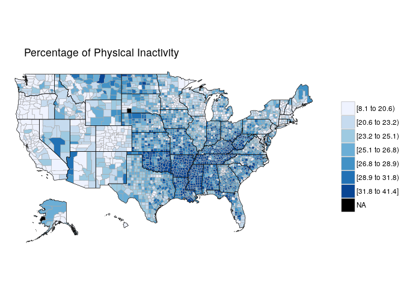
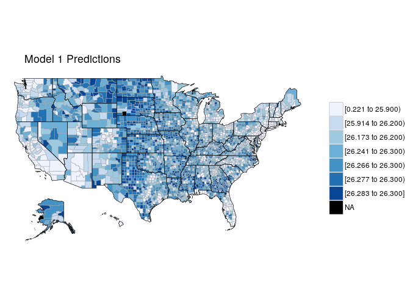
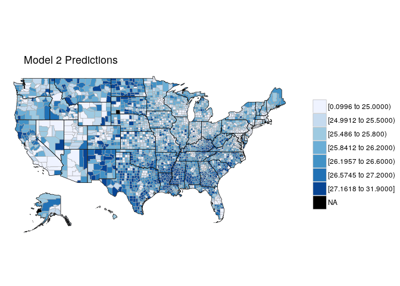
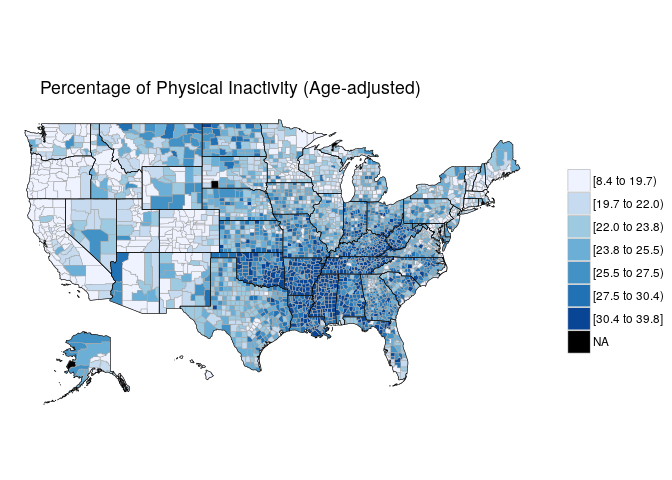

Twitter and Physical Activity
================

``` r
library(foreign)
library(betareg)
library(ggplot2)
library(fitdistrplus)
library(logspline)
library(Hmisc)
library(knitr)
```

The compiled dataset contains a subset of US counties (names and FIPS codes).

The associated data for each county is as follows:

-   All\_Tweets: the total collected number of tweets from that county
-   PA\_Tweets: the number of tweets identified as physical activity-related
-   Inactivity\_Cases: TODO
-   Inactivity\_Percent: TODO
-   Inactivity\_Percent\_AgeAdjusted: TODO
-   Gini\_Index: TODO
-   Gini\_Index\_MoE: the margin of error of the Gini index estimate

``` r
# This helper will render legible tables in both RStudio and the generated markdown.
display <- function(x) {
  if (interactive()) (x)
  else kable(x)
}

all_data <- read.csv("data/all_data.csv")
display(head(all_data))
```

|    X|  FIPS|  Tweets.PA|  Tweets.All| State   | County         |  Inactivity.Cases|  Inactivity.Percent|  lower.confidence.limit|  upper.confidence.limit|  Inactivity.Ageadjusted|  age.adjusted.lower.confidence.limit|  age.adjusted.upper.confidence.limit| FIPS.Long      | Geography               |  Gini\_Index.Estimate|  Gini\_Index.Margin\_of\_Error|
|----:|-----:|----------:|-----------:|:--------|:---------------|-----------------:|-------------------:|-----------------------:|-----------------------:|-----------------------:|------------------------------------:|------------------------------------:|:---------------|:------------------------|---------------------:|------------------------------:|
|    1|  1001|        104|        6063| Alabama | Autauga County |             11342|                28.6|                    23.8|                    33.1|                    28.0|                                 23.3|                                 32.4| 0500000US01001 | Autauga County, Alabama |                0.4295|                         0.0177|
|    2|  1003|        511|       27019| Alabama | Baldwin County |             32856|                22.3|                    19.9|                    24.9|                    21.2|                                 18.8|                                 23.9| 0500000US01003 | Baldwin County, Alabama |                0.4608|                         0.0098|
|    3|  1005|          5|         802| Alabama | Barbour County |              6578|                31.8|                    26.8|                    37.0|                    31.0|                                 26.0|                                 36.2| 0500000US01005 | Barbour County, Alabama |                0.4620|                         0.0117|
|    4|  1007|          1|         591| Alabama | Bibb County    |              5846|                33.9|                    28.0|                    40.1|                    33.3|                                 27.3|                                 39.5| 0500000US01007 | Bibb County, Alabama    |                0.4494|                         0.0533|
|    5|  1009|         23|        1681| Alabama | Blount County  |             11954|                28.0|                    23.2|                    33.7|                    27.1|                                 22.2|                                 32.7| 0500000US01009 | Blount County, Alabama  |                0.4165|                         0.0141|
|    6|  1011|          1|         195| Alabama | Bullock County |              2572|                31.7|                    24.5|                    39.0|                    31.1|                                 24.0|                                 38.3| 0500000US01011 | Bullock County, Alabama |                0.4701|                         0.0373|

Not all counties in the dataset have tweet or physical activity data available, so we must filter those out. We must also normalize the percentages (expressed here as a number /100) to values we can use for a beta distribution (i.e. 0-1)

``` r
# Remove rows with missing values
cat('Rows in complete dataset: ', nrow(all_data), '\n')
```

    ## Rows in complete dataset:  3140

``` r
cleaned_data <- na.omit(all_data)
cleaned_data <- cleaned_data[cleaned_data$Tweets.All >= cleaned_data$Tweets.PA,]
cat('Rows after cleaning: ', nrow(cleaned_data))
```

    ## Rows after cleaning:  3139

``` r
#cleaned_data$Tweets.PA.Log <- log1p(cleaned_data$Tweets.PA)
cleaned_data$Tweets.PA.Percent <- cleaned_data$Tweets.PA / cleaned_data$Tweets.All
cleaned_data$Inactivity.Percent <- cleaned_data$Inactivity.Percent / 100
cleaned_data$Inactivity.Ageadjusted <- cleaned_data$Inactivity.Ageadjusted / 100

vars <- c(
  "Gini_Index.Estimate",
  "Tweets.PA",
  "Tweets.PA.Percent",
#  "Tweets.PA.Log",
  "Tweets.All",
  "Inactivity.Cases",
  "Inactivity.Percent",
  "Inactivity.Ageadjusted"
)
display(as.data.frame(do.call(cbind, lapply(cleaned_data[vars], summary))))
```

|         |  Gini\_Index.Estimate|   Tweets.PA|  Tweets.PA.Percent|  Tweets.All|  Inactivity.Cases|  Inactivity.Percent|  Inactivity.Ageadjusted|
|---------|---------------------:|-----------:|------------------:|-----------:|-----------------:|-------------------:|-----------------------:|
| Min.    |             0.3209000|      0.0000|          0.0000000|       12.00|             16.00|           0.0810000|               0.0840000|
| 1st Qu. |             0.4205000|      5.0000|          0.0082237|      427.50|           2218.00|           0.2260000|               0.2140000|
| Median  |             0.4420000|     20.0000|          0.0143731|     1451.00|           5293.00|           0.2580000|               0.2450000|
| Mean    |             0.4443894|    271.3297|          0.0204867|    15395.96|          16610.13|           0.2595378|               0.2469748|
| 3rd Qu. |             0.4651000|     99.0000|          0.0233094|     5942.50|          12774.00|           0.2940000|               0.2800000|
| Max.    |             0.6265000|  66486.0000|          0.5587734|  2408076.00|        1310363.00|           0.4140000|               0.3980000|

The count data are heavily right-skewed with notable outliers. This is partly attributable to the disparity in population between counties (e.g. LA, the most populous county, has a similar relative magnitude of tweets)

``` r
par(mfrow=c(ceiling(length(vars) / 2), 2))
for (v in vars) {
  boxplot(cleaned_data[v], main = v, horizontal = TRUE)
}
```


``` r
par(mfrow=c(2, 2))
hist(cleaned_data$Inactivity.Percent)
descdist(cleaned_data$Inactivity.Percent)
```

    ## summary statistics
    ## ------
    ## min:  0.081   max:  0.414 
    ## median:  0.258 
    ## mean:  0.2595378 
    ## estimated sd:  0.05203194 
    ## estimated skewness:  -0.03399037 
    ## estimated kurtosis:  2.906753

``` r
hist(cleaned_data$Inactivity.Ageadjusted)
descdist(cleaned_data$Inactivity.Ageadjusted)
```


    ## summary statistics
    ## ------
    ## min:  0.084   max:  0.398 
    ## median:  0.245 
    ## mean:  0.2469748 
    ## estimated sd:  0.04961209 
    ## estimated skewness:  0.05576922 
    ## estimated kurtosis:  2.844345

``` r
fit.beta1 <- fitdist(cleaned_data$Inactivity.Percent, "beta")
plot(fit.beta1)
```


``` r
fit.beta2 <- fitdist(cleaned_data$Inactivity.Ageadjusted, "beta")
plot(fit.beta2)
```


Correlation of variables:

``` r
results <- rcorr(as.matrix(cleaned_data[vars]), type = "pearson")
display(as.data.frame(results$r))
```

|                        |  Gini\_Index.Estimate|   Tweets.PA|  Tweets.PA.Percent|  Tweets.All|  Inactivity.Cases|  Inactivity.Percent|  Inactivity.Ageadjusted|
|------------------------|---------------------:|-----------:|------------------:|-----------:|-----------------:|-------------------:|-----------------------:|
| Gini\_Index.Estimate   |             1.0000000|   0.1438672|         -0.0701097|   0.1769081|         0.1597308|           0.1544075|               0.1766150|
| Tweets.PA              |             0.1438672|   1.0000000|          0.0101980|   0.9600323|         0.8652419|          -0.1728250|              -0.1496722|
| Tweets.PA.Percent      |            -0.0701097|   0.0101980|          1.0000000|  -0.0208140|        -0.0367997|          -0.1276635|              -0.1465862|
| Tweets.All             |             0.1769081|   0.9600323|         -0.0208140|   1.0000000|         0.9018975|          -0.1906965|              -0.1614910|
| Inactivity.Cases       |             0.1597308|   0.8652419|         -0.0367997|   0.9018975|         1.0000000|          -0.1766000|              -0.1398194|
| Inactivity.Percent     |             0.1544075|  -0.1728250|         -0.1276635|  -0.1906965|        -0.1766000|           1.0000000|               0.9879271|
| Inactivity.Ageadjusted |             0.1766150|  -0.1496722|         -0.1465862|  -0.1614910|        -0.1398194|           0.9879271|               1.0000000|

``` r
display(as.data.frame(results$P))
```

|                        |  Gini\_Index.Estimate|  Tweets.PA|  Tweets.PA.Percent|  Tweets.All|  Inactivity.Cases|  Inactivity.Percent|  Inactivity.Ageadjusted|
|------------------------|---------------------:|----------:|------------------:|-----------:|-----------------:|-------------------:|-----------------------:|
| Gini\_Index.Estimate   |                    NA|  0.0000000|          0.0000845|   0.0000000|         0.0000000|                   0|                       0|
| Tweets.PA              |              0.00e+00|         NA|          0.5678987|   0.0000000|         0.0000000|                   0|                       0|
| Tweets.PA.Percent      |              8.45e-05|  0.5678987|                 NA|   0.2436931|         0.0392416|                   0|                       0|
| Tweets.All             |              0.00e+00|  0.0000000|          0.2436931|          NA|         0.0000000|                   0|                       0|
| Inactivity.Cases       |              0.00e+00|  0.0000000|          0.0392416|   0.0000000|                NA|                   0|                       0|
| Inactivity.Percent     |              0.00e+00|  0.0000000|          0.0000000|   0.0000000|         0.0000000|                  NA|                       0|
| Inactivity.Ageadjusted |              0.00e+00|  0.0000000|          0.0000000|   0.0000000|         0.0000000|                   0|                      NA|

Correlation of variables:

``` r
results <- rcorr(as.matrix(cleaned_data[vars]), type = "spearman")
display(as.data.frame(results$r))
```

|                        |  Gini\_Index.Estimate|   Tweets.PA|  Tweets.PA.Percent|  Tweets.All|  Inactivity.Cases|  Inactivity.Percent|  Inactivity.Ageadjusted|
|------------------------|---------------------:|-----------:|------------------:|-----------:|-----------------:|-------------------:|-----------------------:|
| Gini\_Index.Estimate   |             1.0000000|   0.0541604|         -0.0904079|   0.1072164|         0.1318648|           0.1673418|               0.1843002|
| Tweets.PA              |             0.0541604|   1.0000000|          0.4402440|   0.8846005|         0.7795248|          -0.4295164|              -0.3707754|
| Tweets.PA.Percent      |            -0.0904079|   0.4402440|          1.0000000|   0.0262505|        -0.0161094|          -0.2791446|              -0.2960595|
| Tweets.All             |             0.1072164|   0.8846005|          0.0262505|   1.0000000|         0.8864400|          -0.3400844|              -0.2659612|
| Inactivity.Cases       |             0.1318648|   0.7795248|         -0.0161094|   0.8864400|         1.0000000|          -0.1083856|              -0.0323365|
| Inactivity.Percent     |             0.1673418|  -0.4295164|         -0.2791446|  -0.3400844|        -0.1083856|           1.0000000|               0.9851774|
| Inactivity.Ageadjusted |             0.1843002|  -0.3707754|         -0.2960595|  -0.2659612|        -0.0323365|           0.9851774|               1.0000000|

``` r
display(as.data.frame(results$P))
```

|                        |  Gini\_Index.Estimate|  Tweets.PA|  Tweets.PA.Percent|  Tweets.All|  Inactivity.Cases|  Inactivity.Percent|  Inactivity.Ageadjusted|
|------------------------|---------------------:|----------:|------------------:|-----------:|-----------------:|-------------------:|-----------------------:|
| Gini\_Index.Estimate   |                    NA|  0.0024018|          0.0000004|   0.0000000|         0.0000000|                   0|                0.000000|
| Tweets.PA              |             0.0024018|         NA|          0.0000000|   0.0000000|         0.0000000|                   0|                0.000000|
| Tweets.PA.Percent      |             0.0000004|  0.0000000|                 NA|   0.1414541|         0.3669199|                   0|                0.000000|
| Tweets.All             |             0.0000000|  0.0000000|          0.1414541|          NA|         0.0000000|                   0|                0.000000|
| Inactivity.Cases       |             0.0000000|  0.0000000|          0.3669199|   0.0000000|                NA|                   0|                0.070069|
| Inactivity.Percent     |             0.0000000|  0.0000000|          0.0000000|   0.0000000|         0.0000000|                  NA|                0.000000|
| Inactivity.Ageadjusted |             0.0000000|  0.0000000|          0.0000000|   0.0000000|         0.0700690|                   0|                      NA|

Comparing models:

``` r
m1 <- betareg(Inactivity.Percent ~ Tweets.PA, data = cleaned_data)
summary(m1)
```

    ## 
    ## Call:
    ## betareg(formula = Inactivity.Percent ~ Tweets.PA, data = cleaned_data)
    ## 
    ## Standardized weighted residuals 2:
    ##     Min      1Q  Median      3Q     Max 
    ## -4.5343 -0.5938  0.0275  0.6753  3.4450 
    ## 
    ## Coefficients (mean model with logit link):
    ##               Estimate Std. Error z value Pr(>|z|)    
    ## (Intercept) -1.031e+00  4.891e-03 -210.83   <2e-16 ***
    ## Tweets.PA   -7.645e-05  5.206e-06  -14.69   <2e-16 ***
    ## 
    ## Phi coefficients (precision model with identity link):
    ##       Estimate Std. Error z value Pr(>|z|)    
    ## (phi)   71.911      1.805   39.83   <2e-16 ***
    ## ---
    ## Signif. codes:  0 '***' 0.001 '**' 0.01 '*' 0.05 '.' 0.1 ' ' 1 
    ## 
    ## Type of estimator: ML (maximum likelihood)
    ## Log-likelihood:  4883 on 3 Df
    ## Pseudo R-squared: 0.03261
    ## Number of iterations: 15 (BFGS) + 2 (Fisher scoring)

``` r
m2 <- update(m1, . ~ . + Gini_Index.Estimate)
summary(m2)
```

    ## 
    ## Call:
    ## betareg(formula = Inactivity.Percent ~ Tweets.PA + Gini_Index.Estimate, 
    ##     data = cleaned_data)
    ## 
    ## Standardized weighted residuals 2:
    ##     Min      1Q  Median      3Q     Max 
    ## -5.2550 -0.5765  0.0568  0.6774  3.5978 
    ## 
    ## Coefficients (mean model with logit link):
    ##                       Estimate Std. Error z value Pr(>|z|)    
    ## (Intercept)         -1.688e+00  5.973e-02  -28.26   <2e-16 ***
    ## Tweets.PA           -8.976e-05  5.294e-06  -16.95   <2e-16 ***
    ## Gini_Index.Estimate  1.483e+00  1.342e-01   11.06   <2e-16 ***
    ## 
    ## Phi coefficients (precision model with identity link):
    ##       Estimate Std. Error z value Pr(>|z|)    
    ## (phi)   74.763      1.877   39.82   <2e-16 ***
    ## ---
    ## Signif. codes:  0 '***' 0.001 '**' 0.01 '*' 0.05 '.' 0.1 ' ' 1 
    ## 
    ## Type of estimator: ML (maximum likelihood)
    ## Log-likelihood:  4943 on 4 Df
    ## Pseudo R-squared: 0.05137
    ## Number of iterations: 11 (BFGS) + 7 (Fisher scoring)

``` r
m3 <- update(m2, . ~ . + Tweets.PA:Gini_Index.Estimate)
summary(m3)
```

    ## 
    ## Call:
    ## betareg(formula = Inactivity.Percent ~ Tweets.PA + Gini_Index.Estimate + 
    ##     Tweets.PA:Gini_Index.Estimate, data = cleaned_data)
    ## 
    ## Standardized weighted residuals 2:
    ##     Min      1Q  Median      3Q     Max 
    ## -5.5480 -0.5779  0.0557  0.6762  3.4099 
    ## 
    ## Coefficients (mean model with logit link):
    ##                                 Estimate Std. Error z value Pr(>|z|)    
    ## (Intercept)                   -1.629e+00  5.952e-02  -27.37   <2e-16 ***
    ## Tweets.PA                     -5.455e-04  5.141e-05  -10.61   <2e-16 ***
    ## Gini_Index.Estimate            1.365e+00  1.335e-01   10.22   <2e-16 ***
    ## Tweets.PA:Gini_Index.Estimate  9.069e-04  1.002e-04    9.05   <2e-16 ***
    ## 
    ## Phi coefficients (precision model with identity link):
    ##       Estimate Std. Error z value Pr(>|z|)    
    ## (phi)   76.305      1.916   39.82   <2e-16 ***
    ## ---
    ## Signif. codes:  0 '***' 0.001 '**' 0.01 '*' 0.05 '.' 0.1 ' ' 1 
    ## 
    ## Type of estimator: ML (maximum likelihood)
    ## Log-likelihood:  4975 on 5 Df
    ## Pseudo R-squared: 0.06488
    ## Number of iterations: 12 (BFGS) + 6 (Fisher scoring)

``` r
display(merge(AIC(m1, m2, m3), BIC(m1, m2, m3)))
```

|   df|        AIC|        BIC|
|----:|----------:|----------:|
|    3|  -9760.941|  -9742.786|
|    4|  -9878.439|  -9854.233|
|    5|  -9939.653|  -9909.395|

``` r
m1.aa <- betareg(Inactivity.Ageadjusted ~ Tweets.PA, data = cleaned_data)
summary(m1.aa)
```

    ## 
    ## Call:
    ## betareg(formula = Inactivity.Ageadjusted ~ Tweets.PA, data = cleaned_data)
    ## 
    ## Standardized weighted residuals 2:
    ##     Min      1Q  Median      3Q     Max 
    ## -4.3524 -0.6171  0.0190  0.6838  3.2384 
    ## 
    ## Coefficients (mean model with logit link):
    ##               Estimate Std. Error z value Pr(>|z|)    
    ## (Intercept) -1.102e+00  4.837e-03 -227.76   <2e-16 ***
    ## Tweets.PA   -5.720e-05  4.809e-06  -11.89   <2e-16 ***
    ## 
    ## Phi coefficients (precision model with identity link):
    ##       Estimate Std. Error z value Pr(>|z|)    
    ## (phi)   75.845      1.905   39.81   <2e-16 ***
    ## ---
    ## Signif. codes:  0 '***' 0.001 '**' 0.01 '*' 0.05 '.' 0.1 ' ' 1 
    ## 
    ## Type of estimator: ML (maximum likelihood)
    ## Log-likelihood:  5020 on 3 Df
    ## Pseudo R-squared: 0.02419
    ## Number of iterations: 14 (BFGS) + 2 (Fisher scoring)

``` r
m2.aa <- update(m1, . ~ . + Gini_Index.Estimate)
summary(m2.aa)
```

    ## 
    ## Call:
    ## betareg(formula = Inactivity.Percent ~ Tweets.PA + Gini_Index.Estimate, 
    ##     data = cleaned_data)
    ## 
    ## Standardized weighted residuals 2:
    ##     Min      1Q  Median      3Q     Max 
    ## -5.2550 -0.5765  0.0568  0.6774  3.5978 
    ## 
    ## Coefficients (mean model with logit link):
    ##                       Estimate Std. Error z value Pr(>|z|)    
    ## (Intercept)         -1.688e+00  5.973e-02  -28.26   <2e-16 ***
    ## Tweets.PA           -8.976e-05  5.294e-06  -16.95   <2e-16 ***
    ## Gini_Index.Estimate  1.483e+00  1.342e-01   11.06   <2e-16 ***
    ## 
    ## Phi coefficients (precision model with identity link):
    ##       Estimate Std. Error z value Pr(>|z|)    
    ## (phi)   74.763      1.877   39.82   <2e-16 ***
    ## ---
    ## Signif. codes:  0 '***' 0.001 '**' 0.01 '*' 0.05 '.' 0.1 ' ' 1 
    ## 
    ## Type of estimator: ML (maximum likelihood)
    ## Log-likelihood:  4943 on 4 Df
    ## Pseudo R-squared: 0.05137
    ## Number of iterations: 11 (BFGS) + 7 (Fisher scoring)

``` r
m3.aa <- update(m2, . ~ . + Tweets.PA:Gini_Index.Estimate)
summary(m3.aa)
```

    ## 
    ## Call:
    ## betareg(formula = Inactivity.Percent ~ Tweets.PA + Gini_Index.Estimate + 
    ##     Tweets.PA:Gini_Index.Estimate, data = cleaned_data)
    ## 
    ## Standardized weighted residuals 2:
    ##     Min      1Q  Median      3Q     Max 
    ## -5.5480 -0.5779  0.0557  0.6762  3.4099 
    ## 
    ## Coefficients (mean model with logit link):
    ##                                 Estimate Std. Error z value Pr(>|z|)    
    ## (Intercept)                   -1.629e+00  5.952e-02  -27.37   <2e-16 ***
    ## Tweets.PA                     -5.455e-04  5.141e-05  -10.61   <2e-16 ***
    ## Gini_Index.Estimate            1.365e+00  1.335e-01   10.22   <2e-16 ***
    ## Tweets.PA:Gini_Index.Estimate  9.069e-04  1.002e-04    9.05   <2e-16 ***
    ## 
    ## Phi coefficients (precision model with identity link):
    ##       Estimate Std. Error z value Pr(>|z|)    
    ## (phi)   76.305      1.916   39.82   <2e-16 ***
    ## ---
    ## Signif. codes:  0 '***' 0.001 '**' 0.01 '*' 0.05 '.' 0.1 ' ' 1 
    ## 
    ## Type of estimator: ML (maximum likelihood)
    ## Log-likelihood:  4975 on 5 Df
    ## Pseudo R-squared: 0.06488
    ## Number of iterations: 12 (BFGS) + 6 (Fisher scoring)

``` r
display(merge(AIC(m1.aa, m2.aa, m3.aa), BIC(m1.aa, m2.aa, m3.aa)))
```

|   df|         AIC|         BIC|
|----:|-----------:|-----------:|
|    3|  -10033.560|  -10015.405|
|    4|   -9878.439|   -9854.233|
|    5|   -9939.653|   -9909.395|

``` r
par(mfrow=c(2, 1))
scatter.smooth(cleaned_data$Tweets.PA, cleaned_data$Inactivity.Percent)
scatter.smooth(log1p(cleaned_data$Tweets.PA), cleaned_data$Inactivity.Percent)
```


``` r
predict(m3, cleaned_data[cleaned_data$Geography == 'Madison County, New York',])
```

    ##      1854 
    ## 0.2579183

``` r
map_data <- cleaned_data[c('FIPS', 'Inactivity.Percent')]
names(map_data) <- c('region', 'value')

library(choroplethr)
```

    ## Loading required package: acs

    ## Loading required package: stringr

    ## Loading required package: XML

    ## 
    ## Attaching package: 'acs'

    ## The following object is masked from 'package:base':
    ## 
    ##     apply

``` r
#map_data$value <- cleaned_data$Tweets.PA / cleaned_data$Tweets.All * 100
#county_choropleth(map_data)

#map_data$value <- cleaned_data$Tweets.PA
#county_choropleth(map_data)

#map_data$value <- cleaned_data$Gini_Index.Estimate
#county_choropleth(map_data)

map_data$value <- cleaned_data$Inactivity.Percent * 100
county_choropleth(map_data, title = '\tPercentage of Physical Inactivity')
```

    ## Warning in self$bind(): The following regions were missing and are being
    ## set to NA: 46113, 51515, 26061, 2270



``` r
map_data$value <- predict(m1, cleaned_data) * 100
county_choropleth(map_data, title = '\tModel 1 Predictions')
```

    ## Warning in self$bind(): The following regions were missing and are being
    ## set to NA: 46113, 51515, 26061, 2270



``` r
map_data$value <- predict(m2, cleaned_data) * 100
county_choropleth(map_data, title = '\tModel 2 Predictions')
```

    ## Warning in self$bind(): The following regions were missing and are being
    ## set to NA: 46113, 51515, 26061, 2270



``` r
map_data$value <- predict(m3, cleaned_data) * 100
county_choropleth(map_data, title = '\tModel 3 Predictions')
```

    ## Warning in self$bind(): The following regions were missing and are being
    ## set to NA: 46113, 51515, 26061, 2270


``` r
map_data$value <- cleaned_data$Inactivity.Ageadjusted * 100
county_choropleth(map_data, title = '\tPercentage of Physical Inactivity (Age-adjusted)')
```

    ## Warning in self$bind(): The following regions were missing and are being
    ## set to NA: 46113, 51515, 26061, 2270



``` r
map_data$value <- predict(m1.aa, cleaned_data) * 100
county_choropleth(map_data, title = '\tModel 1 Predictions')
```

    ## Warning in self$bind(): The following regions were missing and are being
    ## set to NA: 46113, 51515, 26061, 2270


``` r
map_data$value <- predict(m2.aa, cleaned_data) * 100
county_choropleth(map_data, title = '\tModel 2 Predictions')
```

    ## Warning in self$bind(): The following regions were missing and are being
    ## set to NA: 46113, 51515, 26061, 2270


``` r
map_data$value <- predict(m3.aa, cleaned_data) * 100
county_choropleth(map_data, title = '\tModel 3 Predictions')
```

    ## Warning in self$bind(): The following regions were missing and are being
    ## set to NA: 46113, 51515, 26061, 2270


